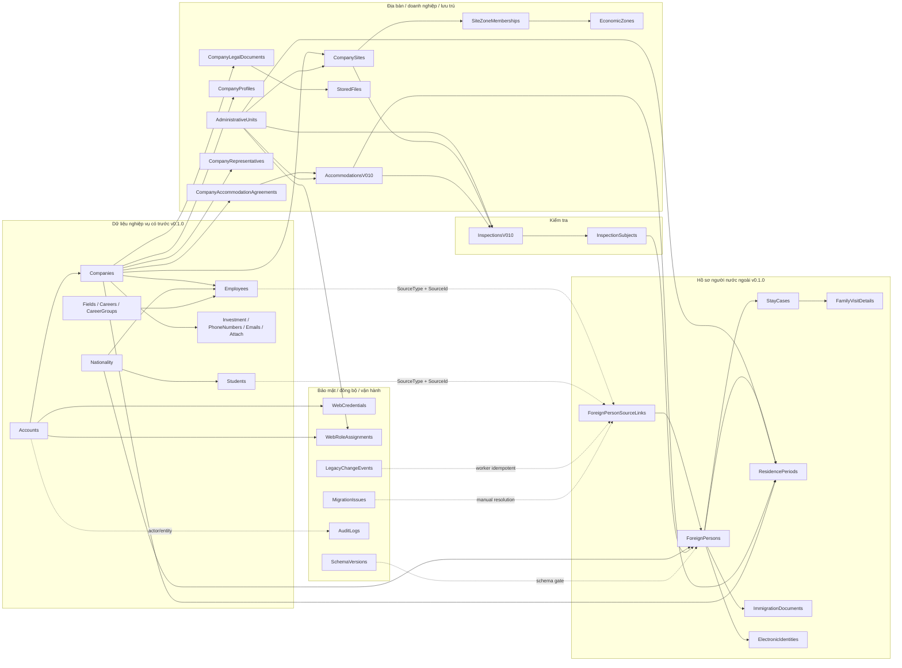
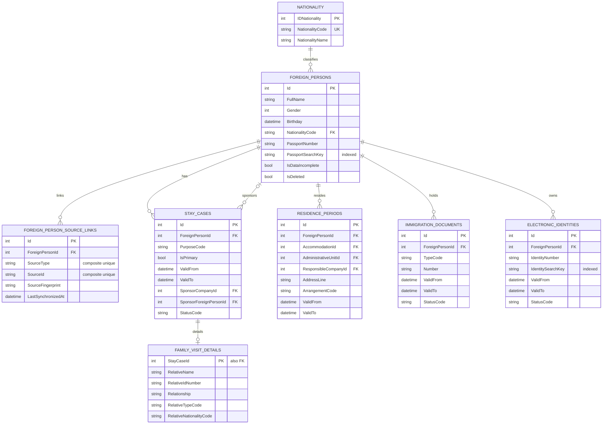
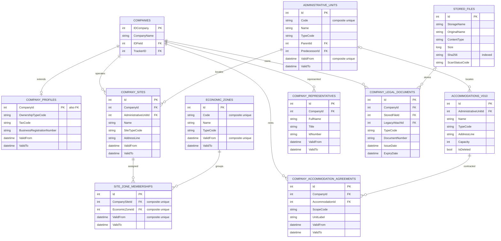
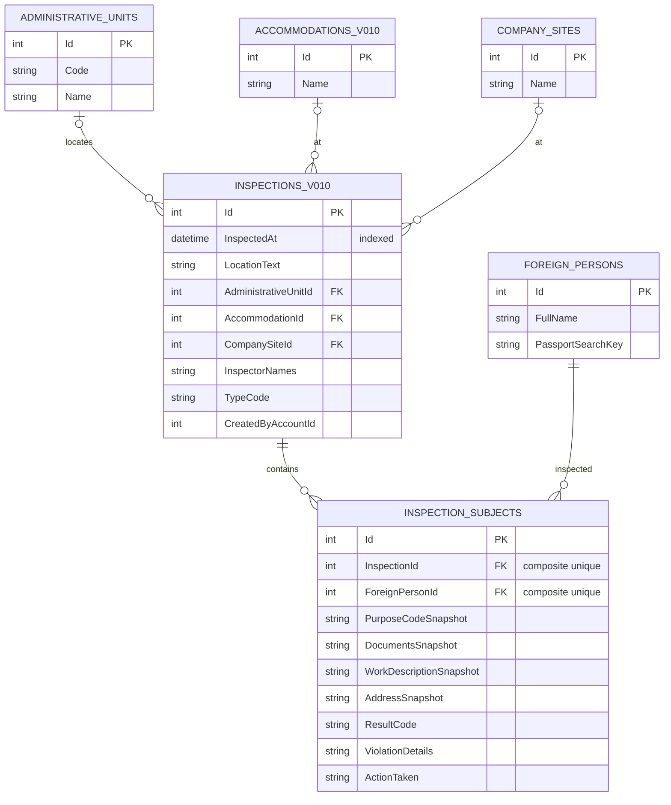
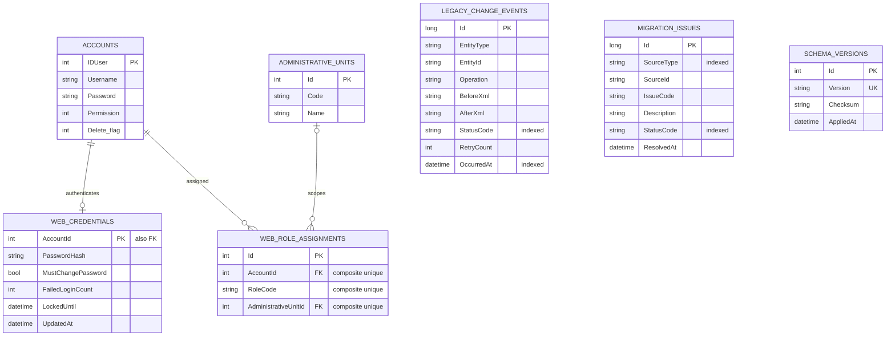
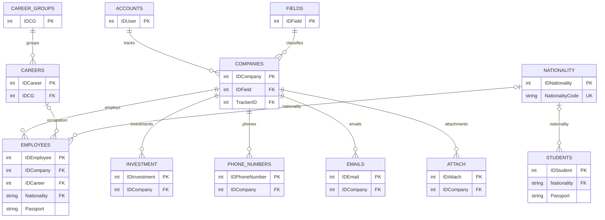
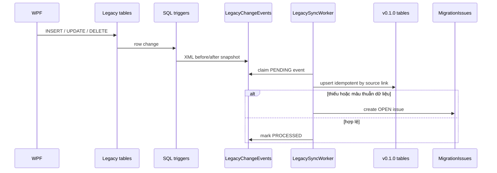

# Sơ đồ và báo cáo kiến trúc database IRM v0.1.0

- **Ngày cập nhật:** 17/08/2026
- **Nguồn sự thật:** `IRM/Data/IrmDbContext.cs`, các model trong `IRM/Data/Models/`, migration `deploy/sql/07-v0.1.0.sql`
- **Phạm vi:** schema ứng dụng v0.1.0 và các bảng legacy được EF Core ánh xạ; không phải bản reverse-engineer database production của khách hàng

## 1. Tóm tắt

IRM v0.1.0 dùng mô hình **additive**: giữ nguyên bảng legacy để WPF tiếp tục hoạt động và thêm một lớp bảng mới phục vụ web, lịch sử hiệu lực, thống kê, kiểm tra và bảo mật.

| Nhóm | Số bảng | Vai trò |
|---|---:|---|
| Legacy WPF | 13 | Tài khoản, doanh nghiệp, lao động và danh mục cũ |
| Mở rộng có trước v0.1.0 | 6 | Du học sinh, audit, import, archive và mapping template |
| Mở rộng v0.1.0 | 24 | Hồ sơ hợp nhất, lịch sử, địa bàn, doanh nghiệp mở rộng, kiểm tra, RBAC và đồng bộ |
| **Tổng** | **43** | Schema được `IrmDbContext` ánh xạ |

Hai môi trường dùng cùng mô hình logic:

- VPS demo/staging: SQLite trên persistent volume.
- Mục tiêu khách hàng: SQL Server 2014, chỉ chạy migration sau backup/restore rehearsal và phê duyệt riêng.

## 2. Sơ đồ tổng thể

Bản xem trực tiếp: [SVG](diagrams/irm-v0.1.0-database-overview.svg) · [PNG](diagrams/irm-v0.1.0-database-overview.png) · [nguồn Mermaid](diagrams/irm-v0.1.0-database-overview.mmd).

## 3. ERD hồ sơ người nước ngoài và lịch sử

`ForeignPersonSourceLinks` là liên kết polymorphic: cặp `(SourceType, SourceId)` trỏ logic tới `Employees`, `Students` hoặc nguồn khác. Database cố ý không tạo FK trực tiếp tới nhiều bảng nguồn; unique index bảo đảm một bản ghi nguồn chỉ liên kết một hồ sơ hợp nhất.

## 4. ERD doanh nghiệp, địa bàn, khu vực và lưu trú

Quan hệ site–zone là many-to-many có thời gian hiệu lực. Quan hệ company–accommodation cũng có thời gian và phạm vi thuê (`WHOLE_PROPERTY`, căn/phòng hoặc hình thức khác), không gắn cứng cơ sở lưu trú vào một doanh nghiệp duy nhất.

## 5. ERD kiểm tra

`InspectionSubjects` giữ snapshot diện cư trú, giấy tờ, công việc và địa chỉ tại thời điểm kiểm tra. Vì vậy báo cáo lịch sử không bị thay đổi khi hồ sơ hiện tại được cập nhật sau này. Unique index `(ForeignPersonId, InspectionId)` ngăn một người bị thêm hai lần trong cùng đợt.

## 6. ERD tài khoản, phân quyền và đồng bộ

`Accounts.Password` vẫn tồn tại để WPF legacy hoạt động. Web dùng `WebCredentials.PasswordHash`; lần đăng nhập đầu hoặc khi quản trị đổi mật khẩu sẽ tạo/cập nhật hash. Các role chuẩn gồm `Admin`, `DataEditor`, `Inspector`, `Reporter`, `Viewer`.

`LegacyChangeEvents`, `MigrationIssues`, `AuditLogs` và `SchemaVersions` không dùng FK tới bản ghi nghiệp vụ. Đây là chủ đích để giữ được bằng chứng khi bản ghi nguồn đã thay đổi/xóa hoặc khi migration gặp dữ liệu không hợp lệ.

## 7. ERD nghiệp vụ có trước v0.1.0

`Districts` và `Wards` tiếp tục là danh mục độc lập của legacy. v0.1.0 không thêm `IDDistrict` vào `Wards`; địa bàn mới dùng `AdministrativeUnits` có hiệu lực và quan hệ tiền nhiệm.

## 8. Danh mục 43 bảng

### 8.1 Legacy WPF

| Bảng | PK | Quan hệ chính | Mục đích |
|---|---|---|---|
| `Accounts` | `IDUser` | tracker của `Companies` | Tài khoản WPF/nguồn danh tính web |
| `Companies` | `IDCompany` | `Fields`, `Accounts` | Doanh nghiệp legacy |
| `Employees` | `IDEmployee` | `Companies`, `Careers`, `Nationality` | Lao động nước ngoài legacy |
| `Fields` | `IDField` | 1–n `Companies` | Lĩnh vực doanh nghiệp |
| `Careers` | `IDCareer` | `CareerGroups`; 1–n `Employees` | Nghề nghiệp |
| `CareerGroups` | `IDCG` | 1–n `Careers` | Nhóm nghề |
| `Nationality` | `IDNationality` | alternate key `NationalityCode` | Quốc tịch dùng chung |
| `Investment` | `IDInvestment` | `Companies` | Vốn/đầu tư doanh nghiệp |
| `PhoneNumbers` | `IDPhoneNumber` | `Companies` | Số điện thoại doanh nghiệp |
| `Emails` | `IDEmail` | `Companies` | Email doanh nghiệp |
| `Districts` | `IDDistrict` | không FK v0.1.0 | Danh mục huyện legacy |
| `Wards` | `IDWard` | không FK v0.1.0 | Danh mục xã/phường legacy |
| `Attach` | `IDAttach` | `Companies` | Metadata/file đính kèm legacy |

### 8.2 Bảng mở rộng có trước v0.1.0

| Bảng | PK/index | Mục đích |
|---|---|---|
| `Students` | `IDStudent`; index passport/quốc tịch/hạn visa | Du học sinh, được tạo bởi migration `05-students-table.sql` |
| `AuditLogs` | `Id` | Nhật ký hành động/đăng nhập/xuất dữ liệu |
| `ImportHistories` | `Id`; index `SessionId` | Tổng hợp kết quả mỗi phiên import |
| `ImportBackups` | `Id`; index `ImportSessionId` | Snapshot phục vụ rollback import |
| `ArchivedEmployees` | `Id`; index `OriginalId`, `ArchiveReason` | Lưu lao động đã archive |
| `ColumnMappingTemplates` | `Id` | Template ánh xạ cột Excel |

### 8.3 Bảng v0.1.0

| Bảng | PK | FK/unique quan trọng | Mục đích |
|---|---|---|---|
| `SchemaVersions` | `Id` | unique `Version` | Gate phiên bản schema/checksum |
| `ForeignPersons` | `Id` | `NationalityCode`; index passport hash | Danh tính người nước ngoài hợp nhất |
| `ForeignPersonSourceLinks` | `Id` | `ForeignPersonId`; unique source pair | Liên kết Employee/Student/nguồn khác |
| `StayCases` | `Id` | person, sponsor company/person | Diện cư trú theo thời gian |
| `FamilyVisitDetails` | `StayCaseId` | PK đồng thời FK | Chi tiết thân nhân/người bảo lãnh |
| `AdministrativeUnits` | `Id` | unique `(Code, ValidFrom)` | Địa bàn có hiệu lực/tiền nhiệm |
| `ResidencePeriods` | `Id` | person, địa bàn, CSLT, doanh nghiệp | Lịch sử nơi ở |
| `ImmigrationDocuments` | `Id` | person | Visa/gia hạn/thẻ và hiệu lực |
| `ElectronicIdentities` | `Id` | person; index identity hash | Số định danh điện tử theo thời gian |
| `CompanyProfiles` | `CompanyId` | PK/FK one-to-one | FDI/trong nước, MST, ĐKKD |
| `CompanySites` | `Id` | company, địa bàn | Nhiều địa điểm của doanh nghiệp |
| `EconomicZones` | `Id` | unique `(Code, ValidFrom)` | KCN/KKT/cụm công nghiệp |
| `SiteZoneMemberships` | `Id` | unique site–zone–from | Many-to-many site/khu theo thời gian |
| `AccommodationsV010` | `Id` | địa bàn | Cơ sở lưu trú vật lý |
| `CompanyAccommodationAgreements` | `Id` | company, accommodation | Hợp đồng/phạm vi thuê theo thời gian |
| `CompanyRepresentatives` | `Id` | company | Lịch sử đại diện pháp luật |
| `StoredFiles` | `Id` | index SHA-256 | Metadata file ngoài webroot |
| `CompanyLegalDocuments` | `Id` | company, stored file/legacy attach | Hồ sơ pháp nhân |
| `InspectionsV010` | `Id` | địa bàn/CSLT/site | Đợt kiểm tra |
| `InspectionSubjects` | `Id` | unique person–inspection | Người và snapshot kết quả kiểm tra |
| `WebCredentials` | `AccountId` | PK/FK one-to-one | Hash, throttling, khóa đăng nhập |
| `WebRoleAssignments` | `Id` | unique account–role–area | RBAC và phạm vi địa bàn |
| `LegacyChangeEvents` | `Id` | index status/time | Outbox snapshot từ trigger legacy |
| `MigrationIssues` | `Id` | index status/source | Hàng chờ dữ liệu cần xác minh |

## 9. Quy tắc dữ liệu quan trọng

1. Một bản ghi nguồn chỉ có một liên kết hợp nhất nhờ unique `(SourceType, SourceId)`.
2. Passport và số định danh có search key chuẩn hóa; không dùng chuỗi hiển thị làm khóa thống kê.
3. Mỗi người chỉ có một `StayCase.IsPrimary` hiệu lực tại một thời điểm; overlap được chặn ở service/test.
4. `ValidFrom/ValidTo` xuất hiện ở diện cư trú, nơi ở, giấy tờ, định danh, địa bàn, site, zone membership, đại diện và hợp đồng lưu trú.
5. Thống kê tổng người phải dùng `COUNT(DISTINCT ForeignPersonId)`.
6. Báo cáo as-of dùng trạng thái hiệu lực tại một ngày; báo cáo range dùng sự kiện phát sinh trong khoảng.
7. Snapshot kiểm tra không join ngược để thay thế bằng dữ liệu hiện tại.
8. File scan nằm ngoài database; `StoredFiles` chỉ lưu metadata, SHA-256 và trạng thái quét.

## 10. Cascade, restrict và vòng đời dữ liệu

### Cascade được cấu hình

- `ForeignPersons` → source links, stay cases, residence periods, immigration documents, electronic identities.
- `StayCases` → `FamilyVisitDetails`.
- `Companies` → profile, sites, agreements, representatives, legal documents.
- `CompanySites`/`EconomicZones` → memberships.
- `AccommodationsV010` → agreements.
- `InspectionsV010` → subjects.
- `Accounts` → web credential và role assignments.

### Restrict được cấu hình

- Quốc tịch đang được person sử dụng.
- Sponsor company/person của stay case.
- Địa bàn, CSLT và doanh nghiệp được lịch sử nơi ở/site/inspection tham chiếu.
- Stored file hoặc `Attach` legacy đang gắn với hồ sơ pháp nhân.
- Foreign person đã xuất hiện trong inspection subject.

Ứng dụng ưu tiên soft delete/effective dating. Không dùng cascade để xóa lịch sử nghiệp vụ đã phát sinh.

## 11. Luồng đồng bộ legacy → v0.1.0

Trigger chỉ ghi outbox; không thực hiện business logic nặng trong transaction của WPF. Worker có retry và dead-letter status để không làm mất sự kiện lỗi.

## 12. Đánh giá và khuyến nghị

### Điểm phù hợp

- Không phá schema legacy và cho phép WPF/web chạy song song.
- Có identity trung tâm nên tránh đếm trùng Employee–Student–thăm thân.
- Mô hình temporal đáp ứng báo cáo quá khứ từ baseline.
- Quan hệ nhiều site/nhiều khu/nhiều CSLT phản ánh đúng thực tế doanh nghiệp.
- Inspection snapshot hỗ trợ loại trừ theo lookback mà không xóa lịch sử.

### Rủi ro/hạn chế còn lại

- Liên kết polymorphic không có FK vật lý; phải giám sát orphan bằng worker và `MigrationIssues`.
- Overlap thời gian được chặn ở application service, chưa phải mọi trường hợp đều có constraint SQL.
- `CreatedByAccountId` trong `StoredFiles` và `InspectionsV010` hiện là liên kết logic, chưa cấu hình FK EF.
- `AuditLogs`, import session và migration issue chủ ý không có FK nên cần retention/cleanup policy riêng.
- Dữ liệu trước baseline là best effort; không thể suy ra chính xác lịch sử chưa từng được ghi.
- Module cửa khẩu (`BorderGates`, `BorderMovements`, `BorderStayEpisodes`) mới là blueprint phase 2, chưa nằm trong 43 bảng hiện tại.
- Production phải reverse-engineer schema thực tế của khách hàng và đối chiếu với báo cáo này sau backup/restore rehearsal.

### Đề xuất tiếp theo

1. UAT ERD với cán bộ nghiệp vụ, đặc biệt sponsor, loại CSLT và membership khu kinh tế.
2. Thêm job kiểm tra orphan cho source links và các logical account links.
3. Đánh giá constraint chống overlap ở SQL Server nếu không phá tương thích WPF.
4. Tạo dashboard `MigrationIssues`/dead-letter và SLA xử lý.
5. Sau khi có bản restore khách hàng, xuất schema/row-count/index/FK thực tế và lập diff ký duyệt trước go-live.

## 13. Kết luận

Schema v0.1.0 đáp ứng mô hình dữ liệu cho yêu cầu 1–3 và 5–9 theo hướng additive. `ForeignPersons` là trung tâm thống kê; `AdministrativeUnits`, effective dating và các bảng liên kết tạo nền cho báo cáo theo thời gian/địa bàn mà không sửa cột legacy. Sơ đồ này được duyệt cho **development/demo/staging**; production vẫn phụ thuộc baseline và UAT trên database khách hàng.
