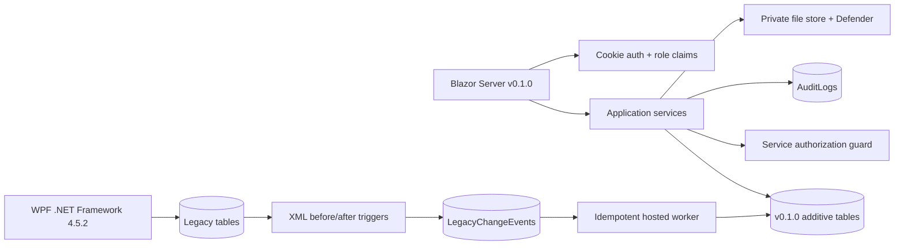
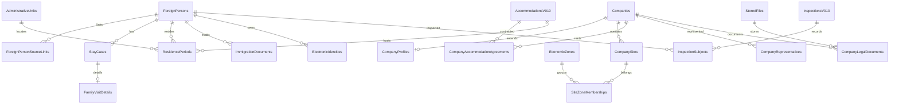

# Báo cáo triển khai và nghiệm thu kỹ thuật IRM v0.1.0

**Ngày lập:** 16/08/2026  
**Phạm vi:** workspace development/test và VPS demo/staging; không gồm database khách hàng  
**Verdict:** **APPROVED FOR DEMO/STAGING ONLY — NOT APPROVED FOR PRODUCTION**

## 1. Tóm tắt điều hành

IRM v0.1.0 đã có các vertical slice cho hồ sơ người nước ngoài hợp nhất, thăm thân, doanh nghiệp–địa điểm–khu vực–lưu trú, kiểm tra hiện trường, lịch sử/as-of, giấy tờ/định danh, pháp nhân và thống kê địa bàn. Web dùng cookie authentication và role ở service; SQL migration là additive/idempotent; WPF đã đổi các `INSERT` trọng yếu sang danh sách cột và tham số.

Kết quả kỹ thuật trong môi trường test: web full build thành công với 0 warning/0 error; 17/17 xUnit pass; SQLite login smoke pass; migration và backfill chạy hai lần trên SQL Server test; seed đủ 54 đơn vị; 5 trigger hoạt động; WPF SQL compatibility smoke pass trong transaction rollback.

Chưa được phép kết luận production-ready vì chưa có backup/restore database khách hàng, chưa có baseline/checksum khách hàng, chưa UAT và chưa build/manual smoke binary WPF do máy hiện tại thiếu .NET Framework 4.5.2 Developer Pack.

## 2. Mapping 9 yêu cầu

| # | Trạng thái v0.1.0 | Bằng chứng triển khai | Điều kiện/hạn chế |
|---:|---|---|---|
| 1 | Implemented (dev/test) | `ForeignPersons`, `StayCases`, `FamilyVisitDetails`; trang `/family-visitors`; liên kết sponsor công ty/người | Bản ghi legacy thăm thân mơ hồ phải xác minh qua `MigrationIssues` |
| 2 | Implemented (dev/test) | `AccommodationsV010`, `CompanyAccommodationAgreements`, `ResidencePeriods`; trang `/accommodations`; thuê toàn bộ/căn/nhà công ty/tự thuê theo thời gian | Địa chỉ ngoài Quảng Ninh lưu được dạng text; danh mục hành chính seed release này là Quảng Ninh |
| 3 | Implemented (dev/test) | `InspectionsV010`, `InspectionSubjects`; snapshot diện, giấy tờ, công việc, địa chỉ, kết quả; lookback do người dùng chọn | Chưa UAT tại hiện trường |
| 4 | Phase 2 foundation only | `BORDER_VISA_EXEMPT`, identity/temporal/event foundation và blueprint mục 11 | Không có trang cửa khẩu, `BorderMovements` hay cảnh báo 15 ngày trong release |
| 5 | Implemented từ baseline | `TemporalReportFilter`, as-of queries, effective dates, range cho sự kiện kiểm tra | Trước baseline hiển thị best effort; chưa cam kết lịch sử đầy đủ |
| 6 | Implemented (dev/test) | `ImmigrationDocuments`, `ElectronicIdentities`; hồ sơ hợp nhất `/foreign-persons`; import Excel ánh xạ diện, định danh, lịch sử nơi ở và nhiều giấy tờ phân cách `;`; báo cáo đã/chưa định danh và loại giấy tờ | Cần UAT template Excel khách hàng; backfill visa dùng dữ liệu legacy sẵn có |
| 7 | Implemented (dev/test) | `CompanyProfiles`, `CompanySites`, `EconomicZones`, `SiteZoneMemberships`; quản lý FDI/trong nước và nhiều khu/cụm | Danh mục khu/cụm do người dùng có quyền nhập trước khi gán |
| 8 | Implemented (dev/test) | 54 `AdministrativeUnits`; distinct người theo diện; danh sách DN/CSLT và export cùng filter | Cần khách hàng xác nhận mã nội bộ và đơn vị tiền nhiệm |
| 9 | Implemented (dev/test) | `CompanyRepresentatives`, `CompanyLegalDocuments`, `StoredFiles`; tab hồ sơ doanh nghiệp | Tải xuống file chưa được UAT; Defender thật chưa chạy trong test tự động |

## 3. Kiến trúc thực tế

Không mở HTTP API nghiệp vụ mới. Các interface chính được tạo: `IForeignerRegistryService`, `IResidenceService`, `ICompanyProfileService`, `IAccommodationService`, `IInspectionService`, `IStatisticsService`, `ILegalDocumentService`, `ILegacySyncService`.

### ERD rút gọn

Bản ERD đầy đủ theo từng miền và catalog 43 bảng: [IRM-v0.1.0-database-architecture-report.md](IRM-v0.1.0-database-architecture-report.md).

## 4. Data flow và bất biến

1. Hộ chiếu được trim, bỏ ký tự không phải chữ/số, uppercase và băm SHA-256 thành search key.
2. Backfill liên kết Employee/Student bằng hộ chiếu. Thiếu hộ chiếu hoặc cùng hộ chiếu nhưng nhân thân mâu thuẫn được đưa vào `MigrationIssues`.
3. Một diện chính không được overlap tại cùng thời điểm. Nơi ở cũng được kiểm tra overlap khi dùng service.
4. Báo cáo trạng thái chọn đúng `AsOfDate`; báo cáo sự kiện kiểm tra dùng `From/To`.
5. Tổng người là `COUNT(DISTINCT ForeignPersonId)`, không cộng số dòng theo danh mục.
6. Trigger legacy chỉ enqueue snapshot; worker dùng khóa `(SourceType, SourceId)` để không nhân bản.

## 5. ADR

| ADR | Quyết định | Hệ quả |
|---|---|---|
| ADR-001 | Không thêm cột v0.1.0 vào bảng legacy | Giảm rủi ro WPF; cần bảng liên kết/backfill |
| ADR-002 | `ForeignPersons` là identity trung tâm | Thống kê không đếm trùng; cần hàng xác minh dữ liệu |
| ADR-003 | Effective dating thay vì overwrite | Hỗ trợ as-of; query và validation phức tạp hơn |
| ADR-004 | WPF + web chạy song song qua outbox trigger | Chuyển đổi ít gián đoạn; phải giám sát dead letter |
| ADR-005 | Cookie auth, hash upgrade lần đăng nhập web đầu | WPF vẫn dùng credential legacy; web không tiếp tục plain-text authentication sau upgrade |
| ADR-006 | Không tự migrate SQL Server lúc startup | Fail-fast an toàn; vận hành phải chạy script có phê duyệt |
| ADR-007 | Requirement 4 chuyển phase 2 | Không tạo module nửa vời; giữ code diện và blueprint tương thích |

## 6. Threat matrix

| Mối đe dọa | Kiểm soát | Bằng chứng | Rủi ro còn lại |
|---|---|---|---|
| Chiếm phiên | Cookie HttpOnly, SameSite Strict, timeout 8h, HTTPS redirect | `Program.cs` | Cần cấu hình TLS/reverse proxy production |
| Brute force | 5 lần sai khóa 15 phút, audit failed/blocked login | xUnit auth upgrade/lockout | Chưa kiểm thử phân tán nhiều node |
| Truy cập trái quyền | Role claims + service guard; policies `ManageData/Inspect/Report/AdminOnly`; guard cả CRUD/import/export legacy | xUnit guard và account-claim tests | Cần pentest/UAT quyền trên môi trường triển khai |
| SQL injection từ WPF insert | Danh sách cột + parameters cho 6 đường ghi trọng yếu | source diff; SQL smoke | Các câu query/update legacy khác vẫn còn concatenation, ngoài phạm vi insert đã duyệt |
| Upload độc hại | Whitelist MIME/extension, magic bytes, 10 MB, GUID name, ngoài webroot, SHA-256, Defender, audit | xUnit mismatch + simulated malware cleanup | Chưa chạy upload UAT với Defender thật |
| Formula injection | Prefix `'` cho `= + - @ tab CR` ở export thống kê và bước ghi chung của export legacy | xUnit | Cần UAT tệp bằng Excel/LibreOffice thực tế |
| Đếm trùng/merge sai | Hash hộ chiếu, source links, distinct ID, `MigrationIssues` | xUnit distinct/overlap; SQL backfill | Dữ liệu thiếu hộ chiếu cần khách hàng xử lý |
| Migration phá hủy | Additive DDL, transaction, checksum, idempotent, không DROP legacy | SQL test chạy hai lần | Phải chạy lại trên bản restore của khách hàng |

## 7. Migration, backfill và rollback

### Artifact

- `deploy/preflight-v0.1.0.ps1`: baseline schema/row count/checksum; tùy chọn backup `COPY_ONLY CHECKSUM`, verify, restore database tạm và so sánh.
- `deploy/sql/07-v0.1.0.sql`: schema additive, seed 54 địa bàn, `SchemaVersions`.
- `deploy/sql/08-v0.1.0-legacy-triggers.sql`: 5 trigger snapshot.
- `deploy/sql/09-v0.1.0-backfill.sql`: Employee/Student, visa và issue queue; idempotent.
- `deploy/sql/10-v0.1.0-disable-legacy-triggers.sql`: rollback switch không xóa dữ liệu mới.
- `deploy/sql/11-v0.1.0-wpf-compatibility-smoke.sql`: insert smoke và rollback giao dịch.

### Evidence test database

| Kiểm tra | Kết quả |
|---|---:|
| Migration lần 1 / lần 2 | PASS / PASS |
| Backfill lần 1 / lần 2 | PASS / PASS |
| `SchemaVersions` 0.1.0 | 1 |
| `AdministrativeUnits` | 54 |
| ForeignPersons / SourceLinks từ seed legacy | 4 / 4 |
| ImmigrationDocuments backfill | 2 |
| MigrationIssues trên bộ seed test | 0 |
| Trigger đang bật | 5 |
| WPF explicit-column SQL smoke | PASS, transaction rolled back |
| Test database | Đã drop sau kiểm tra |

Nguồn danh mục hành chính: [Nghị quyết 1679/NQ-UBTVQH15](https://vanban.chinhphu.vn/?docid=214000&pageid=27160) và [Cổng thông tin tỉnh Quảng Ninh — 54 đơn vị](https://www.quangninh.gov.vn/Trang/ChiTietBVGioiThieu.aspx?bvid=545). Mã `QN-*` là mã nội bộ release, phải được khách hàng xác nhận trước production.

### Rollback

Rollback mặc định: dừng worker, chạy script 10 để disable trigger, quay lại binary trước đó. Không xóa bảng mới. Restore đè database chỉ thực hiện khi có phê duyệt riêng vì có thể mất dữ liệu phát sinh sau backup.

## 8. Kết quả build/test

| Hạng mục | Kết quả | Ghi chú |
|---|---|---|
| `dotnet build IRM/IRM.csproj --no-restore --no-incremental` | PASS | 0 warning, 0 error |
| `dotnet test IRM.Tests/IRM.Tests.csproj --no-restore` | PASS | 17 passed, 0 failed, 0 skipped |
| SQLite demo startup | PASS | `/` trả 302 tới `/login`; trang login 200, có form và nhãn v0.1.0 |
| SQL Server migration schema | PASS | Test database riêng; chạy migration/backfill hai lần |
| WPF SQL compatibility | PASS | 5 loại insert + trigger, rollback |
| WPF binary build | **BLOCKED** | Máy thiếu .NET Framework 4.5.2 Developer Pack (`MSB3644`) |
| Manual browser CRUD/UAT | NOT RUN | Cần người dùng nghiệp vụ và dữ liệu đại diện |
| Demo/staging VPS deployment | PASS | Openship deployment `dep_xrAPbwO0_JlJhLog`; HTTPS smoke và restart persistence pass |
| Customer production backup/deploy | **NOT RUN** | Không có phê duyệt/bằng chứng database khách hàng |

Test tự động bao phủ normalization, overlap, distinct/as-of, inspection lookback, filter modes, formula injection, auth hash upgrade/lockout/đổi password quản trị, RBAC, seed idempotency, import mở rộng nhiều giấy tờ/lịch sử và rollback sạch, MIME/signature và cleanup khi malware scan thất bại.

## 9. Thay đổi tương thích WPF

Các file `AddEmployeeViewModel`, `ReadFileViewModel`, `AddCompanyViewModel`, `AddWardViewModel`, `AddDistrictViewModel`, `AddAttachViewModel` không còn `INSERT INTO ... VALUES` theo thứ tự cột. Mỗi insert có danh sách cột và parameter. Migration kiểm tra baseline `Companies.Uptime` và `Attach.DateDelete`; nếu không khớp sẽ dừng thay vì đoán schema.

Việc build WPF đầy đủ vẫn là gate bắt buộc sau khi cài Developer Pack 4.5.2. SQL smoke chỉ chứng minh hợp đồng câu lệnh/database, không chứng minh UI WPF.

## 10. Dữ liệu cần khách hàng xác minh

- Hồ sơ thiếu hộ chiếu; hộ chiếu trùng nhưng họ tên/ngày sinh/quốc tịch mâu thuẫn.
- 54 mã địa bàn nội bộ và quan hệ đơn vị tiền nhiệm.
- Danh mục KCN/KKT cửa khẩu/KKT ven biển/cụm công nghiệp và membership nhiều khu.
- Hạn của visa legacy khi hệ thống cũ chỉ có `TemporaryStay`.
- Quan hệ thân nhân legacy chưa đủ loại người thân, sponsor hoặc địa chỉ.
- File `Attach` cũ: chỉ liên kết metadata, không tự chuyển hoặc tự khẳng định đã quét malware.

## 11. Blueprint phase 2 — yêu cầu 4

Đề xuất ba bảng:

- `BorderGates(Id, Code, Name, AdministrativeUnitId, ValidFrom, ValidTo)`.
- `BorderMovements(Id, ForeignPersonId, BorderGateId, Direction, OccurredAt, DocumentNumber, SourceEventId)`.
- `BorderStayEpisodes(Id, ForeignPersonId, EntryMovementId, ExitMovementId, EnteredAt, ExitedAt, AllowedUntil, Status)`.

Quy tắc ghép: movement được deduplicate bằng source event; entry mở episode gần nhất chưa đóng; exit đóng episode hợp lệ theo người/cửa khẩu/thời gian; không có exit thì giữ open. `AllowedUntil = EnteredAt + 15 ngày` theo policy được cấu hình/version hóa, không hard-code vào UI. Đi-về trong ngày vẫn tạo episode có thời lượng. Cảnh báo chạy trên episode open, nhưng chỉ triển khai sau khi xác nhận nguồn dữ liệu xuất/nhập và quy tắc pháp lý.

## 12. Production gate còn lại

1. Cài .NET Framework 4.5.2 Developer Pack, build và chạy WPF manual smoke.
2. Chạy preflight read-only trên database khách hàng và review baseline.
3. Có phê duyệt riêng mới backup/verify/restore sang database tạm.
4. Chạy scripts 07/08/09/11 trên bản restore; đối soát row-count/checksum và `MigrationIssues`.
5. UAT các yêu cầu 1–3, 5–9; thử Defender thật và download có quyền.
6. Ký biên bản go-live/rollback; sau đó mới lập lịch production.

Cho tới khi đủ sáu mục trên, verdict production giữ nguyên: **CHANGES REQUESTED — NOT APPROVED FOR PRODUCTION**.

## 13. Bằng chứng deploy demo/staging

### Release và hạ tầng

| Mục | Giá trị/kết quả |
|---|---|
| Code reference | `8c1d8b0-dirty` — release được tạo từ working tree chưa commit |
| Image | `irm:0.1.0` |
| OCI digest | `sha256:706e5dad7f6e935853aa67e969aef228575074e45a9ae0cb1509bd37b42451d4` |
| Image archive SHA-256 | `d7cad2b1e2b5c2ad6156ce64f1e915cb62636e4fa0f3d10c7a87cc0644e6931e` |
| Openship project | `proj_ktNeuK8V-TgRA58h` |
| Active deployment | `dep_xrAPbwO0_JlJhLog` — `ready` |
| URL | `https://irm.180.93.103.206.nip.io` |
| Runtime | Docker, user không đặc quyền `app` (UID 1654), giới hạn 512 MiB |
| Exposure | OpenResty HTTPS → `127.0.0.1:5050`; app port không bind public |
| Persistent volume | `openship-irm-v010-irm-v010-data:/app/data` |

Đây là deployment demo/staging dùng SQLite mới. Không kết nối, backup, migrate hoặc thay đổi SQL Server của khách hàng. Container demo cũ được giữ ở trạng thái dừng với tên `irm-pre-v010-20260816`; stack GH-600 trên cùng VPS không bị thay đổi.

### Backup và rollback

- Backup trước cutover: `/opt/irm/backups/20260816T162240Z`; restore tạm, `PRAGMA integrity_check=ok`, 19 bảng/97 dòng; rollback image `irm:rollback-20260816T162240Z`.
- Backup v0.1.0 hiện hành sau khi xoay credential: `/opt/irm/backups/20260816T165300Z-v010-post-rotation/IRM-v0.1.0-demo.db`; mode 600; SHA-256 `ab57962d9a7a664f0b08268020333c42efdcdca06f6a10d7005aa463da92b3b3`.
- Restore rehearsal v0.1.0: `integrity=ok`, 43 bảng, 284 dòng; row-count của bản backup và bản restore trùng nhau. Tệp restore tạm đã xóa sau kiểm tra.
- Rollback binary nhanh: dừng `openship-irm-v010-app`, khởi động lại container đã giữ `irm-pre-v010-20260816`. Không restore đè dữ liệu nếu chưa có phê duyệt riêng.

### Nghiệm thu runtime

| Kiểm tra | Kết quả |
|---|---:|
| HTTPS `/login` và nhãn `v0.1.0` | PASS — 200 |
| Login demo và cookie Secure/HttpOnly | PASS |
| Xoay 4 credential seed; mật khẩu admin mặc định bị từ chối, credential mới được chấp nhận | PASS |
| `/`, `/family-visitors`, `/accommodations`, `/inspections`, `/statistics`, `/companies`, `/admin` | PASS — 200 sau xác thực |
| Restart container và giữ nguyên session | PASS |
| SQLite + Data Protection key tồn tại trên volume | PASS |
| GH-600 health sau deploy | PASS — 200 |
| Tài nguyên sau deploy | IRM khoảng 82 MiB/512 MiB; đĩa VPS còn khoảng 19 GiB |

### Hạn chế deployment demo

- Data Protection key lưu mode 600 trên volume nhưng chưa được mã hóa bằng certificate/KMS; production phải bổ sung cơ chế bảo vệ khóa.
- `WindowsDefenderMalwareScanner` không có Defender trên Linux; upload hồ sơ pháp nhân sẽ fail-closed. Production Linux cần scanner tương thích hoặc dịch vụ quét được phê duyệt.
- Openship không giữ rollback artifact để pin cho deployment này; rollback được bảo đảm bằng container cũ, image rollback và hai bộ backup đã kiểm tra.
- Hostname `nip.io` chỉ dành cho demo. Go-live cần domain chính thức, chính sách TLS, secrets và giám sát production.

Verdict sau deploy: **APPROVED FOR DEMO/STAGING ONLY**. Verdict production vẫn là **CHANGES REQUESTED — NOT APPROVED FOR PRODUCTION**.

## 14. Redeploy artifact chính thức — 17/08/2026

### Version và provenance

- Phiên bản ứng dụng không đổi: `v0.1.0`.
- Source candidate: tag `v0.1.0`, commit sạch `0723e4ea85ab36fd1172f721a0b433e49cedb9fb`.
- Image bất biến: `irm:0.1.0-0723e4e`; OCI id `sha256:ec1b2e9dabc8a6106de7a714acf5e740aca22b7e931d5e0934979f487b43b0d4`.
- Release archive: `/opt/irm/releases/irm-0.1.0-0723e4e-d50a8b8d.tar`; SHA-256 `d50a8b8d1ed2ddf4e5dd7786f80f39eac10394bc06fb19a87d848051963482cd`.
- Openship deployment mới: `dep_HW3aH3BKVfSKa_1z`, version 4, trạng thái `ready`.

Artifact trước hiển thị cùng `v0.1.0` nhưng được build từ `8c1d8b0-dirty`. Redeploy này không phải bump lên `v0.1.1`; mục tiêu là thay bản không tái tạo được bằng artifact có Git SHA rõ ràng. Header comment `IRM v2.0` trong `irm-interop.js` là nhãn mã nguồn cũ, không phải version assembly/UI/runtime.

### Backup và rollback trước cutover

- SQLite backup mode 600 tại `/opt/irm/backups/20260817T085503Z-pre-0723e4e/IRM-v0.1.0-demo.db`; SHA-256 `28d80a6885d672ee3cf71987952718852ee1e0629e5629dab83219a35a03a88a`.
- Restore rehearsal: `integrity=ok`, 43 bảng, 291 dòng và toàn bộ row-count khớp.
- Runtime files/Data Protection keys đã archive cùng thư mục backup.
- Image cũ được giữ bằng tag `irm:rollback-pre-0723e4e-20260817T085503Z` và archive `/opt/irm/releases/irm-rollback-pre-0723e4e-20260817T085503Z.tar`.

### Giải thích credential local và VPS

Local và VPS không dùng chung database. Khi local SQLite rỗng, `DatabaseSeeder` tạo các tài khoản demo; VPS đã xoay toàn bộ mật khẩu sau deployment đầu và lưu chúng trong volume `openship-irm-v010-irm-v010-data`. Seeder chỉ tạo account khi bảng `Accounts` rỗng, nên redeploy image không thay hoặc reset admin VPS. `WebCredentials` chứa hash cho web; cột legacy `Accounts.Password` tiếp tục tồn tại vì yêu cầu tương thích WPF. Đây là khác biệt môi trường có chủ đích, không phải version drift.

### Hậu kiểm

| Kiểm tra | Kết quả |
|---|---:|
| Build / xUnit / Compose | PASS — 0 warning, 0 error; 17/17; config hợp lệ |
| Local candidate container | PASS — non-root, `/login` 200, hiển thị `v0.1.0` |
| Openship compose service | PASS — 1/1 service, deployment `ready` |
| Rootfs container/candidate | PASS — layer list khớp image `0723e4e` |
| SQLite sau deploy | PASS — integrity `ok`, business row-count giữ nguyên |
| Admin VPS | PASS — đăng nhập bằng credential hiện hành, không ghi secret vào log/report |
| 7 trang nghiệp vụ | PASS — `/`, thăm thân, lưu trú, kiểm tra, thống kê, công ty, quản trị trả 200 sau xác thực |
| Cookie auth | PASS — `Secure`, `HttpOnly`, `SameSite=Strict` |

Hai cảnh báo còn mở cho demo: chưa có endpoint `/api/health`; ASP.NET Core chưa tin `X-Forwarded-Proto` từ Docker bridge nên redirect chưa đăng nhập có thể sinh URL `http` trước khi OpenResty nâng lại HTTPS. Port ứng dụng chỉ bind `127.0.0.1`, cookie vẫn `Secure`; tuy vậy cần sửa cấu hình forwarded headers và thêm health check trước production.

Verdict không thay đổi: **APPROVED FOR DEMO/STAGING ONLY — NOT APPROVED FOR PRODUCTION**.
