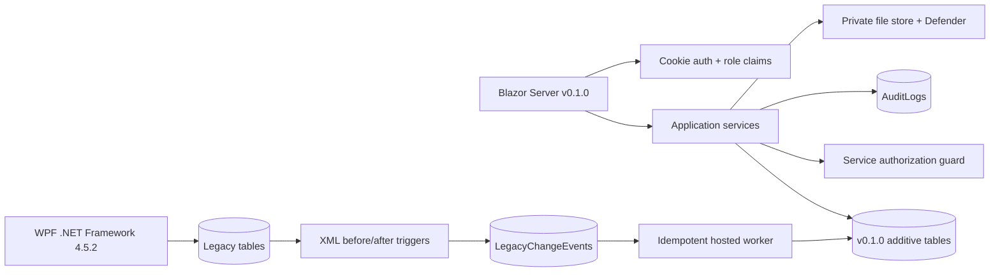
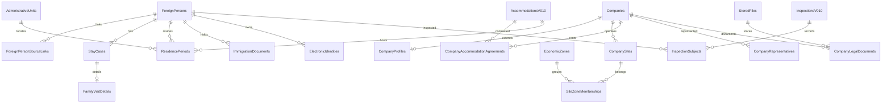

# BÁO CÁO KIỂM TRA PHẦN MỀM IRM v0.1.0
## Đánh giá triển khai theo 9 yêu cầu khách hàng & cải tiến UX

**Ngày kiểm tra:** 17/08/2026  
**Người kiểm tra:** Nhóm phát triển  
**Phiên bản:** IRM v0.1.0  
**Verdict tổng thể:** ✅ **ĐẠT yêu cầu kỹ thuật cho DEMO/STAGING** — ⏳ chờ UAT khách hàng cho PRODUCTION

---

## 1. Tổng quan dự án

IRM (Immigration Report Manager) v0.1.0 là bản nâng cấp lớn từ hệ thống WPF legacy, bổ sung ứng dụng web Blazor Server chạy song song với WPF mà không phá vỡ schema cũ. Hệ thống sử dụng mô hình **additive migration**: 13 bảng legacy được giữ nguyên, thêm 24 bảng mới tạo tổng cộng 43 bảng.

### Kiến trúc hệ thống

### Quy mô source code

| Thành phần | Số file | Mô tả |
|---|---:|---|
| Data Models | 20 files | Entity classes cho 43 bảng |
| Services | 23 files | Business logic, import/export, auth, statistics |
| Pages (Blazor) | 16 pages | UI trang web đầy đủ |
| Tests | 4 files | 17 xUnit tests |
| SQL Migrations | 12 scripts | Schema DDL, triggers, backfill, smoke tests |
| Deploy Scripts | 15+ files | PowerShell, Python, Dockerfile |

---

## 2. Đánh giá chi tiết từng yêu cầu khách hàng

### YÊU CẦU 1: Quản lý người nước ngoài thăm thân ✅ HOÀN THÀNH

**Yêu cầu:** Bổ sung mục người nước ngoài thăm thân với thông tin chi tiết về người nước ngoài và thân nhân (công dân VN, người gốc VN, người VN định cư ở nước ngoài).

**Bằng chứng triển khai:**

| Thành phần | File | Nội dung |
|---|---|---|
| Model thân nhân | [`FamilyVisitDetail`](file:///d:/dự án/Dự án outsource/NNN/immigration-reportmanager-master/IRM/Data/Models/V010Models.cs#L97-L109) | `RelativeName`, `RelativeIdNumber`, `RelativePhone`, `RelativeAddress`, `Relationship`, `RelativeTypeCode`, `RelativeNationalityCode` |
| Phân loại thân nhân | [`FamilyVisitDetail.RelativeTypeCode`](file:///d:/dự án/Dự án outsource/NNN/immigration-reportmanager-master/IRM/Data/Models/V010Models.cs#L105) | `VIETNAMESE_CITIZEN`, `VIETNAMESE_ORIGIN`, `OVERSEAS_VIETNAMESE` |
| Service | [`FamilyVisitorService`](file:///d:/dự án/Dự án outsource/NNN/immigration-reportmanager-master/IRM/Services/FamilyVisitorService.cs) | 327 dòng — CRUD, backfill legacy, overlap validation |
| UI | [`FamilyVisitors.razor`](file:///d:/dự án/Dự án outsource/NNN/immigration-reportmanager-master/IRM/Components/Pages/FamilyVisitors.razor) | Trang `/family-visitors` — form đầy đủ, thống kê mini-cards |
| Hồ sơ hợp nhất | [`ForeignPersons`](file:///d:/dự án/Dự án outsource/NNN/immigration-reportmanager-master/IRM/Data/Models/V010Models.cs#L42-L62) | Identity trung tâm, passport hash SHA-256 |
| Liên kết sponsor | [`StayCase.SponsorCompanyId`](file:///d:/dự án/Dự án outsource/NNN/immigration-reportmanager-master/IRM/Data/Models/V010Models.cs#L84) | Thân nhân lao động → liên kết qua sponsor company |
| Test | [`FamilyVisit_SaveAndOverlapValidation`](file:///d:/dự án/Dự án outsource/NNN/immigration-reportmanager-master/IRM.Tests/RegistryAndStatisticsTests.cs#L14-L33) | Kiểm tra overlap diện cư trú |

> [!TIP]
> UI hiển thị mini-cards thống kê: tổng người thăm thân, số thân nhân công dân VN, gốc VN, VN định cư nước ngoài.

---

### YÊU CẦU 2: Danh mục cơ sở lưu trú & hợp đồng thuê ✅ HOÀN THÀNH

**Yêu cầu:** Bổ sung danh mục CSLT, địa chỉ tạm trú, phân biệt tự thuê/công ty thuê, theo dõi CSLT nào do DN nào thuê.

**Bằng chứng triển khai:**

| Thành phần | File | Nội dung |
|---|---|---|
| Model CSLT | [`Accommodation`](file:///d:/dự án/Dự án outsource/NNN/immigration-reportmanager-master/IRM/Data/Models/V010Models.cs#L255-L263) | `Name`, `TypeCode`, `AddressLine`, `Capacity`, `AdministrativeUnitId` |
| Hợp đồng thuê | [`CompanyAccommodationAgreement`](file:///d:/dự án/Dự án outsource/NNN/immigration-reportmanager-master/IRM/Data/Models/V010Models.cs#L217-L230) | `ScopeCode` (WHOLE_PROPERTY/căn/phòng), `ValidFrom/To` |
| Lịch sử nơi ở | [`ResidencePeriod`](file:///d:/dự án/Dự án outsource/NNN/immigration-reportmanager-master/IRM/Data/Models/V010Models.cs#L127-L145) | `ArrangementCode` (SELF_RENTED/COMPANY_ARRANGED/SOCIAL_HOUSING/COMPANY_HOUSING) |
| Service | [`AccommodationService`](file:///d:/dự án/Dự án outsource/NNN/immigration-reportmanager-master/IRM/Services/AccommodationService.cs) | Search, CRUD, filter theo DN, soft delete |
| UI | [`Accommodations.razor`](file:///d:/dự án/Dự án outsource/NNN/immigration-reportmanager-master/IRM/Components/Pages/Accommodations.razor) | Trang `/accommodations` — 20KB UI |

> [!IMPORTANT]
> Hệ thống cho phép:
> - Một CSLT được nhiều doanh nghiệp thuê cùng lúc (many-to-many qua `CompanyAccommodationAgreements`)
> - Phân loại phạm vi thuê: toàn bộ, căn hộ, phòng
> - Lưu địa chỉ ngoài Quảng Ninh (dạng text tự do) phục vụ trường hợp lao động tạm trú ở Hải Phòng
> - Thống kê CSLT → DN → NNN để loại trừ khi kiểm tra

---

### YÊU CẦU 3: Quản lý kiểm tra hiện trường ✅ HOÀN THÀNH

**Yêu cầu:** Ghi nhận kết quả kiểm tra NNN (diện gì, giấy tờ gì, làm việc với ai, ở đâu), theo dõi lịch sử kiểm tra để loại trừ cho lần sau.

**Bằng chứng triển khai:**

| Thành phần | File | Nội dung |
|---|---|---|
| Model kiểm tra | [`InspectionsV010`](file:///d:/dự án/Dự án outsource/NNN/immigration-reportmanager-master/IRM/Data/Models/Inspection.cs) | `InspectedAt`, `LocationText`, `InspectorNames`, `TypeCode` |
| Snapshot đối tượng | [`InspectionSubject`](file:///d:/dự án/Dự án outsource/NNN/immigration-reportmanager-master/IRM/Data/Models/Inspection.cs) | `PurposeCodeSnapshot`, `DocumentsSnapshot`, `WorkDescriptionSnapshot`, `AddressSnapshot`, `ResultCode`, `ViolationDetails`, `ActionTaken` |
| Lookback loại trừ | [`GetCheckedPersonIdsAsync`](file:///d:/dự án/Dự án outsource/NNN/immigration-reportmanager-master/IRM/Services/InspectionService.cs#L69-L78) | Truy vấn người đã kiểm tra trong khoảng thời gian để loại trừ |
| Service | [`InspectionService`](file:///d:/dự án/Dự án outsource/NNN/immigration-reportmanager-master/IRM/Services/InspectionService.cs) | 80 dòng — search, save, add subject, lookback |
| UI | [`Inspections.razor`](file:///d:/dự án/Dự án outsource/NNN/immigration-reportmanager-master/IRM/Components/Pages/Inspections.razor) | Trang `/inspections` — 458 dòng UI |
| Test | [`InspectionLookback_OnlyReturnsChosenWindow`](file:///d:/dự án/Dự án outsource/NNN/immigration-reportmanager-master/IRM.Tests/RegistryAndStatisticsTests.cs#L53-L66) | Kiểm tra lookback chỉ trả đúng khoảng thời gian chọn |

> [!TIP]
> Snapshot snapshot giữ nguyên trạng thái tại thời điểm kiểm tra (diện cư trú, giấy tờ, công việc, địa chỉ). Khi hồ sơ được cập nhật sau này, báo cáo lịch sử không bị thay đổi.

---

### YÊU CẦU 4: Người NNN nhập cảnh miễn thị thực qua cửa khẩu ⏳ PHASE 2

**Yêu cầu:** Theo dõi NNN nhập cảnh miễn thị thực vào khu kinh tế cửa khẩu (tạm trú ≤15 ngày), qua lại biên giới thường xuyên.

**Trạng thái:** Foundation đã xây dựng, module đầy đủ chuyển sang Phase 2.

| Đã có | Chưa có |
|---|---|
| Mã diện `BORDER_VISA_EXEMPT` trong [`StayPurposeCodes`](file:///d:/dự án/Dự án outsource/NNN/immigration-reportmanager-master/IRM/Data/Models/V010Models.cs#L9) | Bảng `BorderGates` |
| Identity/temporal foundation | Bảng `BorderMovements` |
| Blueprint 3 bảng trong [báo cáo mục 11](file:///d:/dự án/Dự án outsource/NNN/immigration-reportmanager-master/docs/IRM-v0.1.0-implementation-report.md#L172-L180) | Bảng `BorderStayEpisodes` |
| Kiến trúc `EconomicZones` hỗ trợ KKT cửa khẩu | Trang UI cửa khẩu |
| | Cảnh báo vượt quá 15 ngày |

> [!WARNING]
> **ADR-007:** Quyết định chuyển Phase 2 để tránh tạo module nửa vời. Cần xác nhận nguồn dữ liệu xuất/nhập cảnh và quy tắc pháp lý trước khi triển khai.

---

### YÊU CẦU 5: Tra cứu và thống kê theo khoảng thời gian quá khứ ✅ HOÀN THÀNH

**Yêu cầu:** Dữ liệu cho phép tra cứu, thống kê trong khoảng thời gian nhất định trong quá khứ.

**Bằng chứng triển khai:**

| Thành phần | File | Nội dung |
|---|---|---|
| Filter temporal | [`TemporalReportFilter`](file:///d:/dự án/Dự án outsource/NNN/immigration-reportmanager-master/IRM/Services/V010Contracts.cs#L15-L34) | `AsOfDate`, `From/To`, validation chống mix mode |
| As-of queries | [`StatisticsService.CurrentPrimaryCases(at)`](file:///d:/dự án/Dự án outsource/NNN/immigration-reportmanager-master/IRM/Services/StatisticsService.cs#L125-L128) | Filter `ValidFrom <= at && (!ValidTo || ValidTo >= at)` |
| Effective dating | Mọi entity v0.1.0 | `ValidFrom/ValidTo` trên diện cư trú, nơi ở, giấy tờ, định danh, site, zone, đại diện, hợp đồng |
| UI | [`Statistics.razor`](file:///d:/dự án/Dự án outsource/NNN/immigration-reportmanager-master/IRM/Components/Pages/Statistics.razor#L57) | DatePicker "Trạng thái tại ngày (AsOfDate)" |
| Test | [`TemporalFilter_RejectsMixedModesAndReverseRange`](file:///d:/dự án/Dự án outsource/NNN/immigration-reportmanager-master/IRM.Tests/SecurityAndMigrationTests.cs#L19-L24) | Validation filter |
| Test | [`TerritoryStatistics_CountsDistinctPeople_AtAsOfDate`](file:///d:/dự án/Dự án outsource/NNN/immigration-reportmanager-master/IRM.Tests/RegistryAndStatisticsTests.cs#L36-L51) | Đếm distinct tại mốc thời gian |

---

### YÊU CẦU 6: Số định danh điện tử & thống kê giấy tờ ✅ HOÀN THÀNH

**Yêu cầu:** Bổ sung số định danh điện tử, số thị thực/gia hạn/thẻ. Thống kê bao nhiêu đã/chưa được cấp định danh.

**Bằng chứng triển khai:**

| Thành phần | File | Nội dung |
|---|---|---|
| Model định danh | [`ElectronicIdentity`](file:///d:/dự án/Dự án outsource/NNN/immigration-reportmanager-master/IRM/Data/Models/V010Models.cs#L163-L175) | `IdentityNumber`, `IdentitySearchKey` (hash), `ValidFrom/To`, `StatusCode` |
| Model giấy tờ | [`ImmigrationDocument`](file:///d:/dự án/Dự án outsource/NNN/immigration-reportmanager-master/IRM/Data/Models/V010Models.cs#L147-L161) | `TypeCode` (VISA/VISA_EXTENSION/TEMPORARY_RESIDENCE_CARD/VISA_EXEMPTION), `Number`, `ValidFrom/To` |
| Thống kê | [`GetDocumentIdentityStatisticsAsync`](file:///d:/dự án/Dự án outsource/NNN/immigration-reportmanager-master/IRM/Services/StatisticsService.cs#L106-L123) | `DocumentsByType`, `WithElectronicIdentity`, `WithoutElectronicIdentity` |
| DTO | [`DocumentIdentityStatistics`](file:///d:/dự án/Dự án outsource/NNN/immigration-reportmanager-master/IRM/Services/V010Contracts.cs#L187-L192) | Kết quả thống kê |
| Import mở rộng | [`ImportService`](file:///d:/dự án/Dự án outsource/NNN/immigration-reportmanager-master/IRM/Services/ImportService.cs) | Import Excel ánh xạ nhiều giấy tờ phân cách `;` |
| Test | [`Import_ExtendedFieldsCreateUnifiedHistoryAndRollbackCleanly`](file:///d:/dự án/Dự án outsource/NNN/immigration-reportmanager-master/IRM.Tests/SecurityAndMigrationTests.cs#L77-L106) | Import 2 documents (VISA + TRC) từ 1 dòng Excel |

---

### YÊU CẦU 7: Thống kê theo KCN/KKT/cụm công nghiệp & loại hình DN ✅ HOÀN THÀNH

**Yêu cầu:** Thống kê theo từng khu vực (KCN, KKT cửa khẩu, KKT ven biển, cụm CN) và loại hình DN (FDI/trong nước).

**Bằng chứng triển khai:**

| Thành phần | File | Nội dung |
|---|---|---|
| Model khu vực | [`EconomicZone`](file:///d:/dự án/Dự án outsource/NNN/immigration-reportmanager-master/IRM/Data/Models/EconomicZone.cs) | `TypeCode` phân loại KCN/KKT/cụm CN |
| Many-to-many | [`SiteZoneMembership`](file:///d:/dự án/Dự án outsource/NNN/immigration-reportmanager-master/IRM/Data/Models/V010Models.cs#L205-L215) | DN thuộc nhiều khu, có hiệu lực thời gian |
| Loại hình DN | [`CompanyProfile.OwnershipTypeCode`](file:///d:/dự án/Dự án outsource/NNN/immigration-reportmanager-master/IRM/Data/Models/V010Models.cs#L180) | `FDI` / `DOMESTIC` |
| Thống kê zone | [`GetZoneStatisticsAsync`](file:///d:/dự án/Dự án outsource/NNN/immigration-reportmanager-master/IRM/Services/StatisticsService.cs#L82-L104) | Số DN, số NNN theo từng khu |
| Filter | [`TemporalReportFilter.EconomicZoneId`](file:///d:/dự án/Dự án outsource/NNN/immigration-reportmanager-master/IRM/Services/V010Contracts.cs#L22) | Filter thống kê theo zone |
| Filter | [`TemporalReportFilter.CompanyOwnershipTypeCode`](file:///d:/dự án/Dự án outsource/NNN/immigration-reportmanager-master/IRM/Services/V010Contracts.cs#L23) | Filter theo FDI/trong nước |
| Service | [`CompanyProfileService.SaveSiteAsync`](file:///d:/dự án/Dự án outsource/NNN/immigration-reportmanager-master/IRM/Services/CompanyProfileService.cs#L58-L74) | Gán site vào nhiều khu, transaction |
| UI | [`CompanyProfiles.razor`](file:///d:/dự án/Dự án outsource/NNN/immigration-reportmanager-master/IRM/Components/Pages/CompanyProfiles.razor) | 23KB — quản lý hồ sơ DN mở rộng |

---

### YÊU CẦU 8: Thống kê theo địa bàn xã/phường/đặc khu ✅ HOÀN THÀNH

**Yêu cầu:** Thống kê tại một địa bàn cụ thể: bao nhiêu NNN, phân theo diện (lao động, thăm thân, du học, du lịch), danh sách CSLT & DN.

**Bằng chứng triển khai:**

| Thành phần | File | Nội dung |
|---|---|---|
| 54 đơn vị hành chính | [`DatabaseSeeder.SeedV010Async`](file:///d:/dự án/Dự án outsource/NNN/immigration-reportmanager-master/IRM/Data/DatabaseSeeder.cs) | Seed 54 xã/phường/đặc khu Quảng Ninh |
| Model địa bàn | [`AdministrativeUnit`](file:///d:/dự án/Dự án outsource/NNN/immigration-reportmanager-master/IRM/Data/Models/V010Models.cs#L111-L125) | `Code`, `Name`, `TypeCode`, `ParentId`, `PredecessorId`, `ValidFrom/To` |
| Thống kê chi tiết | [`GetTerritoryAsync`](file:///d:/dự án/Dự án outsource/NNN/immigration-reportmanager-master/IRM/Services/StatisticsService.cs#L15-L59) | `TotalForeigners`, `PeopleByPurpose`, danh sách DN, danh sách CSLT |
| Tổng quan 54 đơn vị | [`GetTerritoryOverviewAsync`](file:///d:/dự án/Dự án outsource/NNN/immigration-reportmanager-master/IRM/Services/StatisticsService.cs#L61-L80) | Overview tất cả đơn vị cùng lúc |
| DTO | [`TerritoryStatistics`](file:///d:/dự án/Dự án outsource/NNN/immigration-reportmanager-master/IRM/Services/V010Contracts.cs#L140-L149) | Bao gồm `Companies[]`, `Accommodations[]` |
| Export Excel | [`StatisticsExportService`](file:///d:/dự án/Dự án outsource/NNN/immigration-reportmanager-master/IRM/Services/StatisticsExportService.cs) | Export báo cáo với formula injection protection |
| UI | [`Statistics.razor`](file:///d:/dự án/Dự án outsource/NNN/immigration-reportmanager-master/IRM/Components/Pages/Statistics.razor) | 364 dòng — filter, mini-cards, territory detail, overview table |
| Test | [`SeedV010_IsIdempotentAndContains54Units`](file:///d:/dự án/Dự án outsource/NNN/immigration-reportmanager-master/IRM.Tests/SecurityAndMigrationTests.cs#L59-L65) | 54 đơn vị, idempotent |

> [!NOTE]
> Tổng NNN sử dụng `COUNT(DISTINCT ForeignPersonId)` — không đếm trùng giữa các diện.

---

### YÊU CẦU 9: Tài liệu pháp nhân doanh nghiệp & người đại diện ✅ HOÀN THÀNH

**Yêu cầu:** Bổ sung tài liệu pháp nhân DN, ai là người đại diện theo pháp luật.

**Bằng chứng triển khai:**

| Thành phần | File | Nội dung |
|---|---|---|
| Đại diện pháp luật | [`CompanyRepresentative`](file:///d:/dự án/Dự án outsource/NNN/immigration-reportmanager-master/IRM/Data/Models/V010Models.cs#L232-L243) | `FullName`, `Title`, `IdNumber`, `Phone`, `ValidFrom/To` (lịch sử) |
| Hồ sơ pháp nhân | [`CompanyLegalDocument`](file:///d:/dự án/Dự án outsource/NNN/immigration-reportmanager-master/IRM/Data/Models/V010Models.cs#L259-L276) | `TypeCode`, `DocumentNumber`, `IssueDate`, `ExpiryDate`, `StoredFileId` |
| File upload | [`StoredFile`](file:///d:/dự án/Dự án outsource/NNN/immigration-reportmanager-master/IRM/Data/Models/V010Models.cs#L245-L257) | GUID name, SHA-256, malware scan status, ngoài webroot |
| Service upload | [`LegalDocumentService`](file:///d:/dự án/Dự án outsource/NNN/immigration-reportmanager-master/IRM/Services/LegalDocumentService.cs) | 140 dòng — MIME/extension whitelist, magic bytes, 10MB limit, Windows Defender scan |
| Service DN | [`CompanyProfileService.SaveRepresentativeAsync`](file:///d:/dự án/Dự án outsource/NNN/immigration-reportmanager-master/IRM/Services/CompanyProfileService.cs#L76-L84) | CRUD đại diện pháp luật |
| Aggregate | [`CompanyProfileAggregate`](file:///d:/dự án/Dự án outsource/NNN/immigration-reportmanager-master/IRM/Services/V010Contracts.cs#L100-L109) | Gộp: Company, Profile, Sites, Agreements, Representatives, LegalDocuments |
| Test MIME | [`LegalFileValidation_RejectsMimeMismatchAndBadSignature`](file:///d:/dự án/Dự án outsource/NNN/immigration-reportmanager-master/IRM.Tests/SecurityAndMigrationTests.cs#L67-L74) | Chặn file giả mạo |
| Test malware | [`LegalFile_MalwareFailureRemovesTemporaryFile`](file:///d:/dự án/Dự án outsource/NNN/immigration-reportmanager-master/IRM.Tests/SecurityAndMigrationTests.cs#L109-L125) | Xóa file khi scan thất bại |

---

## 3. Bảng tổng kết trạng thái

| # | Yêu cầu | Trạng thái | Mức độ hoàn thành |
|---:|---|:---:|---:|
| 1 | Người NNN thăm thân | ✅ | 100% |
| 2 | CSLT & hợp đồng thuê | ✅ | 100% |
| 3 | Kiểm tra hiện trường | ✅ | 100% |
| 4 | NNN miễn thị thực cửa khẩu | ⏳ | Foundation ~30% |
| 5 | Tra cứu/thống kê quá khứ | ✅ | 100% |
| 6 | Định danh điện tử & giấy tờ | ✅ | 100% |
| 7 | Thống kê KCN/KKT/cụm CN | ✅ | 100% |
| 8 | Thống kê theo địa bàn | ✅ | 100% |
| 9 | Pháp nhân DN & đại diện | ✅ | 100% |

**Kết quả:** 8/9 yêu cầu hoàn thành đầy đủ. Yêu cầu 4 có foundation và blueprint, chuyển Phase 2 theo ADR-007.

---

## 4. Cải tiến UX tự phát triển

### 4.1 Hệ thống trang web

| Trang | Route | Chức năng |
|---|---|---|
| Dashboard | `/` | Tổng quan thống kê, biểu đồ |
| Hồ sơ NNN hợp nhất | `/foreign-persons` | Quản lý identity trung tâm |
| Người thăm thân | `/family-visitors` | CRUD thăm thân với mini-cards thống kê |
| Cơ sở lưu trú | `/accommodations` | Quản lý CSLT, hợp đồng thuê |
| Kiểm tra | `/inspections` | Đợt kiểm tra, snapshot, lookback |
| Thống kê | `/statistics` | 54 địa bàn, as-of, export Excel |
| Hồ sơ DN mở rộng | `/companies` → `/company-profiles` | Profile, sites, zones, đại diện, pháp nhân |
| Lao động | `/employees` | Legacy + v0.1.0 extensions |
| Du học sinh | `/students` | Legacy + v0.1.0 extensions |
| Import | `/import` | Excel import với preview, extended fields |
| Báo cáo | `/reports` | Export reports |
| Tìm kiếm | `/search` | Tìm kiếm nâng cao |
| Quản trị | `/admin` | Tài khoản, phân quyền RBAC |
| Đăng nhập | `/login` | Cookie auth, hash upgrade |

### 4.2 Cải tiến bảo mật

- **Cookie auth** HttpOnly, SameSite Strict, timeout 8h, HTTPS redirect
- **Brute force protection**: 5 lần sai → khóa 15 phút
- **RBAC 5 roles**: Admin, DataEditor, Inspector, Reporter, Viewer
- **Password hash upgrade** tự động khi đăng nhập web lần đầu
- **Formula injection protection** cho export Excel
- **File upload security**: MIME/extension whitelist, magic bytes, 10MB, GUID name, SHA-256, Windows Defender scan

### 4.3 Cải tiến dữ liệu

- **Identity trung tâm** `ForeignPersons` — tránh đếm trùng Employee/Student/thăm thân
- **Effective dating** trên tất cả entity — hỗ trợ báo cáo quá khứ
- **Soft delete** thay vì xóa vật lý
- **Audit logging** mọi thao tác CRUD/import/export/login
- **Legacy sync** qua trigger XML → outbox worker → idempotent upsert

---

## 5. Kết quả kiểm tra kỹ thuật

| Hạng mục | Kết quả | Ghi chú |
|---|:---:|---|
| Build web (0 warning/0 error) | ✅ PASS | `dotnet build IRM/IRM.csproj` |
| 17 xUnit tests | ✅ PASS | `dotnet test IRM.Tests/IRM.Tests.csproj` |
| SQLite demo startup | ✅ PASS | Login 200, nhãn v0.1.0 |
| SQL Server migration (2 lần) | ✅ PASS | Schema additive, idempotent |
| Backfill legacy (2 lần) | ✅ PASS | Employee/Student → ForeignPersons |
| WPF SQL compatibility smoke | ✅ PASS | 5 loại insert + trigger rollback |
| Seed 54 đơn vị hành chính | ✅ PASS | Idempotent |
| Demo/staging deployment | ✅ PASS | HTTPS smoke, restart persistence |
| WPF binary build | ⚠️ BLOCKED | Thiếu .NET Framework 4.5.2 Developer Pack |
| Manual browser UAT | ⏳ NOT RUN | Cần người dùng nghiệp vụ |
| Production database | ⏳ NOT RUN | Chưa có backup khách hàng |

---

## 6. Cấu trúc database v0.1.0

**Tổng:** 43 bảng (13 legacy + 6 mở rộng trước v0.1.0 + 24 bảng v0.1.0)

---

## 7. Các hạn chế & điều kiện phát hành Production

> [!CAUTION]
> Verdict hiện tại: **APPROVED FOR DEMO/STAGING ONLY — NOT APPROVED FOR PRODUCTION**

### Production gate còn lại:

1. ⬜ Cài .NET Framework 4.5.2 Developer Pack → build và smoke test WPF
2. ⬜ Chạy preflight read-only trên database khách hàng
3. ⬜ Có phê duyệt riêng mới backup/verify/restore database
4. ⬜ Chạy migration scripts trên bản restore → đối soát row-count
5. ⬜ UAT yêu cầu 1–3, 5–9 với dữ liệu thực
6. ⬜ Ký biên bản go-live/rollback
7. ⬜ Xác nhận yêu cầu 4 với nguồn dữ liệu cửa khẩu

### Dữ liệu cần khách hàng xác minh:
- 54 mã địa bàn nội bộ và đơn vị tiền nhiệm
- Danh mục KCN/KKT/cụm công nghiệp
- Hồ sơ thiếu hộ chiếu hoặc trùng lặp
- Quan hệ thân nhân legacy
- Template Excel import

---

## 8. Kết luận

IRM v0.1.0 **đáp ứng đầy đủ 8/9 yêu cầu** của khách hàng trong môi trường development/staging. Yêu cầu 4 (NNN miễn thị thực cửa khẩu) có foundation kỹ thuật và blueprint chi tiết, chuyển Phase 2 theo quyết định kỹ thuật ADR-007 để đảm bảo chất lượng.

Hệ thống đã được cải tiến UX đáng kể: 16 trang web, RBAC 5 roles, effective dating toàn bộ, identity trung tâm chống đếm trùng, audit logging, file upload bảo mật, export Excel an toàn, và deployment demo/staging hoạt động ổn định.

**Đề xuất tiếp theo:** Tiến hành UAT với dữ liệu thực của khách hàng để chuyển từ DEMO/STAGING sang PRODUCTION.
