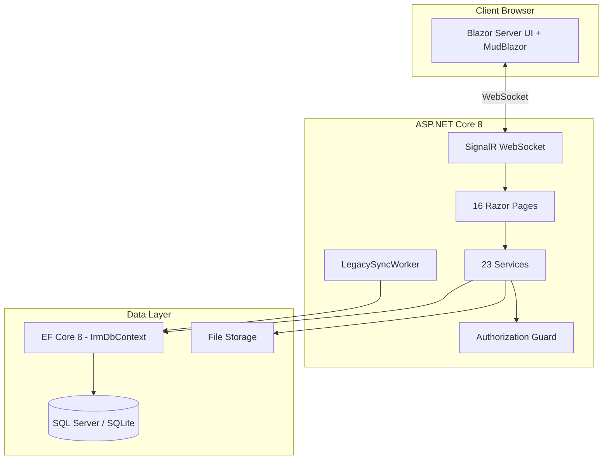

# IRM — Immigration Report Manager

> Hệ thống quản lý người nước ngoài trên địa bàn tỉnh/thành phố. Blazor Server + EF Core 8 + SQL Server/SQLite.

## Mục lục

- [Tổng quan](#tổng-quan)
- [Kiến trúc](#kiến-trúc)
- [Cấu trúc Dự án](#cấu-trúc-dự-án)
- [Hướng dẫn Chạy](#hướng-dẫn-chạy)
- [Tài liệu Features](#tài-liệu-features)
- [Tech Stack](#tech-stack)
- [Hệ thống Phân quyền](#hệ-thống-phân-quyền)

---

## Tổng quan

IRM (Immigration Report Manager) là ứng dụng web quản lý thông tin người nước ngoài (lao động, du học sinh, thăm thân, du lịch) trên địa bàn tỉnh/thành phố. Hệ thống kế thừa database từ phần mềm desktop WPF cũ và mở rộng schema v0.1.0 cho mô hình dữ liệu hợp nhất.

### Tính năng chính

- 📊 **Dashboard** — KPI tổng quan, biểu đồ quốc tịch/GPLĐ, cảnh báo hết hạn
- 🏢 **Quản lý Công ty** — CRUD legacy + hồ sơ mở rộng (chi nhánh, KCN, đại diện, pháp lý)
- 👷 **Quản lý Lao động** — CRUD + kiểm tra trùng + archive hết hạn + mô hình ForeignPerson hợp nhất
- 🎓 **Quản lý Du học sinh** — CRUD + cảnh báo visa
- 👨‍👩‍👧 **Quản lý Thăm thân** — Hồ sơ diện thăm thân, thân nhân, bảo lãnh
- 📥 **Import Excel** — Wizard 4 bước: upload → ghép cột → xem trước → import (có rollback)
- 📤 **Export Excel** — Xuất báo cáo công ty, lao động, du học sinh
- 🔍 **Tìm kiếm toàn cục** — Cross-entity search (NLĐ, công ty, du học sinh)
- 📈 **Thống kê địa bàn** — Báo cáo theo xã/phường, KCN, giấy tờ, temporal (as-of date)
- 🏠 **Quản lý Lưu trú** — CSLT, hợp đồng thuê, lịch sử cư trú
- 🔎 **Kiểm tra** — Đợt kiểm tra, đối tượng, snapshot kết quả, lookback
- 📎 **Hồ sơ pháp lý** — Upload file (PDF/PNG/JPEG), malware scan, SHA256
- 🔄 **Đồng bộ Legacy** — Background worker poll trigger events từ WPF
- ⚙️ **Quản trị** — Tài khoản, phân quyền RBAC, danh mục, nhật ký

---

## Kiến trúc



### Pattern chính

| Pattern | Mô tả |
|---|---|
| **Blazor Server** | UI render server-side, giao tiếp qua SignalR WebSocket |
| **Service Layer** | Mỗi module có 1+ service class, inject qua DI |
| **Soft Delete** | Legacy: `Delete_flag`/`Hidden_flag`, v0.1.0: `IsDeleted` |
| **Temporal Data** | `ValidFrom`/`ValidTo` cho entities có hiệu lực thời gian |
| **Dual Schema** | Legacy tables (WPF) + V0.1.0 tables (Code First) cùng tồn tại |
| **Guard Pattern** | `IServiceAuthorizationGuard` kiểm tra role ở service layer |

---

## Cấu trúc Dự án

```
immigration-reportmanager-master/
├── IRM/                            # Project chính
│   ├── Program.cs                  # Entry point, DI, Auth, DB config
│   ├── IRM.csproj                  # Dependencies
│   ├── Components/
│   │   ├── Layout/                 # MainLayout, NavMenu
│   │   └── Pages/                  # 16 Blazor pages
│   │       ├── Home.razor          # Dashboard
│   │       ├── Companies.razor     # Quản lý công ty
│   │       ├── Employees.razor     # Quản lý lao động
│   │       ├── Students.razor      # Quản lý du học sinh
│   │       ├── Import.razor        # Import Excel
│   │       ├── Search.razor        # Tìm kiếm toàn cục
│   │       ├── Reports.razor       # Báo cáo
│   │       ├── Admin.razor         # Quản trị
│   │       ├── Login.razor         # Đăng nhập
│   │       ├── ForeignPersons.razor    # NNN v0.1.0
│   │       ├── FamilyVisitors.razor    # Thăm thân
│   │       ├── Accommodations.razor    # Lưu trú
│   │       ├── CompanyProfiles.razor   # Hồ sơ DN
│   │       ├── Inspections.razor       # Kiểm tra
│   │       └── Statistics.razor        # Thống kê
│   ├── Data/
│   │   ├── IrmDbContext.cs         # 19+ DbSets, Fluent API
│   │   ├── DatabaseSeeder.cs       # Seed data (SQLite dev)
│   │   └── Models/                 # 14 model files
│   │       ├── Company.cs          # Công ty + Field + Tracker
│   │       ├── Employee.cs         # Lao động
│   │       ├── Student.cs          # Du học sinh
│   │       ├── Account.cs          # Tài khoản
│   │       ├── V010Models.cs       # 20+ entities v0.1.0
│   │       ├── ImportModels.cs     # DTOs import
│   │       └── ...
│   ├── Services/                   # 23 service files
│   │   ├── ImportService.cs        # Import Excel (958 lines)
│   │   ├── ExportService.cs        # Export Excel (471 lines)
│   │   ├── FamilyVisitorService.cs # ForeignerRegistry (327 lines)
│   │   ├── StatisticsService.cs    # Thống kê (130 lines)
│   │   └── ...
│   └── wwwroot/                    # Static files
├── docs/features/                  # Tài liệu chi tiết từng module
│   ├── dashboard/README.md
│   ├── companies/README.md
│   ├── employees/README.md
│   ├── students/README.md
│   ├── import-export/README.md
│   ├── search/README.md
│   ├── reports/README.md
│   ├── admin/README.md
│   ├── family-visitors/README.md
│   ├── accommodations/README.md
│   ├── inspections/README.md
│   ├── statistics/README.md
│   ├── legacy-sync/README.md
│   ├── legal-documents/README.md
│   ├── database/README.md
│   └── deployment/README.md
└── IRM.sln
```

---

## Hướng dẫn Chạy

### Development (SQLite — không cần SQL Server)

```bash
cd IRM
set IRM_USE_SQLITE=true
dotnet run
# → http://localhost:5000
# Login: admin / admin
```

### Production (SQL Server)

Xem chi tiết: [`docs/features/deployment/README.md`](docs/features/deployment/README.md)

---

## Tài liệu Features

Mỗi module có README chi tiết bao gồm: tổng quan, kiến trúc, database schema, service interface, ràng buộc nghiệp vụ, hướng dẫn test, và hướng dẫn mở rộng.

| # | Module | File | Mô tả |
|---|---|---|---|
| 1 | [Dashboard & KPI](docs/features/dashboard/README.md) | DashboardService | KPI cards, biểu đồ, cảnh báo hết hạn |
| 2 | [Quản lý Công ty](docs/features/companies/README.md) | CompanyService, CompanyProfileService | Legacy + hồ sơ mở rộng |
| 3 | [Quản lý Lao động](docs/features/employees/README.md) | EmployeeService, FamilyVisitorService | CRUD + archive + ForeignPerson model |
| 4 | [Quản lý Du học sinh](docs/features/students/README.md) | StudentService | CRUD + cảnh báo visa |
| 5 | [Import/Export Excel](docs/features/import-export/README.md) | ImportService, ExportService | Wizard 4 bước, auto-map, rollback |
| 6 | [Tìm kiếm Toàn cục](docs/features/search/README.md) | SearchService | Cross-entity search |
| 7 | [Báo cáo Tùy chỉnh](docs/features/reports/README.md) | ExportService | Export Excel theo bộ lọc |
| 8 | [Quản trị Hệ thống](docs/features/admin/README.md) | AuthService, AuditService, CatalogService | Tài khoản, RBAC, danh mục, nhật ký |
| 9 | [Thăm thân](docs/features/family-visitors/README.md) | FamilyVisitorService | Diện thăm thân, thân nhân, bảo lãnh |
| 10 | [Lưu trú](docs/features/accommodations/README.md) | AccommodationService, ResidenceService | CSLT, hợp đồng, cư trú |
| 11 | [Kiểm tra](docs/features/inspections/README.md) | InspectionService | Đợt kiểm tra, đối tượng, lookback |
| 12 | [Thống kê Địa bàn](docs/features/statistics/README.md) | StatisticsService | Báo cáo temporal theo địa bàn/KCN |
| 13 | [Đồng bộ Legacy](docs/features/legacy-sync/README.md) | LegacySyncService, LegacySyncWorker | Background sync từ WPF desktop |
| 14 | [Hồ sơ Pháp lý](docs/features/legal-documents/README.md) | LegalDocumentService | Upload file, malware scan, SHA256 |
| 15 | [Database & Schema](docs/features/database/README.md) | IrmDbContext, SchemaVersionService | Dual schema, seeder, migration |
| 16 | [Deployment](docs/features/deployment/README.md) | — | IIS/Kestrel, config, monitoring |

---

## Tech Stack

| Layer | Technology |
|---|---|
| **Frontend** | Blazor Server + MudBlazor 7.x |
| **Backend** | ASP.NET Core 8 |
| **ORM** | Entity Framework Core 8 (Code First + Fluent API) |
| **Database** | SQL Server 2019+ (prod) / SQLite (dev) |
| **Excel** | ClosedXML 0.104.2 |
| **Auth** | Cookie Authentication + ASP.NET Identity PasswordHasher |
| **Transport** | SignalR WebSocket |

---

## Hệ thống Phân quyền

| Role | Quyền |
|---|---|
| `ADMIN` | Toàn quyền: CRUD tất cả + quản trị tài khoản + danh mục |
| `DATA_EDITOR` | CRUD dữ liệu nghiệp vụ (công ty, NLĐ, du học sinh, import) |
| `INSPECTOR` | Tạo/sửa đợt kiểm tra + xem dữ liệu |
| `REPORTER` | Export báo cáo + xem dữ liệu |
| `VIEWER` | Chỉ xem dữ liệu |

Chi tiết: [`docs/features/admin/README.md`](docs/features/admin/README.md)
