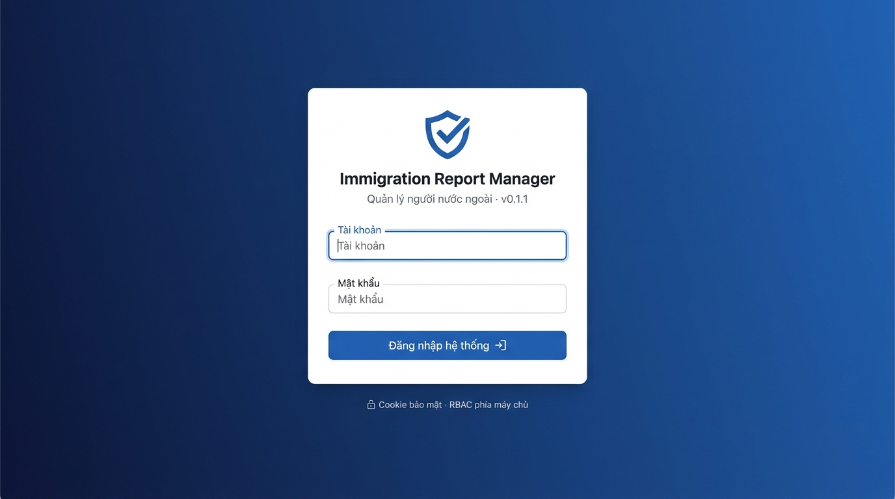
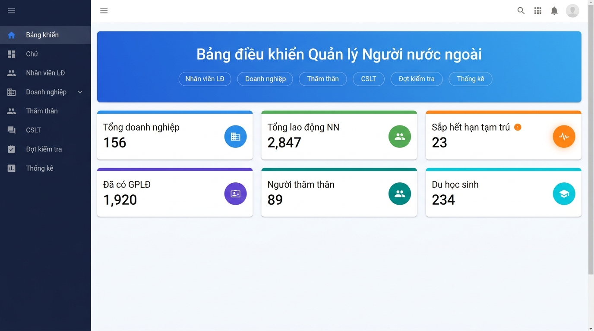
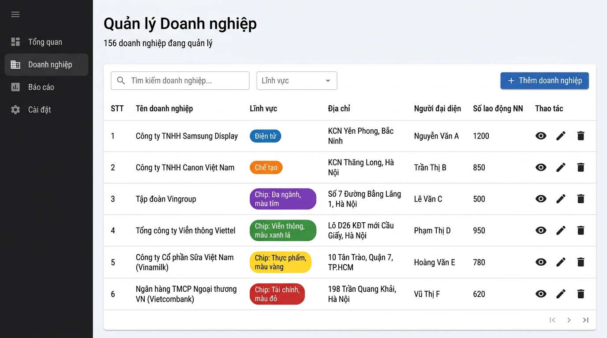
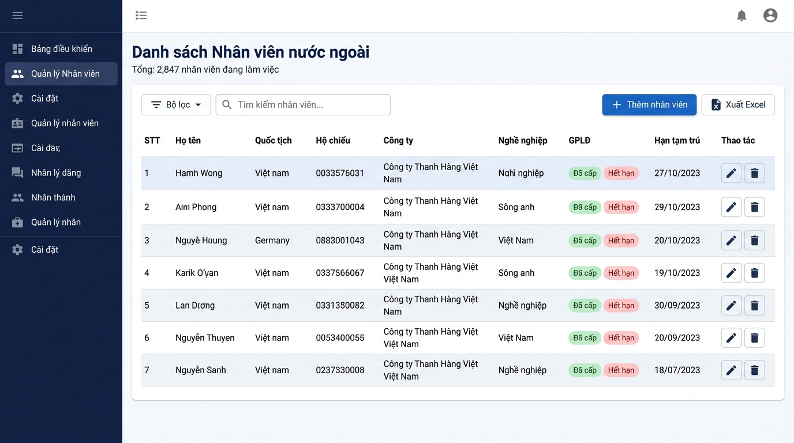
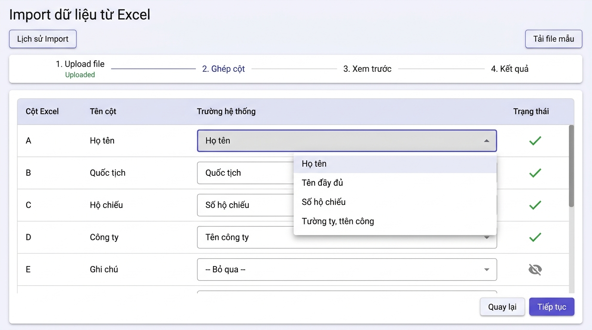
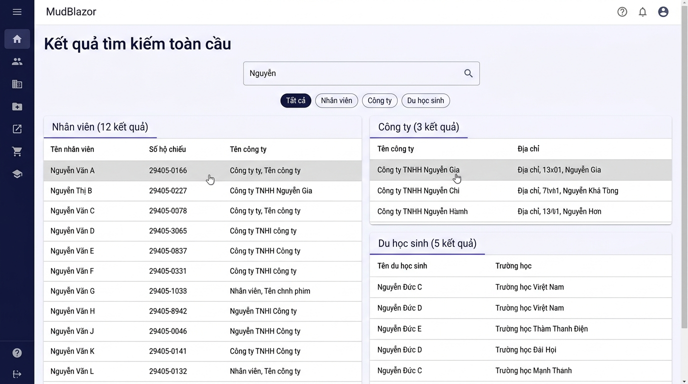
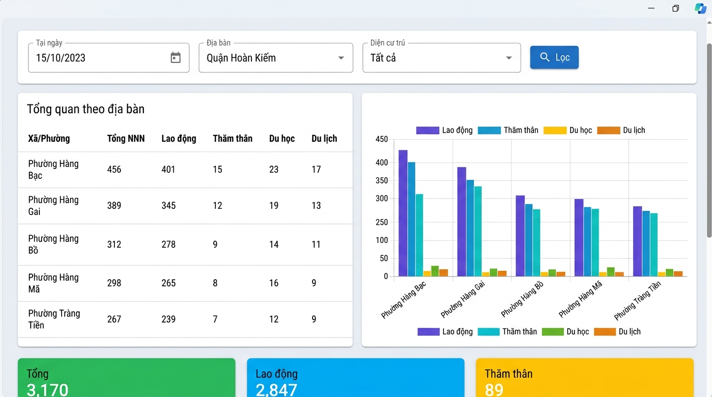
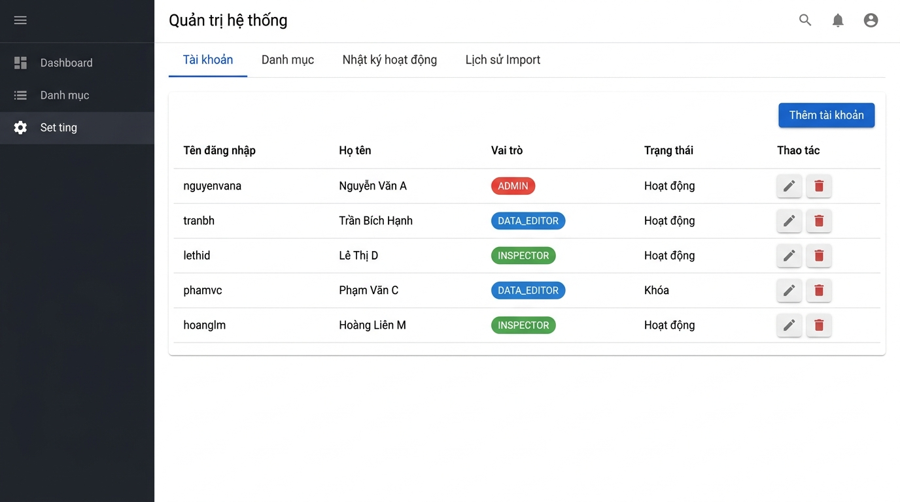

# TÀI LIỆU TẬP HUẤN SỬ DỤNG PHẦN MỀM

# 📋 HỆ THỐNG QUẢN LÝ NGƯỜI NƯỚC NGOÀI (IRM)

**Immigration Report Manager — Phiên bản v0.1.1**

---

| Thông tin | Chi tiết |
|---|---|
| **Phần mềm** | Immigration Report Manager (IRM) v0.1.1 |
| **Đối tượng** | Cán bộ quản lý xuất nhập cảnh, cán bộ nghiệp vụ |
| **Trình duyệt hỗ trợ** | Google Chrome 90+, Microsoft Edge 90+, Firefox 88+ |
| **Ngày cập nhật** | Tháng 08/2026 |

---

## MỤC LỤC

1. [Đăng nhập Hệ thống](#1-đăng-nhập-hệ-thống)
2. [Bảng điều khiển (Dashboard)](#2-bảng-điều-khiển-dashboard)
3. [Hồ sơ NNN Hợp nhất *(Mới)*](#3-hồ-sơ-nnn-hợp-nhất)
4. [Quản lý Doanh nghiệp](#4-quản-lý-doanh-nghiệp)
5. [Hồ sơ Mở rộng Doanh nghiệp (FDI/KKT)](#5-hồ-sơ-mở-rộng-doanh-nghiệp-fdikkt)
6. [Quản lý Lao động Nước ngoài](#6-quản-lý-lao-động-nước-ngoài)
7. [Quản lý Du học sinh](#7-quản-lý-du-học-sinh)
8. [Quản lý Thăm thân](#8-quản-lý-thăm-thân)
9. [Import dữ liệu từ Excel](#9-import-dữ-liệu-từ-excel)
10. [Tìm kiếm Toàn cục](#10-tìm-kiếm-toàn-cục)
11. [Báo cáo Định kỳ & Xuất Excel](#11-báo-cáo-định-kỳ--xuất-excel)
12. [Thống kê 54 Địa bàn](#12-thống-kê-54-địa-bàn)
13. [Quản lý Cơ sở Lưu trú](#13-quản-lý-cơ-sở-lưu-trú)
14. [Quản lý Đợt Kiểm tra](#14-quản-lý-đợt-kiểm-tra)
15. [Quản trị Hệ thống (Dành cho Admin)](#15-quản-trị-hệ-thống-dành-cho-admin)
16. [Phím tắt & Mẹo sử dụng](#16-phím-tắt--mẹo-sử-dụng)

---

## 1. Đăng nhập Hệ thống

### 1.1. Màn hình Đăng nhập

Khi truy cập hệ thống, bạn sẽ thấy màn hình đăng nhập như sau:

### 1.2. Các bước đăng nhập

| Bước | Thao tác |
|---|---|
| **Bước 1** | Nhập **Tài khoản** (tên đăng nhập được cấp) |
| **Bước 2** | Nhập **Mật khẩu** |
| **Bước 3** | Nhấn nút **"Đăng nhập hệ thống"** |

### 1.3. Xử lý sự cố đăng nhập

| Tình huống | Nguyên nhân | Cách khắc phục |
|---|---|---|
| Hiện thông báo *"Sai thông tin đăng nhập"* | Nhập sai tài khoản hoặc mật khẩu | Kiểm tra lại, chú ý phân biệt chữ hoa/thường |
| Hiện thông báo *"Tài khoản tạm khóa"* | Nhập sai mật khẩu 5 lần liên tiếp | Chờ **15 phút** rồi đăng nhập lại, hoặc liên hệ Admin |
| Không thể truy cập trang web | Mất kết nối mạng nội bộ | Kiểm tra kết nối mạng, liên hệ bộ phận IT |

> **⚠️ Lưu ý bảo mật:**
> - Không chia sẻ tài khoản cho người khác
> - Đăng xuất khi rời khỏi máy tính
> - Mật khẩu được mã hóa an toàn trên máy chủ

### 1.4. Đăng xuất

Nhấn vào **avatar/tên người dùng** ở góc phải trên cùng → Chọn **"Đăng xuất"**.

---

## 2. Bảng điều khiển (Dashboard)

### 2.1. Tổng quan

Sau khi đăng nhập thành công, bạn sẽ thấy **Bảng điều khiển** — trang chủ hiển thị tổng quan toàn bộ dữ liệu quản lý.

### 2.2. Các thành phần trên Dashboard

#### 🔵 Thanh truy cập nhanh (Quick Actions)

Phía trên cùng, dãy nút bấm cho phép chuyển nhanh đến từng chức năng:

| Nút | Chức năng |
|---|---|
| **Nhân viên LĐ** | Mở danh sách lao động nước ngoài |
| **Doanh nghiệp** | Mở danh sách công ty |
| **Thăm thân** | Mở quản lý thăm thân |
| **CSLT** | Mở quản lý cơ sở lưu trú |
| **Đợt kiểm tra** | Mở quản lý kiểm tra |
| **Thống kê** | Mở thống kê theo địa bàn |

#### 📊 Thẻ KPI (6 thẻ chỉ số)

| Thẻ | Ý nghĩa | Màu sắc |
|---|---|---|
| **Tổng doanh nghiệp** | Số doanh nghiệp đang quản lý | 🔵 Xanh dương |
| **Tổng lao động NN** | Số lao động nước ngoài đang làm việc | 🟢 Xanh lá |
| **Sắp hết hạn tạm trú** | NLĐ sắp hết hạn trong 30 ngày (⚠️ cảnh báo) | 🟠 Cam |
| **Đã có GPLĐ** | Đã được cấp giấy phép lao động | 🟣 Tím |
| **Người thăm thân** | Hồ sơ thân nhân đang quản lý | 🟢 Xanh ngọc |
| **Du học sinh** | Du học sinh đang học tại VN | 🔵 Lam |

> **💡 Mẹo:** Nhấn vào bất kỳ thẻ KPI nào sẽ chuyển thẳng đến danh sách chi tiết tương ứng.

#### 📈 Biểu đồ

| Biểu đồ | Nội dung |
|---|---|
| **Lao động theo quốc tịch** | Biểu đồ cột — Top quốc gia có nhiều lao động nhất |
| **Tỷ lệ GPLĐ** | Biểu đồ tròn — Phân loại theo tình trạng giấy phép |
| **Xu hướng hết hạn** | Biểu đồ đường — Dự báo số cần gia hạn 12 tháng tới |
| **Danh sách sắp hết hạn** | Danh sách 6 NLĐ sắp hết hạn gần nhất (đỏ = khẩn cấp) |

---

## 3. Hồ sơ NNN Hợp nhất

> **🆕 Tính năng mới** — Mục này quản lý **hồ sơ định danh duy nhất** cho mỗi người nước ngoài, bất kể họ là lao động, du học sinh, hay thăm thân.

### 3.1. Truy cập

Menu bên trái → **Hồ sơ NNN hợp nhất** (mục có badge "Mới").

### 3.2. Ý nghĩa

Thay vì quản lý NNN riêng lẻ theo từng diện (lao động, du học, thăm thân), trang này **gộp tất cả** thành **1 hồ sơ duy nhất** theo mã `ForeignPersonId`. Một người có thể vừa là lao động, vừa có thân nhân thăm thân — tất cả hiển thị trên 1 dòng.

### 3.3. Thẻ thống kê (4 thẻ)

| Thẻ | Ý nghĩa |
|---|---|
| 🔵 **Tổng hồ sơ** | Tổng số NNN đang quản lý |
| 🟢 **Đã cấp định danh** | Có số định danh điện tử đang hiệu lực |
| 🟡 **Chưa có định danh** | Chưa được cấp định danh điện tử |
| 🟣 **Có giấy tờ hiệu lực** | Có thị thực / thẻ tạm trú / visa còn hiệu lực |

### 3.4. Bộ lọc

| Bộ lọc | Mô tả |
|---|---|
| **Tìm kiếm** | Theo tên, số hộ chiếu, quốc tịch |
| **Trạng thái tại ngày (AsOf)** | Xem trạng thái giấy tờ tại ngày bất kỳ (mặc định: hôm nay) |

### 3.5. Cột dữ liệu

| Cột | Mô tả |
|---|---|
| **Họ và tên** | Tên NNN + mã ID hệ thống |
| **Số hộ chiếu** | Passport number |
| **Quốc tịch** | Mã quốc gia |
| **Diện cư trú hiện tại** | Chip màu: 🔵 Lao động / 🟢 Thăm thân / 🟡 Du học / 🟠 Du lịch (một người có thể có nhiều diện) |
| **Giấy tờ thị thực / thẻ** | Số giấy tờ còn hiệu lực (hover để xem chi tiết) |
| **Định danh điện tử** | Số định danh nếu đã cấp, hoặc "Chưa cấp" |

### 3.6. Thao tác trên từng hồ sơ

| Thao tác | Biểu tượng | Mô tả |
|---|---|---|
| **Thêm giấy tờ** | 📄 | Thêm visa, thẻ tạm trú, giấy phép lao động mới |
| **Cấp định danh** | 🔑 | Cấp số định danh điện tử cho NNN |

### 3.7. Thêm hồ sơ NNN mới

| Bước | Thao tác |
|---|---|
| **Bước 1** | Nhấn **"Thêm hồ sơ NNN"** |
| **Bước 2** | Nhập: Họ tên, Số hộ chiếu, Quốc tịch, Ngày sinh, Giới tính |
| **Bước 3** | Nhấn **"Lưu"** |

> **💡 Mẹo:** Khi cần tra cứu tổng hợp 1 NNN — xem họ có bao nhiêu giấy tờ, thuộc diện gì, đã cấp định danh chưa — hãy dùng trang này thay vì tìm từng danh sách riêng lẻ.

---

## 4. Quản lý Doanh nghiệp

### 4.1. Màn hình Danh sách Doanh nghiệp

Vào menu bên trái → **Doanh nghiệp**, hoặc nhấn thẻ KPI "Tổng doanh nghiệp" trên Dashboard.

### 4.2. Tìm kiếm & Lọc

| Thao tác | Cách thực hiện |
|---|---|
| **Tìm theo tên** | Gõ tên công ty vào ô tìm kiếm → kết quả lọc tức thì |
| **Lọc theo lĩnh vực** | Chọn dropdown "Lĩnh vực" → chọn ngành (Điện tử, Chế tạo, Dệt may...) |
| **Xóa bộ lọc** | Xóa nội dung ô tìm kiếm, chọn "Tất cả" ở dropdown |

### 4.3. Thêm Doanh nghiệp mới

| Bước | Thao tác |
|---|---|
| **Bước 1** | Nhấn nút **"+ Thêm doanh nghiệp"** (nút xanh góc phải) |
| **Bước 2** | Điền thông tin: Tên doanh nghiệp *(bắt buộc)*, Địa chỉ, Lĩnh vực, Người đại diện, Loại hình kinh doanh, Ghi chú |
| **Bước 3** | Nhấn **"Lưu"** để tạo mới |

### 4.4. Sửa/Xóa Doanh nghiệp

| Thao tác | Cách thực hiện |
|---|---|
| **Xem chi tiết** | Nhấn biểu tượng 👁️ (mắt) ở cột Thao tác |
| **Sửa** | Nhấn biểu tượng ✏️ (bút) → chỉnh sửa thông tin → **"Lưu"** |
| **Xóa** | Nhấn biểu tượng 🗑️ (thùng rác) → Xác nhận xóa |

> **⚠️ Lưu ý:** Doanh nghiệp không bị xóa hoàn toàn, chỉ ẩn khỏi danh sách (xóa mềm). Admin có thể khôi phục.

### 4.5. Hồ sơ mở rộng

Xem chi tiết hồ sơ pháp lý, địa điểm, KCN, người đại diện tại **Chương 5 — Hồ sơ Mở rộng Doanh nghiệp**.

---

## 5. Hồ sơ Mở rộng Doanh nghiệp (FDI/KKT)

> Trang **Hồ sơ mở rộng** (badge "FDI/KKT" trên sidebar) quản lý toàn bộ thông tin chi tiết pháp lý, địa điểm, và quan hệ của doanh nghiệp.

### 5.1. Truy cập

Menu → **Hồ sơ mở rộng** (dưới mục Doanh nghiệp, có badge **FDI/KKT**).

### 5.2. Chọn Doanh nghiệp

Đầu tiên, chọn doanh nghiệp từ dropdown → hệ thống hiển thị badge phân loại:
- **Doanh nghiệp FDI** — có vốn đầu tư nước ngoài
- **Doanh nghiệp trong nước** — doanh nghiệp nội địa

### 5.3. Hệ thống 6 Tab

Sau khi chọn DN, giao diện hiển thị **6 tab** chi tiết:

#### Tab 1: Phân loại & Pháp lý

| Trường | Mô tả |
|---|---|
| **Loại hình DN** | Trong nước / FDI |
| **Mã số thuế** | MST doanh nghiệp |
| **Số ĐKKD** | Số giấy chứng nhận đăng ký kinh doanh |

Nhấn **"Lưu thông tin phân loại"** sau khi cập nhật.

#### Tab 2: Địa điểm & Khu kinh tế

Quản lý danh sách địa điểm hoạt động của DN:

| Cột | Mô tả |
|---|---|
| **Tên địa điểm** | Tên chi nhánh / nhà xưởng |
| **Loại địa điểm** | Trụ sở chính / Chi nhánh / Nhà xưởng |
| **Địa chỉ** | Địa chỉ cụ thể |
| **Địa bàn** | Xã/Phường quản lý |
| **KCN/KKT** | Khu công nghiệp hoặc khu kinh tế (nếu thuộc) |

Thêm địa điểm mới: Điền form bên dưới → nhấn **"Thêm địa điểm"**.

Quản lý danh mục KCN/KKT: Điền Mã, Tên, Loại hình (KCN/CCN/KKT cửa khẩu/KKT ven biển) → **"Tạo khu mới"**.

#### Tab 3: Cơ sở lưu trú đã thuê

Xem danh sách hợp đồng thuê CSLT:
- Tên cơ sở lưu trú, phạm vi thuê, căn/phòng, thời hạn thuê
- Để thêm/sửa hợp đồng → vào màn hình **Cơ sở lưu trú** (Chương 13)

#### Tab 4: Thân nhân NLĐ

Danh sách người thăm thân thuộc diện bảo lãnh bởi NLĐ tại DN:
- Họ tên, hộ chiếu, thân nhân bảo lãnh, mối quan hệ, thời hạn

#### Tab 5: Người đại diện pháp luật

Quản lý danh sách người ĐDPL:

| Cột | Mô tả |
|---|---|
| **Họ và tên** | Tên người đại diện |
| **Chức danh** | Tổng giám đốc, Giám đốc, Đại diện ủy quyền... |
| **Số CCCD/HC** | Số căn cước hoặc hộ chiếu |
| **Điện thoại** | SĐT liên hệ |

Thêm mới: Điền form → nhấn **"Thêm"**.

#### Tab 6: Hồ sơ pháp nhân Scan

Quản lý tài liệu scan đính kèm:

| Thao tác | Cách thực hiện |
|---|---|
| **Xem danh sách** | Bảng hiển thị: Loại tài liệu, Số văn bản, Cơ quan cấp, Tên tệp |
| **Tải về** | Nhấn nút **"Tải về"** ở từng tệp |
| **Upload mới** | Nhập loại tài liệu + số + cơ quan cấp → chọn file (PDF/PNG/JPG) → **"Lưu hồ sơ pháp nhân"** |

> **⚠️ Bảo mật file:** Tệp upload được quét virus tự động và lưu trữ mã hóa trên máy chủ.

---

## 6. Quản lý Lao động Nước ngoài

### 6.1. Màn hình Danh sách Nhân viên

Vào menu → **Nhân viên**, hoặc nhấn thẻ KPI "Tổng lao động NN" trên Dashboard.

### 6.2. Bộ lọc Nhân viên

Nhấn nút **"Bộ lọc"** để mở panel bộ lọc nâng cao:

| Bộ lọc | Mô tả |
|---|---|
| **Công ty** | Gõ tên công ty → hệ thống gợi ý tự động (autocomplete) |
| **Quốc tịch** | Chọn: 🇨🇳 Trung Quốc, 🇰🇷 Hàn Quốc, 🇯🇵 Nhật Bản, 🇹🇼 Đài Loan, 🇮🇳 Ấn Độ, 🇺🇸 Hoa Kỳ... |
| **Tình trạng GPLĐ** | Tất cả / Miễn GPLĐ / Đã có / Chưa có / NĐT |
| **Sắp hết hạn** | Bật/tắt → chỉ hiện NLĐ sắp hết hạn tạm trú trong 30 ngày |

### 6.3. Thêm Nhân viên mới

| Bước | Thao tác |
|---|---|
| **Bước 1** | Nhấn **"+ Thêm nhân viên"** |
| **Bước 2** | Điền thông tin bắt buộc: **Họ tên**, **Số hộ chiếu**, **Quốc tịch**, **Công ty** |
| **Bước 3** | Điền thông tin bổ sung: Nghề nghiệp, Tình trạng GPLĐ, Hạn tạm trú, Số visa, Địa chỉ, Ghi chú |
| **Bước 4** | Nhấn **"Lưu"** |

> **⚠️ Kiểm tra trùng:** Hệ thống tự động kiểm tra trùng số hộ chiếu. Nếu trùng sẽ cảnh báo.

### 6.4. Cảnh báo Hết hạn

- Nhân viên **sắp hết hạn tạm trú** (trong 30 ngày) được đánh dấu màu cam/đỏ
- Trên Dashboard → danh sách **"Sắp hết hạn tạm trú"** hiện 6 trường hợp khẩn cấp nhất
- Sắp xếp: 🔴 **≤7 ngày** (khẩn cấp) → 🟡 **≤15 ngày** (cảnh báo) → 🟢 **≤30 ngày** (bình thường)

### 6.5. Xuất danh sách ra Excel

Nhấn nút **"Xuất Excel"** → file Excel sẽ được tải về máy tính. Có thể lọc trước rồi xuất để chỉ lấy dữ liệu đã lọc.

---

## 7. Quản lý Du học sinh

### 7.1. Truy cập

Menu bên trái → **Du học sinh** (hoặc nhấn thẻ KPI "Du học sinh" trên Dashboard).

### 7.2. Thông tin Du học sinh

Tương tự quản lý Nhân viên, nhưng có thêm các trường đặc thù:

| Trường | Mô tả |
|---|---|
| **Trường học** | Tên trường đang theo học |
| **Ngành học** | Chuyên ngành |
| **Mã sinh viên** | Mã SV do trường cấp |
| **Trình độ** | Đại học / Thạc sĩ / Tiến sĩ / Ngắn hạn / Khác |
| **Loại học bổng** | Tự túc / HB Chính phủ VN / HB Nước ngoài / Khác |
| **Hạn visa** | Ngày hết hạn visa |
| **Trạng thái** | Đang học / Đã TN / Tạm nghỉ / Đã về nước |

### 7.3. Các thao tác

| Thao tác | Cách thực hiện |
|---|---|
| **Thêm mới** | Nhấn "Thêm du học sinh" → điền form → Lưu |
| **Lọc theo trường** | Chọn dropdown "Trường học" |
| **Cảnh báo visa** | Du học sinh có visa sắp hết hạn được highlight |
| **Xuất Excel** | Nhấn "Xuất Excel" |

---

## 8. Quản lý Thăm thân

### 8.1. Truy cập

Menu → **Thăm thân** (hoặc thẻ KPI "Người thăm thân" trên Dashboard).

### 8.2. Thông tin hồ sơ Thăm thân

Mỗi hồ sơ gồm:

**Thông tin người nước ngoài:**
- Họ tên, quốc tịch, số hộ chiếu
- Ngày sinh, giới tính

**Thông tin thân nhân tại VN:**
- Họ tên thân nhân
- Số CMND/CCCD
- Số điện thoại
- Địa chỉ
- Mối quan hệ (Vợ/Chồng/Con/Cha mẹ...)
- Loại thân nhân: Công dân VN / Người gốc VN / Việt kiều

**Thông tin cư trú:**
- Thời hạn hiệu lực (từ — đến)
- Địa chỉ lưu trú tại VN
- Đơn vị bảo lãnh (công ty hoặc cá nhân)

### 8.3. Thêm hồ sơ Thăm thân

| Bước | Thao tác |
|---|---|
| **Bước 1** | Nhấn **"Thêm người thăm thân"** |
| **Bước 2** | Nhập thông tin người nước ngoài (họ tên, hộ chiếu, quốc tịch) |
| **Bước 3** | Nhập thông tin thân nhân tại VN |
| **Bước 4** | Nhập thời hạn và địa chỉ lưu trú |
| **Bước 5** | Nhấn **"Lưu"** |

> **💡 Tự động phát hiện trùng:** Nếu số hộ chiếu đã tồn tại, hệ thống sẽ tự động liên kết với hồ sơ cũ thay vì tạo mới.

---

## 9. Import dữ liệu từ Excel

### 9.1. Tổng quan

Chức năng Import cho phép cập nhật hàng loạt danh sách lao động từ file Excel — tiết kiệm thời gian nhập liệu thủ công.

### 9.2. Truy cập

Menu → **Import Excel** (hoặc nút "Thêm nhanh" → "Import Excel" trên thanh công cụ).

### 9.3. Quy trình Import (4 bước)

#### 📌 Bước 1: Upload file

| Thao tác | Chi tiết |
|---|---|
| Chọn file | Nhấn khu vực upload hoặc kéo thả file Excel (.xlsx) |
| Chọn công ty | Chọn công ty mà danh sách nhân viên thuộc về |
| File mẫu | Nhấn **"📥 Tải file mẫu"** để tải template chuẩn |

#### 📌 Bước 2: Ghép cột (Column Mapping)

Hệ thống **tự động nhận dạng** cột Excel và ghép với trường dữ liệu hệ thống:

| Cột Excel | → | Trường hệ thống |
|---|---|---|
| "Họ tên", "Ho ten", "Full name" | → | Họ tên nhân viên |
| "Hộ chiếu", "Ho chieu", "Passport" | → | Số hộ chiếu |
| "Quốc tịch", "Quoc tich" | → | Quốc tịch |
| "Công ty", "Cong ty" | → | Tên công ty |

- ✅ **Đã ghép** — biểu tượng tích xanh
- ⏭️ **Bỏ qua** — cột không cần import, chọn "-- Bỏ qua --"
- Bạn có thể **chỉnh sửa thủ công** mapping bằng dropdown

> **💡 Mẹo:** Nhấn **"Tải file mẫu"** ở Bước 1 để xem cấu trúc cột chuẩn, giúp auto-map chính xác hơn.

#### 📌 Bước 3: Xem trước (Preview)

Trước khi import, hệ thống hiển thị bảng xem trước:

| Trạng thái | Ý nghĩa | Hành động |
|---|---|---|
| 🟢 **Mới** | Nhân viên chưa có trong hệ thống | Sẽ được thêm mới |
| 🟡 **Trùng** | Số hộ chiếu đã tồn tại | Sẽ cập nhật thông tin |
| 🔴 **Lỗi** | Dữ liệu không hợp lệ (thiếu tên, sai format...) | Sẽ bị bỏ qua |

**Kiểm tra kỹ bảng xem trước trước khi nhấn "Xác nhận Import".**

#### 📌 Bước 4: Kết quả

Sau khi import xong, hệ thống hiển thị:
- ✅ Số bản ghi **thêm mới** thành công
- 🔄 Số bản ghi **cập nhật**
- ❌ Số bản ghi **lỗi** (kèm lý do)

### 9.4. Hoàn tác (Rollback) Import

Nếu import sai, bạn có thể **hoàn tác toàn bộ phiên import**:

| Bước | Thao tác |
|---|---|
| **Bước 1** | Nhấn **"Lịch sử Import"** |
| **Bước 2** | Tìm phiên import cần hoàn tác |
| **Bước 3** | Nhấn nút **"↩ Hoàn tác"** |
| **Bước 4** | Xác nhận → dữ liệu được khôi phục về trạng thái trước import |

> **⚠️ Quan trọng:** Mỗi phiên import đều có bản sao lưu (backup), đảm bảo an toàn dữ liệu.

### 9.5. Nhập thủ công

Ngoài Import Excel, bạn có thể chuyển sang chế độ **"✏️ Nhập thủ công"** bằng nút toggle ở góc phải. Chế độ này cho phép nhập từng nhân viên trực tiếp trên giao diện.

---

## 10. Tìm kiếm Toàn cục

### 10.1. Cách truy cập

Có **3 cách** mở tìm kiếm:

| Cách | Thao tác |
|---|---|
| **Phím tắt** | Nhấn **Ctrl + K** |
| **Thanh tìm kiếm** | Nhấn vào ô "Tìm kiếm nhanh..." trên thanh công cụ |
| **Menu** | Menu → **Tìm kiếm** |

### 10.2. Kết quả Tìm kiếm

Hệ thống tìm kiếm **đồng thời** trên 3 loại dữ liệu:

| Loại | Tìm theo |
|---|---|
| **Nhân viên** | Họ tên, hộ chiếu, visa, địa chỉ, ghi chú, tên công ty, quốc tịch, nghề nghiệp |
| **Công ty** | Tên công ty, địa chỉ, người đại diện, ghi chú, lĩnh vực |
| **Du học sinh** | Họ tên, hộ chiếu, trường, ngành, visa, mã SV, quốc tịch |

### 10.3. Lọc kết quả

Sử dụng các nút lọc phía trên kết quả:
- **Tất cả** — hiện tất cả loại
- **Nhân viên** — chỉ hiện nhân viên
- **Công ty** — chỉ hiện công ty
- **Du học sinh** — chỉ hiện du học sinh

> **💡 Mẹo:** Tìm bằng **số hộ chiếu** sẽ cho kết quả chính xác nhất.

---

## 11. Báo cáo Định kỳ & Xuất Excel

### 11.1. Xuất nhanh từ danh sách

Tại bất kỳ danh sách nào (Nhân viên, Công ty, Du học sinh), nhấn nút **"Xuất Excel"** để tải file Excel về máy.

### 11.2. Báo cáo định kỳ

Menu → **Báo cáo** để tạo báo cáo theo yêu cầu:

| Loại báo cáo | Tham số lọc |
|---|---|
| **Danh sách Công ty** | Tìm kiếm, Lĩnh vực |
| **Danh sách Lao động** | Công ty, Quốc tịch, Tình trạng GPLĐ, Chỉ sắp hết hạn |
| **Danh sách Du học sinh** | Trường, Quốc tịch, Trạng thái |

### 11.3. Định dạng file Excel xuất ra

- Header: **In đậm**, nền xanh dương, chữ trắng
- Cột tự động điều chỉnh độ rộng
- Dữ liệu ngày tháng: định dạng **dd/MM/yyyy**
- File có thể mở bằng Excel, Google Sheets, LibreOffice

---

## 12. Thống kê 54 Địa bàn

### 12.1. Truy cập

Menu → **Thống kê** (hoặc nút "Thống kê" trên Dashboard).

### 12.2. Giao diện Thống kê

### 12.3. Bộ lọc Thống kê

| Bộ lọc | Mô tả |
|---|---|
| **Tại ngày** | Xem dữ liệu tại thời điểm cụ thể (mặc định: hôm nay) |
| **Địa bàn** | Chọn quận/huyện, xã/phường |
| **Diện cư trú** | Tất cả / Lao động / Thăm thân / Du học / Du lịch |
| **KCN/CCN** | Lọc theo khu công nghiệp/cụm công nghiệp |

### 12.4. Các chế độ xem

| Chế độ | Nội dung |
|---|---|
| **Tổng quan địa bàn** | Bảng tổng hợp tất cả xã/phường: tổng NNN, phân theo diện |
| **Chi tiết 1 địa bàn** | Danh sách DN, CSLT, người nước ngoài tại 1 xã/phường |
| **Thống kê KCN** | Số DN và NNN trong từng KCN/CCN |
| **Thống kê giấy tờ** | Phân loại theo loại giấy tờ, có/không có định danh điện tử |

> **💡 Tính năng nổi bật:** Thống kê hỗ trợ **xem dữ liệu tại ngày bất kỳ trong quá khứ** — ví dụ xem số NNN tại 1 xã vào ngày 01/01/2026.

### 12.5. Xuất thống kê

Nhấn **"Xuất Excel"** trên trang thống kê để tải báo cáo thống kê về file Excel.

---

## 13. Quản lý Cơ sở Lưu trú

### 13.1. Truy cập

Menu → **CSLT** (Cơ sở Lưu trú).

### 13.2. Thông tin CSLT

| Trường | Mô tả |
|---|---|
| **Tên CSLT** | Tên nhà trọ, ký túc xá, nhà doanh nghiệp |
| **Loại hình** | Nhà thuê / Ký túc xá / Nhà công ty |
| **Địa chỉ** | Địa chỉ đầy đủ |
| **Sức chứa** | Số người tối đa |
| **Liên hệ** | Tên + SĐT người liên hệ |
| **Địa bàn** | Xã/Phường quản lý |

### 13.3. Các thao tác

| Thao tác | Cách thực hiện |
|---|---|
| **Thêm CSLT** | Nhấn "Thêm CSLT" → điền form → Lưu |
| **Gắn hợp đồng thuê** | Mở chi tiết CSLT → thêm hợp đồng (DN thuê, thời hạn) |
| **Xem lịch sử cư trú** | Danh sách NNN đã/đang ở tại CSLT |

---

## 14. Quản lý Đợt Kiểm tra

### 14.1. Truy cập

Menu → **Đợt kiểm tra**.

### 14.2. Tạo Đợt kiểm tra mới

| Bước | Thao tác |
|---|---|
| **Bước 1** | Nhấn **"Tạo đợt kiểm tra"** |
| **Bước 2** | Điền: Thời gian, Địa điểm, Tên cán bộ kiểm tra, Loại kiểm tra |
| **Bước 3** | Chọn loại: **Theo kế hoạch** / **Đột xuất** / **Theo khiếu nại** |
| **Bước 4** | Nhấn **"Lưu"** |

### 14.3. Thêm Đối tượng kiểm tra

Sau khi tạo đợt, thêm từng đối tượng (NNN) được kiểm tra:

| Trường | Mô tả |
|---|---|
| **Người kiểm tra** | Chọn NNN từ danh sách (tìm theo tên/hộ chiếu) |
| **Kết quả** | ✅ Hợp lệ / ⚠️ Hết hạn / ❌ Vi phạm / ⚡ Cảnh cáo |
| **Chi tiết vi phạm** | Mô tả vi phạm (nếu có) |
| **Biện pháp xử lý** | Hành động đã thực hiện |

> **💡 Snapshot dữ liệu:** Khi thêm đối tượng vào đợt kiểm tra, hệ thống lưu **bản chụp** (snapshot) trạng thái giấy tờ tại thời điểm kiểm tra — không bị thay đổi khi dữ liệu gốc được cập nhật sau này.

---

## 15. Quản trị Hệ thống (Dành cho Admin)

> **🔒 Chỉ tài khoản có quyền ADMIN mới truy cập được mục này.**

### 15.1. Truy cập

Menu → **Quản trị** (hoặc avatar → "Quản trị hệ thống").

### 15.2. Giao diện Quản trị

Giao diện gồm **4 tab**:

### Tab 1: Quản lý Tài khoản

| Thao tác | Cách thực hiện |
|---|---|
| **Thêm tài khoản** | Nhấn "Thêm tài khoản" → nhập Username, Mật khẩu, Họ tên, Vai trò → Lưu |
| **Đổi mật khẩu** | Nhấn ✏️ → nhập mật khẩu mới → Lưu |
| **Khóa tài khoản** | Nhấn 🗑️ → tài khoản bị khóa (không xóa hoàn toàn) |

**Các vai trò trong hệ thống:**

| Vai trò | Quyền hạn |
|---|---|
| 🔴 **ADMIN** | Toàn quyền: CRUD tất cả + quản trị tài khoản + danh mục |
| 🔵 **DATA_EDITOR** | Nhập/sửa/xóa dữ liệu nghiệp vụ (công ty, NLĐ, du học sinh, import) |
| 🟢 **INSPECTOR** | Tạo đợt kiểm tra + xem dữ liệu |
| 🟡 **REPORTER** | Xuất báo cáo + xem dữ liệu |
| ⚪ **VIEWER** | Chỉ xem dữ liệu, không thao tác |

### Tab 2: Quản lý Danh mục

Quản lý các danh mục dùng chung:

| Danh mục | Ví dụ |
|---|---|
| **Lĩnh vực** | Điện tử, Dệt may, Chế biến, Xây dựng... |
| **Ngành nghề** | Kỹ sư, Quản lý, Chuyên gia, Lao động phổ thông... |
| **Quốc tịch** | Trung Quốc, Hàn Quốc, Nhật Bản, Đài Loan... |
| **Quận/Huyện** | Danh sách đơn vị hành chính |
| **Xã/Phường** | Danh sách đơn vị hành chính cấp xã |
| **KCN/CCN** | Khu công nghiệp, cụm công nghiệp |

### Tab 3: Nhật ký Hoạt động

Xem lịch sử toàn bộ thao tác trên hệ thống:

| Cột | Mô tả |
|---|---|
| **Thời gian** | Ngày giờ thao tác |
| **Người dùng** | Tài khoản thực hiện |
| **Hành động** | CREATE, UPDATE, DELETE, UPLOAD, IMPORT... |
| **Đối tượng** | Loại dữ liệu (Employee, Company, Student...) |
| **Mô tả** | Chi tiết thay đổi |

Có thể lọc theo: Người dùng, Loại hành động, Khoảng thời gian.

### Tab 4: Lịch sử Import

Xem tất cả phiên import đã thực hiện, bao gồm trạng thái (Đã lưu / Đã hoàn tác), số lượng thêm/sửa/lỗi.

---

## 16. Phím tắt & Mẹo sử dụng

### 16.1. Phím tắt

| Phím | Chức năng |
|---|---|
| **Ctrl + K** | Mở tìm kiếm nhanh (Spotlight Search) |
| **Esc** | Đóng hộp thoại / popup |

### 16.2. Menu bên trái (Sidebar)

- Nhấn biểu tượng **☰** ở góc trái trên cùng để **thu gọn / mở rộng** menu
- Menu tự động thu gọn trên màn hình nhỏ (tablet, điện thoại)

### 16.3. Chế độ Tối (Dark Mode)

Nhấn biểu tượng **🌙/☀️** trên thanh công cụ để chuyển đổi giữa giao diện sáng và tối. Hệ thống nhớ lựa chọn của bạn.

### 16.4. Nút "Thêm nhanh"

Nút **"+ Thêm nhanh"** trên thanh công cụ (chỉ hiện với quyền Admin/DataEditor) cho phép tạo nhanh:
- Thêm nhân viên NNN
- Thêm người thăm thân
- Thêm cơ sở lưu trú
- Tạo đợt kiểm tra
- Import Excel

### 16.5. Mẹo sử dụng hiệu quả

| Mẹo | Chi tiết |
|---|---|
| **Tìm nhanh bằng hộ chiếu** | Dùng Ctrl+K → gõ số hộ chiếu → kết quả chính xác tức thì |
| **Kiểm tra hết hạn hàng ngày** | Xem Dashboard mỗi sáng → thẻ cam "Sắp hết hạn tạm trú" |
| **Import thay vì nhập tay** | File Excel nhiều NLĐ → dùng Import sẽ nhanh hơn |
| **Lưu template Import** | Lần đầu mapping cột → lưu template → lần sau tự áp dụng |
| **Hoàn tác Import** | Import sai? → Lịch sử Import → Hoàn tác |
| **Xuất báo cáo có lọc** | Lọc dữ liệu trước → rồi Xuất Excel → file chỉ chứa dữ liệu đã lọc |
| **Thống kê quá khứ** | Thống kê → chọn "Tại ngày" = ngày trong quá khứ → xem dữ liệu lúc đó |

---

## Phụ lục: Bảng phân quyền chức năng

| Chức năng | Admin | DataEditor | Inspector | Reporter | Viewer |
|---|:---:|:---:|:---:|:---:|:---:|
| Xem Dashboard | ✅ | ✅ | ✅ | ✅ | ✅ |
| Xem danh sách | ✅ | ✅ | ✅ | ✅ | ✅ |
| Thêm/Sửa/Xóa dữ liệu | ✅ | ✅ | ❌ | ❌ | ❌ |
| Import Excel | ✅ | ✅ | ❌ | ❌ | ❌ |
| Tìm kiếm | ✅ | ✅ | ✅ | ✅ | ✅ |
| Xuất báo cáo | ✅ | ✅ | ❌ | ✅ | ✅ |
| Tạo đợt kiểm tra | ✅ | ❌ | ✅ | ❌ | ❌ |
| Xem thống kê | ✅ | ✅ | ✅ | ✅ | ✅ |
| Quản trị hệ thống | ✅ | ❌ | ❌ | ❌ | ❌ |
| Upload hồ sơ pháp lý | ✅ | ✅ | ❌ | ❌ | ❌ |

---

## Liên hệ Hỗ trợ

Khi gặp sự cố kỹ thuật hoặc cần hỗ trợ sử dụng, vui lòng liên hệ:

- **Email:** *(điền email hỗ trợ)*
- **Điện thoại:** *(điền SĐT hỗ trợ)*
- **Giờ hỗ trợ:** Thứ 2 – Thứ 6, 08:00 – 17:00

---

> *Tài liệu này được tạo cho phiên bản IRM v0.1.1. Nội dung có thể thay đổi theo cập nhật phần mềm.*
