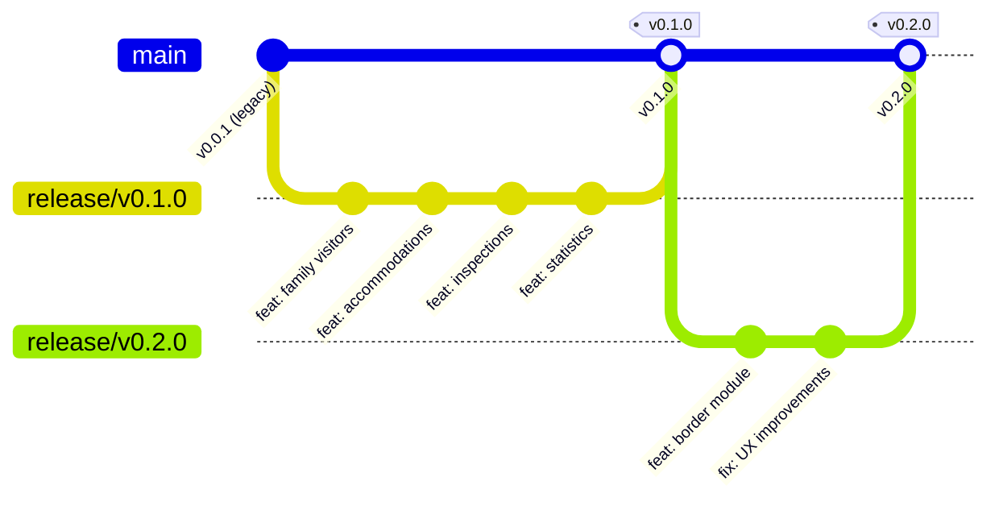
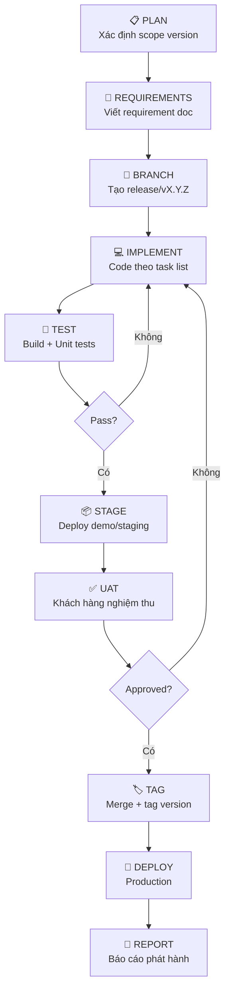
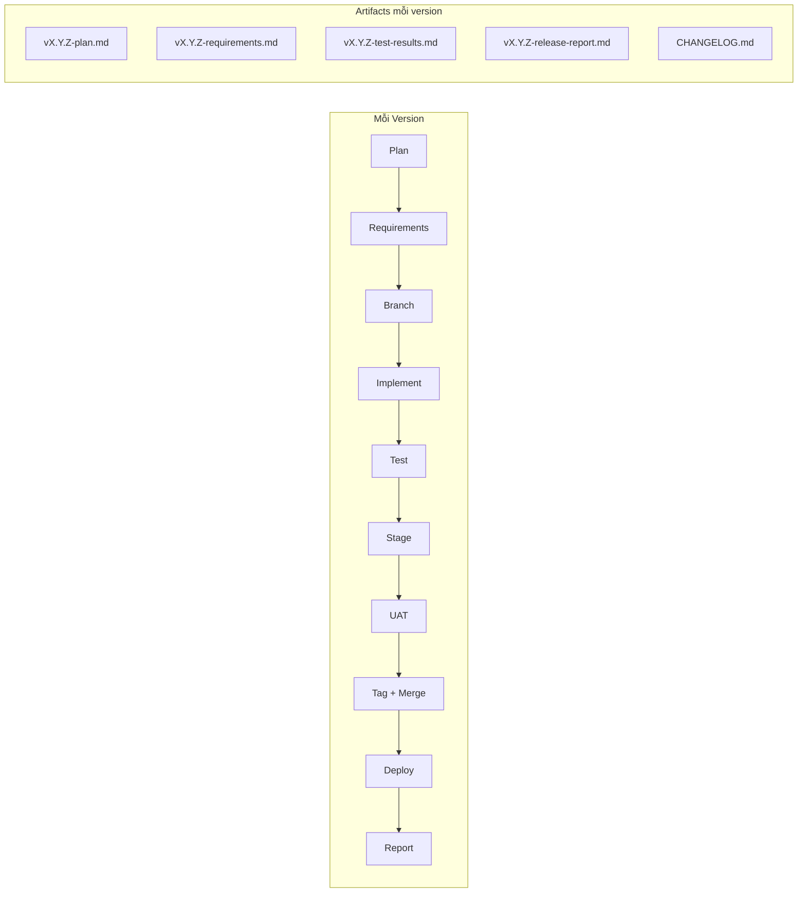

# QUY TRÌNH QUẢN LÝ PHIÊN BẢN — IRM

**Ngày tạo:** 17/08/2026  
**Áp dụng cho:** Tất cả version từ v0.1.0 trở đi  
**Mục tiêu:** Không nhầm lẫn giữa code cũ và mới, truy xuất được bất kỳ phiên bản nào đã phát hành

---

## 1. Vấn đề hiện tại

> [!WARNING]
> **Những rủi ro đang gặp:**
> - Code v0.1.0 đã viết xong nhưng **chưa commit/tag** — đang là `8c1d8b0-dirty`
> - Chỉ có 1 branch `main`, 1 tag `v0.0.1`
> - `PROJECT_MANAGEMENT.md` vẫn ghi "v2.0" nhưng thực tế đang ở v0.1.0
> - Không có CHANGELOG — không biết version nào thêm gì
> - Nếu cần quay lại code trước v0.1.0 → không có cách nào chắc chắn

---

## 2. Quy ước đặt số Version

Sử dụng **Semantic Versioning** (`MAJOR.MINOR.PATCH`):

```
v0.1.0  →  v0.2.0  →  v0.3.0  →  ...  →  v1.0.0  →  v1.1.0
│            │           │                   │
│            │           │                   └─ Production release chính thức
│            │           └─ Phase 2 cửa khẩu (YC4)
│            └─ Version tiếp theo (ví dụ: UX cải tiến, tính năng mới)
└─ Version hiện tại (8/9 yêu cầu, demo/staging)
```

| Phần | Khi nào tăng | Ví dụ |
|---|---|---|
| **MAJOR** (0 → 1) | Go-live production lần đầu | `v0.x.x` → `v1.0.0` |
| **MINOR** (x.0 → x.1) | Thêm tính năng mới hoặc nhóm yêu cầu | `v0.1.0` → `v0.2.0` |
| **PATCH** (x.x.0 → x.x.1) | Sửa lỗi, hotfix | `v0.1.0` → `v0.1.1` |

> [!IMPORTANT]
> **Quy tắc:** Mọi thay đổi code đều phải thuộc về MỘT version cụ thể. Không có code "trôi nổi" không biết thuộc version nào.

---

## 3. Branching Strategy

Dùng **Git Flow đơn giản hóa** phù hợp nhóm nhỏ (1-2 developer + AI):



### Hệ Thống Các Nhánh (Branching Model)

Dự án sử dụng mô hình 4 nhánh tiêu chuẩn:

| Nhánh | Môi trường / Mục đích | Trigger CI/CD | Quy tắc |
|---|---|---|---|
| `main` | **Production Release**: Mã nguồn ổn định nhất, phiên bản chạy thực tế | CI test + Release build khi gắn tag | Chỉ nhận merge từ `test` qua PR |
| `test` | **Staging / UAT**: Kiểm thử chất lượng, nghiệm thu chức năng | CI test + Auto build staging | Nhận merge từ `develop` để tiến hành test |
| `develop` | **Development Integration**: Tích hợp các tính năng đang phát triển | CI test liên tục | Tích hợp code từ các nhánh `feature/*` |
| `feature/*` | **Feature Branches**: Phát triển tính năng riêng lẻ (VD: `feature/v0.2.0-custom-reports`) | CI test | Rẽ nhánh từ `develop`, merge về `develop` qua PR |

### Quy trình làm việc và đánh dấu Version đã chạy

```bash
# 1. Phát triển tính năng mới
git checkout -b feature/v0.2.0-reports develop
# ... viết code & commit ...

# 2. Merge vào develop để tích hợp
git checkout develop
git merge feature/v0.2.0-reports
git push origin develop

# 3. Chuyển sang nhánh test để kiểm thử nghiệm thu (UAT)
git checkout test
git merge develop
git push origin test

# 4. Khi test PASS và sẵn sàng chạy Production -> Merge vào main & Đánh dấu Tag Version
git checkout main
git merge test
git tag -a v0.2.0 -m "Release v0.2.0: Cập nhật tính năng Báo cáo tùy chỉnh"
git push origin main --tags
```

---

## 4. Vòng đời phát hành Version



### Chi tiết từng bước

#### Bước 1: PLAN — Xác định scope version

Tạo file `docs/versions/vX.Y.Z-plan.md`:

```markdown
# Kế hoạch phiên bản vX.Y.Z

## Mục tiêu
Mô tả ngắn gọn mục tiêu version này.

## Yêu cầu khách hàng bao gồm
- [ ] YC#1: ...
- [ ] YC#2: ...

## Cải tiến UX tự phát triển
- [ ] UX#1: ...

## Phạm vi KHÔNG bao gồm
- Liệt kê rõ những gì KHÔNG làm trong version này

## Ước tính thời gian
| Task | Ước tính |
|---|---|
| ... | ... |
```

#### Bước 2: REQUIREMENTS — Viết requirement doc

Mỗi yêu cầu/task trong version phải có:

```markdown
## TASK: [ID] — [Tên task]

**Version:** vX.Y.Z
**Yêu cầu gốc:** YC#N hoặc UX tự phát triển
**Trạng thái:** Todo | In Progress | Done | Verified

### Mô tả
Chi tiết yêu cầu cần làm gì.

### Acceptance Criteria
- [ ] Tiêu chí 1
- [ ] Tiêu chí 2

### Files thay đổi (dự kiến)
- `IRM/Data/Models/...`
- `IRM/Services/...`
- `IRM/Components/Pages/...`
- `deploy/sql/...`

### Dependencies
- Phụ thuộc task nào khác
```

#### Bước 3: BRANCH — Tạo release branch

```bash
# Đảm bảo main sạch
git checkout main
git pull

# Tạo release branch
git checkout -b release/vX.Y.Z

# Push branch lên remote
git push -u origin release/vX.Y.Z
```

#### Bước 4: IMPLEMENT — Code theo task list

Commit messages PHẢI có prefix version:

```bash
# Format: <type>(vX.Y.Z): <mô tả>
git commit -m "feat(v0.2.0): add border gate management page"
git commit -m "feat(v0.2.0): add BorderMovements table and service"
git commit -m "fix(v0.2.0): correct 15-day overstay calculation"
git commit -m "test(v0.2.0): add border stay episode tests"
git commit -m "docs(v0.2.0): update database architecture report"
```

> [!TIP]
> **Quy tắc cho AI (Antigravity/Claude):** Khi tôi nói "làm cho version X", bạn PHẢI:
> 1. Kiểm tra đang ở branch nào (`git branch --show-current`)
> 2. Nếu chưa ở đúng branch → nhắc tôi chuyển branch
> 3. Commit message phải có `(vX.Y.Z)` trong prefix
> 4. Không sửa code thuộc scope version khác

#### Bước 5: TEST — Build + Unit tests

```bash
# Build (0 warning, 0 error)
dotnet build IRM/IRM.csproj --no-restore --no-incremental

# Run tests (tất cả phải pass)
dotnet test IRM.Tests/IRM.Tests.csproj --no-restore --verbosity normal

# SQL migration test (nếu có script mới)
# Chạy trên database test, KHÔNG chạy trên production
```

Kết quả test phải được ghi vào `docs/versions/vX.Y.Z-test-results.md`.

#### Bước 6: STAGE — Deploy demo/staging

Checklist trước khi deploy staging:

- [ ] Build pass (0 warning, 0 error)
- [ ] Tất cả tests pass
- [ ] Migration scripts idempotent (chạy 2 lần không lỗi)
- [ ] CHANGELOG đã cập nhật
- [ ] Review report đã viết

#### Bước 7: UAT — Khách hàng nghiệm thu

- [ ] Demo cho khách hàng
- [ ] Ghi nhận feedback
- [ ] Sửa nếu cần → quay lại bước 4

#### Bước 8: TAG — Merge + tag version

```bash
# Chuyển về main
git checkout main

# Merge release branch
git merge --no-ff release/vX.Y.Z -m "Release vX.Y.Z"

# Tag
git tag -a vX.Y.Z -m "Release vX.Y.Z: <mô tả ngắn>"

# Push
git push origin main --tags

# (Tùy chọn) Xóa release branch
git branch -d release/vX.Y.Z
git push origin --delete release/vX.Y.Z
```

#### Bước 9: DEPLOY — Production

Theo deploy guide hiện có + preflight script.

#### Bước 10: REPORT — Báo cáo phát hành

File `docs/versions/vX.Y.Z-release-report.md` (tương tự báo cáo vừa tạo).

---

## 5. CHANGELOG

Tạo file `CHANGELOG.md` ở gốc dự án, cập nhật MỖI VERSION:

```markdown
# Changelog

Tất cả thay đổi đáng chú ý của dự án này được ghi lại tại đây.
Format theo [Keep a Changelog](https://keepachangelog.com/).

## [Unreleased]
### Added
- (Tính năng đang phát triển cho version tiếp theo)

## [0.1.0] - 2026-08-17
### Added
- YC1: Quản lý người NNN thăm thân (FamilyVisitDetails, FamilyVisitors.razor)
- YC2: Danh mục CSLT & hợp đồng thuê (AccommodationsV010, Accommodations.razor)
- YC3: Kiểm tra hiện trường & snapshot (InspectionsV010, Inspections.razor)
- YC5: Tra cứu/thống kê quá khứ (TemporalReportFilter, effective dating)
- YC6: Số định danh điện tử & giấy tờ (ElectronicIdentities, ImmigrationDocuments)
- YC7: Thống kê theo KCN/KKT/cụm CN (EconomicZones, SiteZoneMemberships)
- YC8: Thống kê theo 54 địa bàn (AdministrativeUnits, Statistics.razor)
- YC9: Pháp nhân DN & đại diện (CompanyRepresentatives, CompanyLegalDocuments)
- Hồ sơ NNN hợp nhất (ForeignPersons) — identity trung tâm
- RBAC 5 roles (Admin, DataEditor, Inspector, Reporter, Viewer)
- Cookie auth, hash upgrade, brute force protection
- File upload bảo mật (MIME/magic bytes/SHA-256/Defender)
- Audit logging toàn hệ thống
- Legacy sync (XML triggers → outbox worker)
- 43 bảng database (24 bảng v0.1.0 mới)
- 17 xUnit tests
- 12 SQL migration scripts

### Deferred
- YC4: NNN miễn thị thực cửa khẩu → Phase 2 (ADR-007)

### Security
- Cookie HttpOnly, SameSite Strict, timeout 8h
- Login lockout sau 5 lần sai (15 phút)
- Formula injection protection cho Excel export
- SQL parameterized cho WPF inserts

## [0.0.1] - 2026-xx-xx
### Added
- Phiên bản initial: WPF legacy + Blazor Server cơ bản
- Dashboard, Import, Export, Login
- 13 bảng legacy
```

> [!IMPORTANT]
> **Quy tắc:** Mỗi lần merge release branch về main, CHANGELOG PHẢI được cập nhật TRƯỚC khi tag.

---

## 6. Cấu trúc thư mục quản lý version

```
docs/
├── versions/                           # THƯ MỤC MỚI
│   ├── v0.1.0-plan.md                 # Kế hoạch v0.1.0
│   ├── v0.1.0-requirements.md         # Chi tiết yêu cầu v0.1.0
│   ├── v0.1.0-test-results.md         # Kết quả test v0.1.0
│   ├── v0.1.0-release-report.md       # Báo cáo phát hành v0.1.0
│   ├── v0.2.0-plan.md                 # Kế hoạch v0.2.0 (tiếp theo)
│   └── ...
├── IRM-v0.1.0-implementation-report.md # Báo cáo triển khai chi tiết
├── IRM-v0.1.0-database-architecture-report.md
├── IRM-v0.1.0-review-report.md
└── ...
CHANGELOG.md                            # FILE MỚI — changelog tổng hợp
VERSION                                 # FILE MỚI — chỉ chứa "0.1.0"
```

---

## 7. Cách phân biệt code cũ vs code mới

### Bằng Git

```bash
# Xem code tại version cụ thể
git checkout v0.0.1          # → code legacy
git checkout v0.1.0          # → code đã thêm 9 yêu cầu
git checkout main            # → code mới nhất

# So sánh thay đổi giữa 2 version
git diff v0.0.1..v0.1.0 --stat        # Tổng quan file thay đổi
git diff v0.0.1..v0.1.0 -- IRM/       # Chi tiết thay đổi source

# Xem commit thuộc version nào
git log --oneline v0.0.1..v0.1.0      # Commits trong v0.1.0
```

### Bằng code convention

| Quy ước | Ví dụ | Mục đích |
|---|---|---|
| Hậu tố `V010` | `AccommodationsV010`, `InspectionsV010` | Bảng mới v0.1.0, phân biệt với legacy |
| Prefix `V010` trong contract | `V010Contracts.cs`, `V010Models.cs` | File chứa code v0.1.0 |
| SQL script đánh số | `07-v0.1.0.sql`, `08-v0.1.0-*.sql` | Migration theo thứ tự + version |
| Nhãn UI | `v0.1.0` trên trang login | Người dùng biết đang dùng version nào |

### Bằng CHANGELOG

Khi bạn hỏi "tính năng X được thêm khi nào?", mở `CHANGELOG.md` → tìm tính năng → biết version.

---

## 8. Hành động ngay — Commit v0.1.0

> [!CAUTION]
> Code v0.1.0 hiện tại đang ở trạng thái `dirty` (chưa commit). Cần thực hiện ngay:

```bash
# 1. Tạo release branch từ main hiện tại
git checkout -b release/v0.1.0

# 2. Stage tất cả thay đổi v0.1.0
git add -A

# 3. Commit
git commit -m "feat(v0.1.0): implement 8/9 customer requirements

- YC1: Family visitor management (FamilyVisitDetails, FamilyVisitors.razor)
- YC2: Accommodation registry & company agreements
- YC3: Field inspection with snapshot & lookback
- YC5: Temporal queries with effective dating
- YC6: Electronic identity & immigration documents
- YC7: Economic zone statistics (KCN/KKT)
- YC8: 54 administrative unit territory statistics
- YC9: Legal documents & company representatives
- YC4: Phase 2 foundation only (ADR-007)
- 24 new tables (43 total), 17 xUnit tests
- RBAC, cookie auth, audit logging, file upload security"

# 4. Merge về main
git checkout main
git merge --no-ff release/v0.1.0 -m "Release v0.1.0"

# 5. Tag
git tag -a v0.1.0 -m "Release v0.1.0: 8/9 customer requirements implemented"

# 6. Push
git push origin main --tags
```

---

## 9. Template cho version tiếp theo (v0.2.0)

Khi bắt đầu version mới, bạn nói với tôi:

> "Bắt đầu version v0.2.0 với yêu cầu: ..."

Tôi sẽ:

1. ✅ Kiểm tra `main` đã sạch và có tag version trước
2. ✅ Tạo `release/v0.2.0` branch
3. ✅ Tạo `docs/versions/v0.2.0-plan.md`
4. ✅ Cập nhật `CHANGELOG.md` phần `[Unreleased]`
5. ✅ Tất cả commit message có prefix `(v0.2.0)`
6. ✅ Không sửa code thuộc scope version khác (trừ hotfix)

---

## 10. Xử lý Hotfix

Khi phát hiện lỗi trên version đã phát hành:

```bash
# 1. Tạo hotfix branch từ tag bị lỗi
git checkout -b hotfix/v0.1.1-fix-login v0.1.0

# 2. Sửa lỗi
git commit -m "fix(v0.1.1): correct login lockout timing"

# 3. Merge về main
git checkout main
git merge --no-ff hotfix/v0.1.1-fix-login

# 4. Tag
git tag -a v0.1.1 -m "Hotfix v0.1.1: fix login lockout timing"

# 5. Nếu đang có release branch mở → merge hotfix vào đó nữa
git checkout release/v0.2.0
git merge hotfix/v0.1.1-fix-login
```

---

## 11. Tổng kết quy trình



| Câu hỏi thường gặp | Cách trả lời |
|---|---|
| "Version nào thêm tính năng X?" | Mở `CHANGELOG.md` → tìm |
| "Code trước khi làm YC1 trông như nào?" | `git checkout v0.0.1` |
| "Đang phát triển version nào?" | `git branch --show-current` → `release/vX.Y.Z` |
| "Version mới nhất đã deploy là gì?" | `git tag --sort=-version:refname | head -1` |
| "So sánh thay đổi giữa 2 bản?" | `git diff v0.0.1..v0.1.0 --stat` |
| "Hotfix lỗi production?" | Branch từ tag → fix → merge + tag patch |
