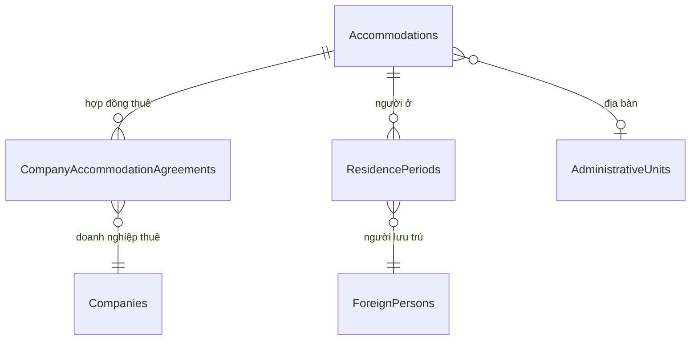

# Lưu trú (Accommodations)

## 1. Tổng quan

Module quản lý cơ sở lưu trú (CSLT) cho người nước ngoài: nhà trọ, ký túc xá, nhà thuê doanh nghiệp. Theo dõi hợp đồng thuê giữa doanh nghiệp và CSLT, cùng lịch sử lưu trú của từng người.

**Route:** `/accommodations`

## 2. Kiến trúc kỹ thuật

### Files liên quan

| Layer | File | Vai trò |
|---|---|---|
| Page | `Components/Pages/Accommodations.razor` | UI quản lý CSLT |
| Service | `Services/AccommodationService.cs` | CRUD + search |
| Service | `Services/ResidenceService.cs` | Lịch sử lưu trú cá nhân |
| Model | `Data/Models/Accommodation.cs` | Entity CSLT |
| Model | `Data/Models/V010Models.cs` | CompanyAccommodationAgreement, ResidencePeriod |

### DI Registration

```csharp
builder.Services.AddScoped<IAccommodationService, AccommodationService>();
builder.Services.AddScoped<IResidenceService, ResidenceService>();
```

## 3. Database Schema



### Accommodation

| Cột | Type | Mô tả |
|---|---|---|
| `Id` | `int` PK | |
| `Name` | `string` | Tên CSLT |
| `TypeCode` | `string` | RENTED, DORMITORY, COMPANY_HOUSING |
| `AddressLine` | `string` | Địa chỉ |
| `AdministrativeUnitId` | `int?` | FK → AdministrativeUnits |
| `Capacity` | `int?` | Sức chứa |
| `ContactName/Phone` | `string?` | Liên hệ |
| `IsDeleted` | `bool` | Soft delete |

## 4. Service Interface

### `IAccommodationService`

| Method | Tham số | Return | Mô tả |
|---|---|---|---|
| `SearchAsync` | `search?, adminUnitId?, companyId?, asOfDate?` | `Task<IReadOnlyList<Accommodation>>` | Tìm kiếm + lọc |
| `SaveAsync` | `accommodation` | `Task<int>` | Upsert (Admin/DataEditor) |
| `SaveAgreementAsync` | `agreement` | `Task<int>` | Upsert hợp đồng thuê |
| `SoftDeleteAsync` | `id` | `Task` | Xóa mềm |

### `IResidenceService`

| Method | Return | Mô tả |
|---|---|---|
| `GetHistoryAsync(foreignPersonId)` | `Task<IReadOnlyList<ResidencePeriod>>` | Lịch sử lưu trú |
| `SaveAsync(residence)` | `Task<int>` | Upsert lưu trú |

## 5. Ràng buộc Nghiệp vụ

- **Tên + địa chỉ bắt buộc** khi tạo Accommodation
- **Hợp đồng thuê temporal:** ValidTo >= ValidFrom
- **Lọc theo công ty:** Tìm CSLT có hợp đồng thuê active với công ty đã chọn (theo as-of date)
- **Soft delete:** `IsDeleted = true`

## 6. Hướng dẫn Mở rộng

- **Thêm TypeCode:** Thêm vào dropdown UI, không cần đổi schema
- **Dashboard CSLT:** Query aggregate số CSLT, capacity, resident count
