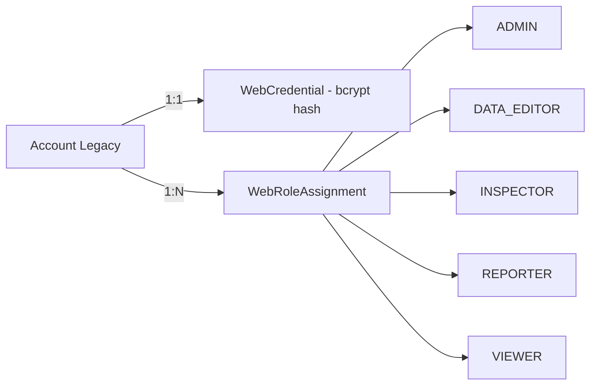
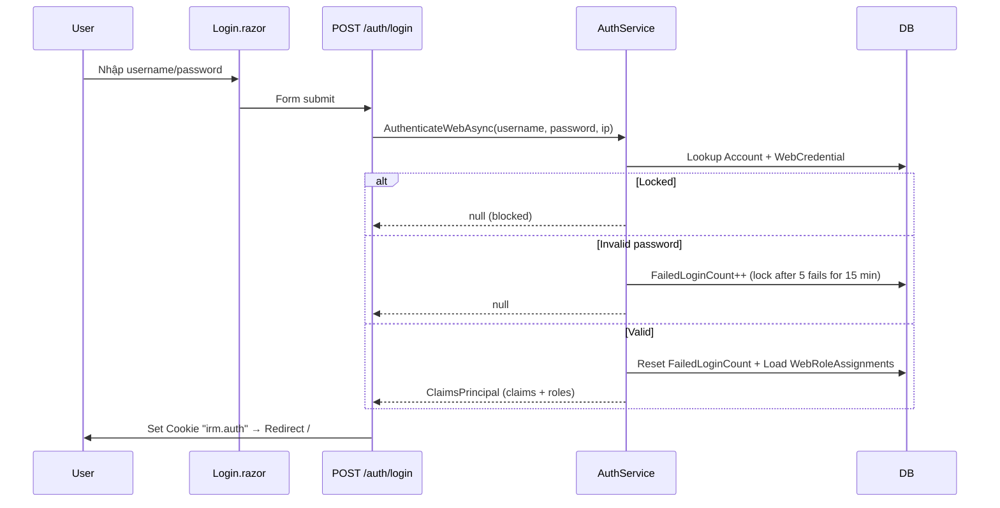

# Quản trị Hệ thống

## 1. Tổng quan

Module quản trị tổng hợp: quản lý tài khoản, phân quyền (RBAC), danh mục (lĩnh vực, ngành nghề, quốc tịch, quận/huyện, phường/xã, đơn vị hành chính, KCN), nhật ký hoạt động, và lịch sử import.

**Route:** `/admin`

## 2. Kiến trúc kỹ thuật

### Files liên quan

| Layer | File | Vai trò |
|---|---|---|
| Page | `Components/Pages/Admin.razor` | UI tổng hợp quản trị (tabs) |
| Page | `Components/Pages/Login.razor` | Trang đăng nhập |
| Service | `Services/AuthService.cs` | Xác thực, CRUD tài khoản |
| Service | `Services/AuditService.cs` | Ghi/đọc nhật ký |
| Service | `Services/CatalogService.cs` | CRUD danh mục |
| Service | `Services/ServiceAuthorizationGuard.cs` | Guard phân quyền ở service layer |
| Model | `Data/Models/Account.cs` | Tài khoản legacy |
| Model | `Data/Models/AuditLog.cs` | Nhật ký, ImportHistory, ImportBackup |
| Model | `Data/Models/V010Models.cs` | WebCredential, WebRoleAssignment |

### Hệ thống phân quyền (RBAC)



### Authorization Policies (Program.cs)

| Policy | Roles |
|---|---|
| `ManageData` | Admin, DataEditor |
| `Inspect` | Admin, Inspector |
| `Report` | Admin, Reporter, Viewer |
| `AdminOnly` | Admin |

### Authentication Flow



### DI Registration

```csharp
builder.Services.AddScoped<AuthService>();
builder.Services.AddScoped<AuditService>();
builder.Services.AddScoped<CatalogService>();
builder.Services.AddScoped<IServiceAuthorizationGuard, ServiceAuthorizationGuard>();
```

## 3. Database Schema

### Authentication

| Bảng | Mô tả |
|---|---|
| `Accounts` | Tài khoản legacy (Username, Password plaintext, Permission) |
| `WebCredentials` | Mật khẩu bcrypt hash, lockout (1:1 với Accounts) |
| `WebRoleAssignments` | Vai trò (ADMIN, DATA_EDITOR, INSPECTOR, REPORTER, VIEWER) |

### Audit & History

| Bảng | Mô tả |
|---|---|
| `AuditLogs` | Nhật ký: Action, EntityType, EntityId, Username, Timestamp, IP |
| `ImportHistories` | Lịch sử import: SessionId, FileName, counts, status |
| `ImportBackups` | Dữ liệu backup cho rollback import |

### Catalogs

| Bảng | Mô tả |
|---|---|
| `Fields` | Lĩnh vực (công nghiệp, thương mại...) |
| `Careers` / `CareerGroups` | Ngành nghề / Nhóm ngành |
| `Nationality` | Quốc tịch (Code + Name) |
| `Districts` / `Wards` | Quận huyện / Phường xã (legacy) |
| `AdministrativeUnits` | Đơn vị hành chính v0.1.0 (Province/Commune/Ward/SpecialZone, temporal) |
| `EconomicZones` | KCN/CCN/KKT (temporal) |

## 4. Service Interface

### `AuthService`

| Method | Return | Mô tả |
|---|---|---|
| `AuthenticateWebAsync(username, password, ip)` | `Task<ClaimsPrincipal?>` | Xác thực + trả principal |
| `GetAllAccountsAsync()` | `Task<List<Account>>` | Danh sách tài khoản (Admin only) |
| `CreateAccountAsync(account)` | `Task` | Tạo + hash password + assign role |
| `UpdateAccountAsync(account)` | `Task` | Cập nhật + re-hash password |
| `DeleteAccountAsync(id)` | `Task` | Soft delete |

### `AuditService`

| Method | Return | Mô tả |
|---|---|---|
| `LogAsync(action, entityType, entityId, description, username)` | `Task` | Ghi log |
| `GetRecentAsync(count)` | `Task<List<AuditLog>>` | 100 log gần nhất |
| `SearchAsync(username, action, from, to)` | `Task<List<AuditLog>>` | Tìm kiếm log (max 500) |

### `CatalogService`

CRUD cho tất cả danh mục: `GetFieldsAsync()`, `CreateFieldAsync()`, `UpdateFieldAsync()`, `DeleteFieldAsync()`, tương tự cho Career, Nationality, District, Ward, AdministrativeUnit, EconomicZone.

## 5. Ràng buộc Nghiệp vụ

- **Password migration:** Login đầu tiên so sánh plaintext legacy → tạo `WebCredential` với bcrypt hash → lần sau dùng hash
- **Account lockout:** 5 lần sai → khóa 15 phút
- **Cookie:** `irm.auth`, HttpOnly, SameSite=Strict, 8h expiry, sliding
- **Role fallback:** Nếu account chưa có WebRoleAssignment, tự tạo dựa trên `Permission` legacy (1=Admin, khác=DataEditor)
- **Soft delete danh mục:** Tất cả catalog dùng `Delete_flag = 1`
- **Temporal units:** AdministrativeUnit, EconomicZone có `ValidFrom`/`ValidTo` — query filter by as-of date

## 6. Hướng dẫn Test

- Login: đúng/sai password, lockout after 5 fails, unlock after 15 min
- Password migration: login bằng plaintext → verify WebCredential created
- CRUD accounts: tạo → sửa password → soft delete
- CRUD catalogs: tạo Field → sửa → soft delete → verify không còn trong danh sách
- Audit log: thực hiện thao tác → verify log entry

## 7. Hướng dẫn Mở rộng

- **Thêm role mới:** Thêm constant vào `IrmRoles`, thêm policy trong `Program.cs`, gán trong `CreateAccountAsync`
- **Thêm danh mục mới:** Tạo model → DbSet → Fluent API → CRUD methods trong `CatalogService` → tab UI trong `Admin.razor`
- **2FA:** Có thể mở rộng `WebCredential` thêm TOTP secret, xử lý trong `AuthenticateWebAsync`
