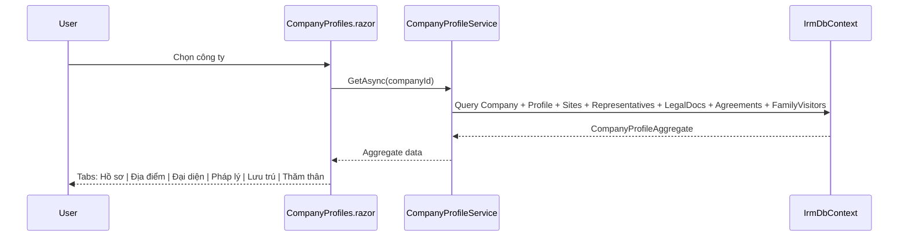
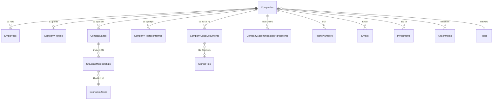

# Quản lý Công ty

## 1. Tổng quan

Module quản lý thông tin doanh nghiệp sử dụng lao động nước ngoài. Bao gồm 2 tầng:
- **Legacy (Companies):** Thông tin cơ bản từ hệ thống WPF cũ — tên, lĩnh vực, số lượng LĐ, đại diện pháp luật
- **V010 (CompanyProfiles):** Mở rộng — hồ sơ doanh nghiệp, chi nhánh/địa điểm, khu công nghiệp, người đại diện, hồ sơ pháp lý, lưu trú

**Routes:** `/companies` (danh sách cơ bản), `/company-profiles` (hồ sơ mở rộng)

## 2. Kiến trúc kỹ thuật

### Files liên quan

| Layer | File | Vai trò |
|---|---|---|
| Page | `Components/Pages/Companies.razor` | CRUD công ty legacy |
| Page | `Components/Pages/CompanyProfiles.razor` | Hồ sơ mở rộng v0.1.0 |
| Service | `Services/CompanyService.cs` | CRUD Companies cơ bản |
| Service | `Services/CompanyProfileService.cs` | Aggregate hồ sơ mở rộng |
| Service | `Services/LegalDocumentService.cs` | Upload/quản lý hồ sơ pháp lý |
| Model | `Data/Models/Company.cs` | Entity Company legacy |
| Model | `Data/Models/V010Models.cs` | CompanyProfile, CompanySite, CompanyRepresentative, CompanyLegalDocument, EconomicZone, SiteZoneMembership |

### Luồng xử lý



### DI Registration

```csharp
builder.Services.AddScoped<CompanyService>();
builder.Services.AddScoped<ICompanyProfileService, CompanyProfileService>();
builder.Services.AddScoped<ILegalDocumentService, LegalDocumentService>();
```

## 3. Database Schema



### Bảng chính

| Bảng | Loại | Mô tả |
|---|---|---|
| `Companies` | Legacy | Thông tin cơ bản: tên, loại hình, lĩnh vực, LĐ |
| `CompanyProfiles` | v0.1.0 | Mã số thuế, ĐKKD, loại hình sở hữu (1:1 với Companies) |
| `CompanySites` | v0.1.0 | Địa điểm/chi nhánh, có hiệu lực thời gian |
| `CompanyRepresentatives` | v0.1.0 | Người đại diện pháp luật, có hiệu lực thời gian |
| `CompanyLegalDocuments` | v0.1.0 | Hồ sơ pháp lý (ĐKKD, giấy phép...) |
| `CompanyAccommodationAgreements` | v0.1.0 | Hợp đồng thuê lưu trú |
| `EconomicZones` | v0.1.0 | KCN/CCN/KKT |
| `SiteZoneMemberships` | v0.1.0 | Mapping địa điểm ↔ KCN |

## 4. Service Interface

### `CompanyService` (Legacy CRUD)

| Method | Tham số | Return | Mô tả |
|---|---|---|---|
| `GetAllAsync` | `search?, fieldId?` | `Task<List<Company>>` | Danh sách + lọc + tìm kiếm |
| `GetByIdAsync` | `id` | `Task<Company?>` | Chi tiết (include Employees, Phones, Emails, Investments, Attachments) |
| `GetEmployeeCountAsync` | `companyId` | `Task<int>` | Đếm NLĐ đang hoạt động |
| `CreateAsync` | `company` | `Task` | Tạo mới (yêu cầu Admin/DataEditor) |
| `UpdateAsync` | `company` | `Task` | Cập nhật |
| `DeleteAsync` | `id` | `Task` | Soft delete (Delete_flag = 1) |

### `ICompanyProfileService` (V010 Aggregate)

| Method | Tham số | Return | Mô tả |
|---|---|---|---|
| `GetAsync` | `companyId` | `Task<CompanyProfileAggregate?>` | Lấy toàn bộ hồ sơ mở rộng |
| `SaveProfileAsync` | `profile` | `Task` | Tạo/cập nhật profile |
| `SaveSiteAsync` | `site, economicZoneIds` | `Task<int>` | Tạo/cập nhật địa điểm + mapping KCN |
| `SaveRepresentativeAsync` | `representative` | `Task<int>` | Tạo/cập nhật đại diện |

### `CompanyProfileAggregate` DTO

| Property | Type |
|---|---|
| `Company` | `Company?` |
| `Profile` | `CompanyProfile?` |
| `Sites` | `IReadOnlyList<CompanySite>` |
| `AccommodationAgreements` | `IReadOnlyList<CompanyAccommodationAgreement>` |
| `Representatives` | `IReadOnlyList<CompanyRepresentative>` |
| `LegalDocuments` | `IReadOnlyList<CompanyLegalDocument>` |
| `SponsoredFamilyVisitors` | `IReadOnlyList<FamilyVisitor>` |

## 5. Luồng UI

### Companies.razor (Legacy)
1. Danh sách công ty với lọc theo lĩnh vực và tìm kiếm
2. Modal thêm/sửa công ty
3. Xem chi tiết → danh sách NLĐ trong công ty

### CompanyProfiles.razor (V010)
1. Chọn công ty → Load aggregate
2. **Tab Hồ sơ:** Thông tin pháp lý, mã số thuế, ĐKKD
3. **Tab Địa điểm:** Chi nhánh, mapping KCN/CCN
4. **Tab Đại diện:** Người đại diện pháp luật
5. **Tab Pháp lý:** Upload/quản lý hồ sơ (ĐKKD, giấy phép)
6. **Tab Lưu trú:** Hợp đồng thuê CSLT
7. **Tab Thăm thân:** NLĐ diện thăm thân được công ty bảo lãnh

## 6. Ràng buộc Nghiệp vụ

- **Soft delete:** `Delete_flag = 1` (Companies legacy), `IsDeleted = true` (CompanySite, EconomicZone)
- **Temporal validity:** CompanySite, CompanyRepresentative có `ValidFrom`/`ValidTo`
- **Authorization:** Tạo/sửa/xóa yêu cầu role `Admin` hoặc `DataEditor`
- **CompanyProfile:** Quan hệ 1:1 với Companies (PK = CompanyId = FK)
- **SiteZoneMemberships:** Khi save site, xóa tất cả mapping KCN cũ rồi tạo lại (replace strategy)
- **OwnershipTypeCode:** DOMESTIC, FDI, JOINT_VENTURE, UNCLASSIFIED

## 7. Hướng dẫn Test

- CRUD công ty: tạo → xem → sửa → soft delete → verify Hidden_flag
- Lọc theo lĩnh vực (Fields dropdown)
- Tìm kiếm theo tên, địa chỉ, đại diện pháp luật
- Profile aggregate: verify tất cả tabs load đúng dữ liệu
- SaveSite: verify zone membership được replace đúng

## 8. Hướng dẫn Mở rộng

- **Thêm cột mới cho Companies legacy:** Thêm property vào `Company.cs`, map trong `OnModelCreating` nếu tên cột khác
- **Thêm tab mới cho CompanyProfiles:** Thêm collection vào `CompanyProfileAggregate`, query trong `CompanyProfileService.GetAsync()`, thêm tab UI trong `CompanyProfiles.razor`
- **Thêm loại hình sở hữu:** Thêm vào dropdown UI, không cần đổi schema (lưu dạng string code)
