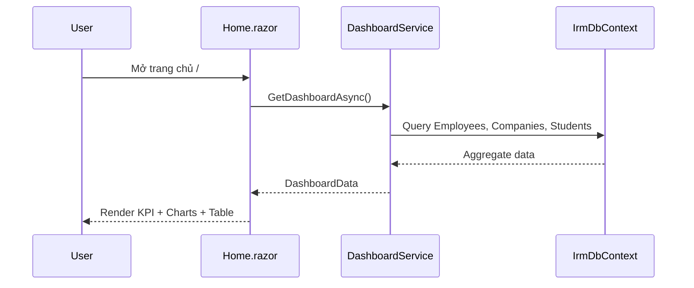

# Dashboard & KPI

## 1. Tổng quan

Dashboard là trang chủ của hệ thống IRM, hiển thị tổng hợp thông tin quan trọng nhất dưới dạng KPI cards, biểu đồ và bảng cảnh báo. Mục đích là cung cấp cái nhìn toàn cảnh về tình hình quản lý người nước ngoài tại địa phương ngay khi đăng nhập.

**Route:** `/` (trang chủ)

## 2. Kiến trúc kỹ thuật

### Files liên quan

| Layer | File | Vai trò |
|---|---|---|
| Page | `Components/Pages/Home.razor` | UI Dashboard, KPI cards, biểu đồ MudBlazor |
| Service | `Services/DashboardService.cs` | Query tổng hợp dữ liệu thống kê |
| DTOs | `DashboardData`, `ChartItem` (trong DashboardService.cs) | Data transfer objects |

### Luồng xử lý



### DI Registration

```csharp
builder.Services.AddScoped<DashboardService>();
```

## 3. Database Schema

Dashboard không có bảng riêng — nó query dữ liệu từ các bảng khác:

| Bảng | Dữ liệu lấy |
|---|---|
| `Employees` | Tổng NLĐ, sắp hết hạn, có GPLĐ, thăm thân |
| `Companies` | Tổng công ty |
| `Students` | Tổng du học sinh, visa sắp hết |
| `Nationality` | Thống kê theo quốc tịch |

## 4. Service Interface

### `DashboardService`

| Method | Return | Mô tả |
|---|---|---|
| `GetDashboardAsync()` | `Task<DashboardData>` | Lấy toàn bộ dữ liệu dashboard |

### `DashboardData` DTO

| Property | Type | Mô tả |
|---|---|---|
| `TotalCompanies` | `int` | Tổng công ty (Delete_flag == 0) |
| `TotalEmployees` | `int` | Tổng NLĐ đang làm việc (Hidden_flag == 0, WorkingStatus == 0) |
| `ExpiringCount` | `int` | NLĐ sắp hết hạn tạm trú (trong 30 ngày) |
| `WithWorkPermit` | `int` | NLĐ đã có GPLĐ (WorkPermit == 1 hoặc 4) |
| `FamilyVisitCount` | `int` | NLĐ diện thăm thân |
| `FamilyVisitExpiringCount` | `int` | Thăm thân sắp hết hạn (30 ngày) |
| `TotalStudents` | `int` | Du học sinh đang học |
| `StudentVisaExpiringCount` | `int` | Du học sinh visa sắp hết (30 ngày) |
| `NationalityStats` | `List<ChartItem>` | Top 10 quốc tịch (cho biểu đồ) |
| `WorkPermitStats` | `List<ChartItem>` | Phân bổ GPLĐ (6 loại) |
| `ExpiringEmployees` | `List<Employee>` | 50 NLĐ sắp hết hạn gần nhất (90 ngày) |

## 5. Luồng UI

1. Đăng nhập → Redirect về `/`
2. Dashboard load → Gọi `GetDashboardAsync()`
3. Hiển thị:
   - **KPI Cards:** Tổng công ty, tổng NLĐ, sắp hết hạn, có GPLĐ, thăm thân, du học sinh
   - **Biểu đồ quốc tịch:** Bar/Pie chart top 10 quốc tịch
   - **Biểu đồ GPLĐ:** Phân bổ 6 loại giấy phép lao động
   - **Bảng cảnh báo:** Danh sách NLĐ sắp hết hạn tạm trú (90 ngày)

## 6. Ràng buộc Nghiệp vụ

- **Ngưỡng cảnh báo:** 30 ngày cho KPI card, 90 ngày cho bảng chi tiết
- **Lọc dữ liệu:** Chỉ đếm NLĐ đang làm việc (`WorkingStatus == 0`, `Hidden_flag == 0`)
- **GPLĐ mapping:** 0=Miễn, 1=Đã có, 2=Chưa có, 3=NĐT miễn, 4=NĐT đã có, 5=NĐT chưa có
- **Top quốc tịch:** Lấy tối đa 10 quốc gia đông nhất

## 7. Hướng dẫn Test

- Kiểm tra KPI cards hiển thị đúng số liệu so với DB
- Kiểm tra biểu đồ render với MudBlazor (MudChart)
- Kiểm tra bảng cảnh báo sort theo ngày hết hạn ASC
- Kiểm tra khi DB rỗng (tất cả KPI = 0, biểu đồ trống)

## 8. Hướng dẫn Mở rộng

- **Thêm KPI mới:** Thêm property vào `DashboardData`, query trong `GetDashboardAsync()`, thêm card vào `Home.razor`
- **Đổi ngưỡng cảnh báo:** Sửa `in30Days` (dòng 24-25 DashboardService.cs) và `today.AddDays(90)` (dòng 79)
- **Thêm biểu đồ mới:** Thêm `List<ChartItem>` property, query GroupBy tương ứng
