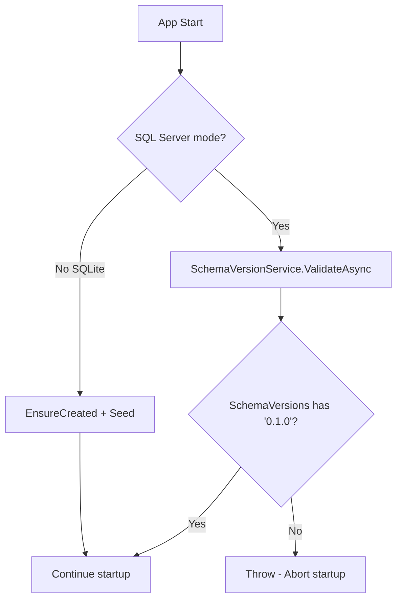

# Database & Schema Management

## 1. Tổng quan

Hệ thống sử dụng 2 chế độ database:
- **Production:** SQL Server — kết nối database legacy của phần mềm WPF cũ
- **Development:** SQLite — standalone, tự tạo + seed data, không cần SQL Server

Schema có 2 lớp:
- **Legacy tables:** Bảng gốc từ WPF (Companies, Employees, Students, Careers...) — EF Core map bằng Fluent API
- **V0.1.0 tables:** Bảng mở rộng (ForeignPersons, StayCases, Accommodations...) — EF Core Code First

## 2. Kiến trúc kỹ thuật

### Files liên quan

| Layer | File | Vai trò |
|---|---|---|
| DbContext | `Data/IrmDbContext.cs` | 19 DbSets, Fluent API mapping, temporal model |
| Seeder | `Data/DatabaseSeeder.cs` | Seed data cho SQLite dev mode |
| Service | `Services/SchemaVersionService.cs` | Validate schema version |
| Config | `Program.cs` (dòng 32-45) | Chọn SQL Server vs SQLite theo env var |
| Config | `appsettings.json` | Connection strings |

### Database Provider Selection

```csharp
// Program.cs
if (runSqlite)
{
    // SQLite: in-memory style, auto-create + seed
    builder.Services.AddDbContext<IrmDbContext>(o => o.UseSqlite("Data Source=irm.db"));
    builder.Services.AddDbContextFactory<IrmDbContext>(o => o.UseSqlite("Data Source=irm.db"));
}
else
{
    // SQL Server: production
    builder.Services.AddDbContext<IrmDbContext>(o => o.UseSqlServer(connStr));
    builder.Services.AddDbContextFactory<IrmDbContext>(o => o.UseSqlServer(connStr));
}
```

### Schema Version Check



## 3. DbContext — Fluent API Highlights

### Legacy Table Mapping

```csharp
// Companies → map PK, tên bảng, cột với convention khác
modelBuilder.Entity<Company>(e => {
    e.ToTable("Companies");
    e.HasKey(x => x.IDCompany);
});

// Employees → map FK, ignore computed properties
modelBuilder.Entity<Employee>(e => {
    e.HasKey(x => x.IDEmployee);
    e.HasOne(x => x.NationalityNav)
     .WithMany()
     .HasForeignKey(x => x.Nationality)
     .HasPrincipalKey(n => n.NationalityCode);
    e.Ignore(x => x.IsActive);
    e.Ignore(x => x.DaysUntilExpiry);
});
```

### V0.1.0 Table Naming

```csharp
// Tất cả v0.1.0 tables có prefix schema-like mapping
modelBuilder.Entity<ForeignPerson>().HasIndex(x => x.PassportSearchKey);
modelBuilder.Entity<StayCase>().HasOne(x => x.FamilyVisitDetail)
    .WithOne(x => x.StayCase).HasForeignKey<FamilyVisitDetail>(x => x.StayCaseId);
```

## 4. Database Schema Map (19 DbSets)

### Legacy Tables

| DbSet | Table | PK |
|---|---|---|
| `Companies` | Companies | IDCompany |
| `Employees` | Employees | IDEmployee |
| `Students` | Students | IDStudent |
| `Fields` | Fields | IDField |
| `Careers` | Careers | IDCareer |
| `CareerGroups` | CareerGroups | IDCG |
| `Nationality` | Nationality | IDNationality |
| `Districts` | Districts | IDDistrict |
| `Wards` | Wards | IDWard |
| `Accounts` | Users | IDUser |
| `PhoneNumbers` | PhoneNumbers | IDPhoneNumber |
| `Emails` | Emails | IDEmail |
| `Attachments` | Attachments | IDAttachment |
| `Investments` | Investments | IDInvestment |

### V0.1.0 Tables

| DbSet | Table | PK |
|---|---|---|
| `ForeignPersons` | ForeignPersons | Id (auto) |
| `StayCases` | StayCases | Id (auto) |
| `ImmigrationDocuments` | ImmigrationDocuments | Id (auto) |
| `ElectronicIdentities` | ElectronicIdentities | Id (auto) |
| `ResidencePeriods` | ResidencePeriods | Id (auto) |
| `CompanyProfiles` | CompanyProfiles | CompanyId (FK=PK) |
| `CompanySites` | CompanySites | Id (auto) |
| `CompanyRepresentatives` | CompanyRepresentatives | Id (auto) |
| `CompanyLegalDocuments` | CompanyLegalDocuments | Id (auto) |
| `StoredFiles` | StoredFiles | Id (auto) |
| `Accommodations` | Accommodations | Id (auto) |
| `AdministrativeUnits` | AdministrativeUnits | Id (auto) |
| `EconomicZones` | EconomicZones | Id (auto) |
| `Inspections` | Inspections | Id (auto) |
| `AuditLogs` | AuditLogs | Id (auto) |
| `ArchivedEmployees` | ArchivedEmployees | Id (long, auto) |
| `SchemaVersions` | SchemaVersions | Version (string PK) |
| `LegacyChangeEvents` | LegacyChangeEvents | Id (auto) |
| `MigrationIssues` | MigrationIssues | Id (auto) |

## 5. Seeder (SQLite Mode)

`DatabaseSeeder.SeedAsync()` tạo dữ liệu mẫu:
- 5 Fields, 3 CareerGroups, 10 Careers
- 5 Nationalities, Districts, Wards
- 3 AdministrativeUnits
- 2 Companies + 10 Employees mỗi công ty
- 5 Students
- 2 Accounts (admin/editor)
- SchemaVersion "0.1.0"

## 6. Ràng buộc

- **No auto-migration production:** App KHÔNG chạy EF `Migrate()` ở SQL Server mode — DBA phải chạy migration script riêng
- **SQLite dev mode:** `EnsureCreated()` + `DatabaseSeeder.SeedAsync()` tự động
- **DbContextFactory:** Dùng cho long-running operations (Export, Background services)
- **Soft delete everywhere:** Legacy dùng `Delete_flag`/`Hidden_flag`, v0.1.0 dùng `IsDeleted`

## 7. Hướng dẫn Mở rộng

- **Thêm bảng mới:** Tạo model → Thêm `DbSet` trong `IrmDbContext` → Fluent API mapping trong `OnModelCreating` → Tạo migration script → Cập nhật SchemaVersions
- **Thêm index:** `modelBuilder.Entity<T>().HasIndex(x => x.Column)`
- **Rename cột legacy:** Dùng `.HasColumnName("TenCotCu")` trong Fluent API
