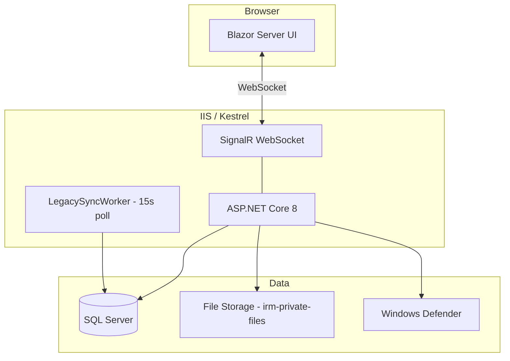

# Deployment & Infrastructure

## 1. Tổng quan

Hướng dẫn triển khai IRM — ứng dụng Blazor Server ASP.NET Core 8 chạy trên Windows Server với IIS hoặc standalone Kestrel, kết nối SQL Server production hoặc SQLite development.

## 2. Yêu cầu Hệ thống

### Production

| Thành phần | Yêu cầu |
|---|---|
| OS | Windows Server 2019+ |
| Runtime | .NET 8 Runtime (ASP.NET Core Hosting Bundle) |
| Database | SQL Server 2019+ (hoặc Azure SQL) |
| Web Server | IIS 10+ hoặc Kestrel standalone |
| Disk | ≥ 1GB cho app + file storage (`irm-private-files/`) |
| Antivirus | Windows Defender (bắt buộc cho file upload scan) |

### Development

| Thành phần | Yêu cầu |
|---|---|
| SDK | .NET 8 SDK |
| Database | SQLite (tự động, không cần cài) |
| IDE | Visual Studio 2022 / VS Code + C# Dev Kit |

## 3. Cấu hình

### appsettings.json

```json
{
  "ConnectionStrings": {
    "DefaultConnection": "Server=...;Database=IRM;Trusted_Connection=True;TrustServerCertificate=True"
  },
  "FileStorage": {
    "Root": "D:\\irm-private-files"
  },
  "Logging": {
    "LogLevel": {
      "Default": "Information"
    }
  }
}
```

### Environment Variables

| Biến | Mô tả | Mặc định |
|---|---|---|
| `IRM_USE_SQLITE` | `true` = SQLite dev mode | (không set = SQL Server) |
| `ASPNETCORE_ENVIRONMENT` | Development / Production | Production |
| `ASPNETCORE_URLS` | URLs Kestrel listen | `http://localhost:5000` |

## 4. Chạy Development

```bash
# Clone & restore
git clone <repo-url>
cd immigration-reportmanager-master/IRM

# Chạy SQLite mode (không cần SQL Server)
set IRM_USE_SQLITE=true
dotnet run

# Mở trình duyệt: http://localhost:5000
# Login: admin/admin (seed data)
```

## 5. Build Production

```bash
dotnet publish -c Release -o ./publish
```

### Deploy lên IIS

1. Cài **ASP.NET Core 8 Hosting Bundle** trên server
2. Tạo site IIS → Physical path: `./publish`
3. Application Pool: **No Managed Code**, Pipeline Mode: Integrated
4. Cấu hình `appsettings.Production.json` với connection string SQL Server
5. Tạo thư mục `irm-private-files` ngoài webroot, cấp quyền ghi cho app pool user
6. Đảm bảo Windows Defender active (cho malware scanning)

### Deploy Kestrel Standalone

```bash
cd publish
dotnet IRM.dll --urls "http://0.0.0.0:5000"
```

## 6. Database Setup (Production)

1. **Database legacy đã có:** Các bảng Companies, Employees, Students... đã tồn tại từ hệ thống WPF
2. **Chạy migration script v0.1.0:** DBA chạy script SQL tạo bảng mới (ForeignPersons, StayCases, Accommodations, SchemaVersions...)
3. **Insert schema version:** `INSERT INTO SchemaVersions (Version, AppliedAt) VALUES ('0.1.0', GETUTCDATE())`
4. **App startup:** `SchemaVersionService.ValidateAsync()` kiểm tra `0.1.0` tồn tại
5. **(Optional) Backfill:** Chạy `BackfillLegacyAsync()` để link Employees/Students → ForeignPersons

> **⚠️ QUAN TRỌNG:** App KHÔNG tự chạy EF migrations. Mọi thay đổi schema phải qua DBA.

## 7. Kiến trúc Runtime



## 8. Monitoring & Troubleshooting

- **Logs:** Cấu hình `Logging:LogLevel` trong appsettings.json
- **Audit trail:** Xem bảng `AuditLogs` hoặc Admin → Nhật ký
- **Legacy sync health:** Kiểm tra bảng `LegacyChangeEvents` — nếu nhiều DEAD_LETTER thì cần xem xét
- **File upload issues:** Kiểm tra Windows Defender active + app pool user có quyền ghi `irm-private-files`

## 9. Dependencies

| Package | Version | Vai trò |
|---|---|---|
| `Microsoft.EntityFrameworkCore.SqlServer` | 8.x | ORM SQL Server |
| `Microsoft.EntityFrameworkCore.Sqlite` | 8.x | ORM SQLite dev |
| `MudBlazor` | 7.x | UI Component Library |
| `ClosedXML` | 0.104.2 | Import/Export Excel |
| `Microsoft.AspNetCore.Identity` | 8.x | Password hashing (bcrypt) |
