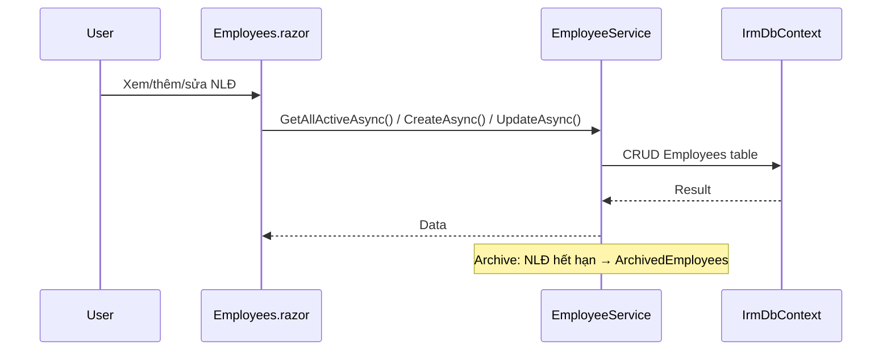
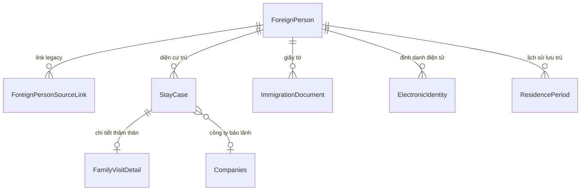

# Quản lý Người lao động

## 1. Tổng quan

Module quản lý lao động nước ngoài — lõi nghiệp vụ chính của hệ thống IRM. Gồm 2 tầng:
- **Legacy (Employees):** Hồ sơ lao động từ hệ thống WPF cũ — tên, hộ chiếu, GPLĐ, tạm trú, thăm thân
- **V010 (ForeignPersons):** Mô hình hợp nhất — 1 ForeignPerson có nhiều StayCases (diện cư trú), ImmigrationDocuments, ElectronicIdentities, ResidencePeriods

**Routes:** `/employees` (legacy), `/foreign-persons` (v0.1.0)

## 2. Kiến trúc kỹ thuật

### Files liên quan

| Layer | File | Vai trò |
|---|---|---|
| Page | `Components/Pages/Employees.razor` | CRUD nhân viên legacy |
| Page | `Components/Pages/ForeignPersons.razor` | Quản lý người nước ngoài v0.1.0 |
| Service | `Services/EmployeeService.cs` | CRUD Employees + archive |
| Service | `Services/FamilyVisitorService.cs` | IForeignerRegistryService — quản lý ForeignPerson, StayCase, backfill legacy |
| Model | `Data/Models/Employee.cs` | Entity Employee legacy |
| Model | `Data/Models/ArchivedEmployee.cs` | Lưu trữ NLĐ hết hạn |
| Model | `Data/Models/V010Models.cs` | ForeignPerson, ForeignPersonSourceLink, StayCase, ImmigrationDocument, ElectronicIdentity, ResidencePeriod |

### Luồng xử lý chính



### Mô hình V010 — ForeignPerson Unified



### DI Registration

```csharp
builder.Services.AddScoped<EmployeeService>();
builder.Services.AddScoped<IForeignerRegistryService, FamilyVisitorService>();
```

## 3. Database Schema

### Bảng Legacy

| Bảng | Mô tả |
|---|---|
| `Employees` | Lao động nước ngoài — PK: `IDEmployee` |
| `ArchivedEmployees` | Lưu trữ NLĐ đã hết hạn (snapshot toàn bộ cột) |

### Bảng V010

| Bảng | Mô tả |
|---|---|
| `ForeignPersons` | Người nước ngoài hợp nhất — PK: `Id`, index: `PassportSearchKey` |
| `ForeignPersonSourceLinks` | Link ngược về Employees/Students legacy — unique: `(SourceType, SourceId)` |
| `StayCases` | Diện cư trú — WORK, FAMILY_VISIT, STUDY, TOURISM, OTHER |
| `ImmigrationDocuments` | Visa, thẻ tạm trú, gia hạn... |
| `ElectronicIdentities` | Số định danh điện tử |
| `ResidencePeriods` | Lịch sử lưu trú tại địa chỉ cụ thể |

### Employee — Cột quan trọng

| Cột | Type | Mô tả |
|---|---|---|
| `WorkPermit` | `int` | 0=Miễn, 1=Đã có, 2=Chưa có, 3-5=NĐT |
| `WorkingStatus` | `int` | 0=Đang làm, khác=Nghỉ |
| `Hidden_flag` | `int` | 0=Hiện, 1=Đã xóa (soft delete) |
| `FamilyVisit` | `int` | 0=Không, 1=Có diện thăm thân |
| `TemporaryStay` | `DateTime?` | Hạn tạm trú |

## 4. Service Interface

### `EmployeeService`

| Method | Return | Mô tả |
|---|---|---|
| `GetAllActiveAsync()` | `Task<List<Employee>>` | NLĐ đang làm việc |
| `GetByCompanyAsync(companyId, includeHidden)` | `Task<List<Employee>>` | NLĐ theo công ty |
| `GetByIdAsync(id)` | `Task<Employee?>` | Chi tiết (include Company, Career, Nationality) |
| `GetExpiringAsync(days)` | `Task<List<Employee>>` | Sắp hết hạn tạm trú |
| `CreateAsync(employee)` | `Task` | Tạo mới (Admin/DataEditor) |
| `UpdateAsync(employee)` | `Task` | Cập nhật |
| `DeleteAsync(id)` | `Task` | Soft delete |
| `CheckDuplicatePassportAsync(passport, excludeId)` | `Task<bool>` | Kiểm tra trùng hộ chiếu |
| `ArchiveExpiredTemporaryStayAsync(archivedBy)` | `Task<int>` | Archive NLĐ hết hạn tạm trú |
| `ArchiveExpiredFamilyVisitAsync(archivedBy)` | `Task<int>` | Archive NLĐ hết hạn thăm thân |

### `IForeignerRegistryService`

| Method | Return | Mô tả |
|---|---|---|
| `SearchAsync(search, asOfDate)` | `Task<IReadOnlyList<ForeignPerson>>` | Tìm kiếm bằng tên hoặc hộ chiếu (SHA256 hashed) |
| `FindOrCreateMinimalAsync(fullName, passport, nationality)` | `Task<ForeignPerson>` | Tìm/tạo ForeignPerson (tránh duplicate) |
| `BackfillLegacyAsync()` | `Task<BackfillResult>` | Đồng bộ Employees/Students → ForeignPersons + SourceLinks + StayCases |
| `SaveDocumentAsync(document)` | `Task<int>` | Upsert ImmigrationDocument |
| `SaveElectronicIdentityAsync(identity)` | `Task<int>` | Upsert ElectronicIdentity |
| `SoftDeleteAsync(foreignPersonId)` | `Task` | Soft delete + cascade StayCases |

## 5. Ràng buộc Nghiệp vụ

- **Passport hashing:** Passport được normalize (chỉ giữ alphanumeric, uppercase) rồi SHA256 hash lưu vào `PassportSearchKey` — bảo mật + tìm kiếm nhanh
- **Duplicate detection:** Tìm kiếm ForeignPerson bằng `PassportSearchKey` trước khi tạo mới
- **Overlap validation:** StayCase primary không được trùng khoảng `ValidFrom`–`ValidTo` cho cùng ForeignPerson
- **Backfill:** Khi chạy SQLite mode, tự động backfill Employees → ForeignPersons + StayCases(WORK), Students → ForeignPersons + StayCases(STUDY)
- **Archive flow:** NLĐ hết hạn → copy toàn bộ fields sang `ArchivedEmployees` (bao gồm snapshot CompanyName, CareerName) → soft delete từ `Employees`

## 6. Hướng dẫn Test

- CRUD Employee: tạo → sửa → check duplicate passport → soft delete
- Archive expired: seed NLĐ với `TemporaryStay < today` → call `ArchiveExpiredTemporaryStayAsync` → verify ArchivedEmployees có bản ghi, Employees.Hidden_flag = 1
- ForeignPerson dedup: tạo 2 Employee cùng passport → backfill → verify chỉ 1 ForeignPerson
- Overlap validation: tạo 2 StayCase trùng khoảng → expect InvalidOperationException

## 7. Hướng dẫn Mở rộng

- **Thêm cột Employee:** Thêm property vào `Employee.cs`, map column name trong `IrmDbContext.OnModelCreating` nếu khác convention, cập nhật `MapToArchive()` trong EmployeeService
- **Thêm diện cư trú mới:** Thêm constant vào `StayPurposeCodes`, xử lý logic tương ứng trong FamilyVisitorService
- **Thêm loại giấy tờ:** Thêm vào `ImmigrationDocumentTypeCodes`, không cần đổi schema
