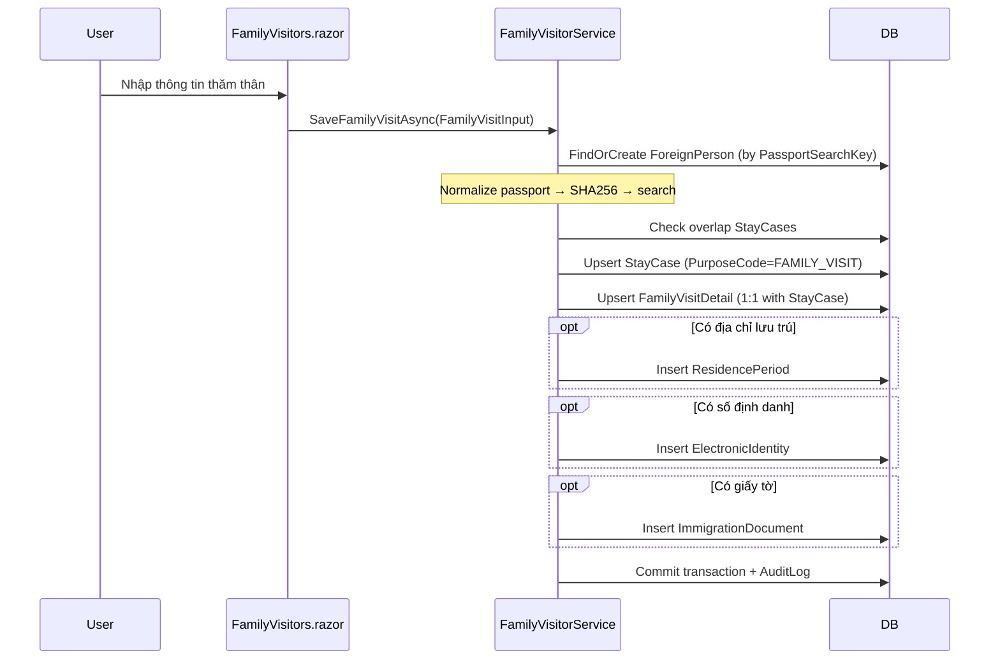
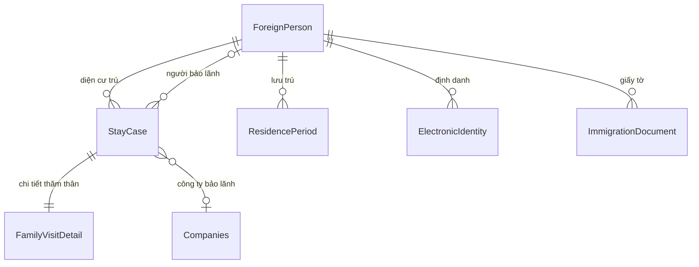

# Thăm thân (Family Visitors)

## 1. Tổng quan

Module quản lý người nước ngoài diện thăm thân — những người đến Việt Nam thăm thân nhân (công dân VN, người gốc VN, Việt kiều). Dữ liệu lưu trong mô hình v0.1.0 (ForeignPerson + StayCase + FamilyVisitDetail), hiển thị qua projection `FamilyVisitor`.

**Route:** `/family-visitors`

## 2. Kiến trúc kỹ thuật

### Files liên quan

| Layer | File | Vai trò |
|---|---|---|
| Page | `Components/Pages/FamilyVisitors.razor` | UI quản lý thăm thân |
| Service | `Services/FamilyVisitorService.cs` | Implements `IForeignerRegistryService` |
| DTO | `Services/V010Contracts.cs` | `FamilyVisitInput`, `ForeignerSearchFilter` |
| Model | `Data/Models/FamilyVisitor.cs` | Projection (NotMapped) |
| Model | `Data/Models/V010Models.cs` | ForeignPerson, StayCase, FamilyVisitDetail |

### Luồng tạo hồ sơ thăm thân

## 3. Database Schema

### FamilyVisitDetail

| Cột | Type | Mô tả |
|---|---|---|
| `StayCaseId` | `int` (PK, FK) | 1:1 với StayCase |
| `RelativeName` | `string` | Tên thân nhân |
| `RelativeIdNumber` | `string?` | CMND/CCCD thân nhân |
| `RelativePhone` | `string?` | SĐT thân nhân |
| `RelativeAddress` | `string?` | Địa chỉ thân nhân |
| `Relationship` | `string` | Vợ/Chồng/Con/Cha mẹ... |
| `RelativeTypeCode` | `string` | VIETNAMESE_CITIZEN, VIETNAMESE_ORIGIN, OVERSEAS_VIETNAMESE_DUAL |

### FamilyVisitor (Projection, NotMapped)

DTO kết hợp dữ liệu từ ForeignPerson + StayCase + FamilyVisitDetail + ResidencePeriod + ElectronicIdentity để hiển thị trên UI.

## 4. Service Interface

### `IForeignerRegistryService` (key methods cho thăm thân)

| Method | Return | Mô tả |
|---|---|---|
| `SearchFamilyVisitsAsync(filter)` | `Task<IReadOnlyList<FamilyVisitor>>` | Tìm kiếm thăm thân (tên, passport, thân nhân, địa bàn) |
| `SaveFamilyVisitAsync(input)` | `Task<int>` | Tạo/cập nhật hồ sơ (transaction) |
| `SoftDeleteAsync(foreignPersonId)` | `Task` | Xóa mềm ForeignPerson + cascade StayCases |

## 5. Ràng buộc Nghiệp vụ

- **Transaction:** `SaveFamilyVisitAsync` chạy trong DB transaction — đảm bảo atomic
- **Overlap check:** Không cho phép 2 StayCase primary trùng khoảng hiệu lực cho cùng người
- **Validation:** Họ tên và thông tin thân nhân là bắt buộc; ValidTo >= ValidFrom
- **RelativeTypeCode:** VIETNAMESE_CITIZEN (công dân VN), VIETNAMESE_ORIGIN (người gốc VN), OVERSEAS_VIETNAMESE_DUAL (Việt kiều 2 quốc tịch)
- **Sponsor:** Có thể sponsor bởi công ty (SponsorCompanyId) hoặc người nước ngoài khác (SponsorForeignPersonId)

## 6. Hướng dẫn Test

- Tạo hồ sơ thăm thân → verify ForeignPerson + StayCase + FamilyVisitDetail created
- Tạo trùng passport → verify reuse ForeignPerson (không tạo mới)
- Overlap validation: tạo 2 stay case trùng khoảng → expect exception
- Tìm kiếm: theo tên, passport, tên thân nhân, CMND thân nhân
- Lọc theo địa bàn (AdministrativeUnitId)

## 7. Hướng dẫn Mở rộng

- **Thêm loại thân nhân:** Thêm code vào `RelativeTypeCode`, cập nhật `RelativeTypeString` trong `FamilyVisitor.cs`
- **Thêm trường FamilyVisitDetail:** Thêm property, map trong `OnModelCreating` → cập nhật `FamilyVisitInput` DTO + `SaveFamilyVisitAsync` logic
