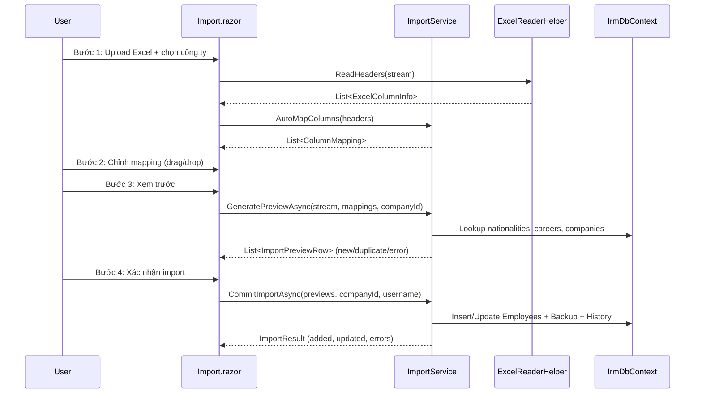

# Import/Export Excel

## 1. Tổng quan

Module xử lý import dữ liệu lao động từ file Excel và xuất báo cáo ra Excel. Import sử dụng wizard 4 bước: Upload → Ghép cột → Xem trước → Kết quả. Hỗ trợ auto-map cột, kiểm tra trùng, rollback, và lưu lịch sử.

**Route:** `/import`

## 2. Kiến trúc kỹ thuật

### Files liên quan

| Layer | File | Vai trò |
|---|---|---|
| Page | `Components/Pages/Import.razor` | Wizard UI 4 bước |
| Service | `Services/ImportService.cs` (958 dòng) | Toàn bộ logic import |
| Service | `Services/ExportService.cs` (471 dòng) | Export Companies, Employees, Students, Custom reports |
| Helper | `Services/ExcelReaderHelper.cs` | Đọc file Excel bằng ClosedXML |
| DTOs | `Data/Models/ImportModels.cs` | ExcelColumnInfo, ColumnMapping, ImportPreviewRow, ImportResult, SystemFields |
| Model | `Data/Models/AuditLog.cs` | ImportHistory, ImportBackup, ColumnMappingTemplate |

### Luồng Import (Wizard 4 bước)



### DI Registration

```csharp
builder.Services.AddScoped<ImportService>();
builder.Services.AddScoped<ExportService>();
```

## 3. Database Schema

| Bảng | Mô tả |
|---|---|
| `ImportHistories` | Lịch sử phiên import — SessionId, filename, counts, status |
| `ImportBackups` | Snapshot dữ liệu cũ (JSON) trước khi update — cho rollback |
| `ColumnMappingTemplates` | Template ghép cột tái sử dụng — JSON mapping |

## 4. Service Interface

### `ImportService`

| Method | Return | Mô tả |
|---|---|---|
| `AutoMapColumns(headers)` | `List<ColumnMapping>` | Tự động nhận dạng cột Excel → trường hệ thống |
| `GeneratePreviewAsync(stream, mappings, companyId)` | `Task<List<ImportPreviewRow>>` | Parse file + check trùng + trả preview |
| `CommitImportAsync(previews, companyId, username)` | `Task<ImportResult>` | Insert/update vào DB + backup + log |
| `RollbackAsync(sessionId)` | `Task<int>` | Rollback phiên import dựa trên backup data |
| `GetHistoryAsync(count)` | `Task<List<ImportSessionInfo>>` | Lịch sử import |
| `SaveTemplateAsync(template)` | `Task` | Lưu template mapping |
| `GetTemplatesAsync(companyId)` | `Task<List<ColumnMappingTemplate>>` | Lấy templates |

### `ExportService`

| Method | Return | Mô tả |
|---|---|---|
| `ExportCompaniesAsync(search, fieldId)` | `Task<byte[]>` | Export danh sách công ty |
| `ExportEmployeesAsync(companyId, nationality, workPermit, expiringOnly)` | `Task<byte[]>` | Export NLĐ theo bộ lọc |
| `ExportStudentsAsync(...)` | `Task<byte[]>` | Export du học sinh |
| `ExportCustomReportAsync(config)` | `Task<byte[]>` | Export báo cáo tùy chỉnh |

### Auto-Map Keywords

`SystemFields.AutoMapKeywords` chứa mapping từ khóa → trường hệ thống. Ví dụ:
- `"họ tên"`, `"ho ten"`, `"full name"` → `StaffName`
- `"hộ chiếu"`, `"ho chieu"`, `"passport"` → `Passport`
- `"công ty"`, `"cong ty"`, `"company"` → `CompanyName`

Hỗ trợ cả tiếng Việt có dấu, không dấu, và tiếng Anh.

## 5. Ràng buộc Nghiệp vụ

- **Duplicate detection:** So sánh passport — nếu trùng thì đánh dấu `status = "duplicate"` và lưu `ExistingEmployeeId`
- **Company resolution:** Nếu có cột CompanyName, fuzzy match với Companies trong DB
- **Rollback:** Mỗi INSERT/UPDATE tạo bản ghi `ImportBackup` chứa `OldData` (JSON). Rollback = restore từ backup + xóa bản ghi mới
- **Session tracking:** Mỗi phiên import có `SessionId` unique dạng `"IMP-{year}-{seq}"`
- **V010 extended fields:** Import cũng hỗ trợ các cột v0.1.0 (StayPurposeCode, ElectronicIdentityNumber, DocumentTypeCode, ResidenceAddress...) thông qua `ExtendedFields` dictionary
- **Authorization:** Yêu cầu `Admin` hoặc `DataEditor`

## 6. Hướng dẫn Test

- Upload file Excel hợp lệ → verify auto-map đúng
- Preview: check new vs duplicate vs error
- Commit: verify Employees được insert/update đúng
- Rollback: commit → rollback → verify dữ liệu restore
- Edge case: file Excel rỗng, file không có header, file sai định dạng
- Template: save mapping → load lại → verify mapping đúng

## 7. Hướng dẫn Mở rộng

- **Thêm trường import mới:** Thêm entry vào `SystemFields.All` và `AutoMapKeywords`, xử lý trong `ImportService.ParseRow()`
- **Thêm entity export:** Thêm method vào `ExportService`, tạo worksheet ClosedXML mới
- **Đổi format Excel:** Sửa trong `ExportService` — header style, column widths ở cuối mỗi method export
