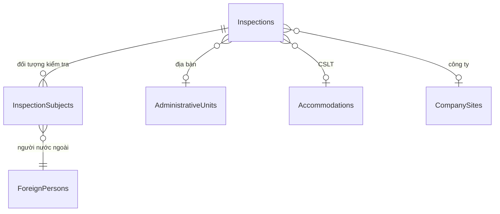

# Kiểm tra (Inspections)

## 1. Tổng quan

Module quản lý đợt kiểm tra người nước ngoài tại các địa bàn/CSLT/công ty. Ghi nhận kết quả kiểm tra từng đối tượng (ForeignPerson), snapshot trạng thái tại thời điểm kiểm tra, hỗ trợ lookback (xem ai đã/chưa được kiểm tra trong khoảng thời gian).

**Route:** `/inspections`

## 2. Kiến trúc kỹ thuật

### Files liên quan

| Layer | File | Vai trò |
|---|---|---|
| Page | `Components/Pages/Inspections.razor` | UI đợt kiểm tra |
| Service | `Services/InspectionService.cs` | CRUD + lookback |
| Model | `Data/Models/Inspection.cs` | Inspection, InspectionSubject |

### DI Registration

```csharp
builder.Services.AddScoped<IInspectionService, InspectionService>();
```

## 3. Database Schema



### Inspection

| Cột | Type | Mô tả |
|---|---|---|
| `InspectedAt` | `DateTime` | Thời gian kiểm tra |
| `LocationText` | `string` | Địa điểm (text tự do) |
| `InspectorNames` | `string` | Tên cán bộ kiểm tra |
| `TypeCode` | `string` | PLANNED, SURPRISE, COMPLAINT |
| `Summary` | `string?` | Tóm tắt kết quả |

### InspectionSubject

| Cột | Type | Mô tả |
|---|---|---|
| `PurposeCodeSnapshot` | `string` | Diện cư trú tại thời điểm kiểm tra |
| `DocumentsSnapshot` | `string?` | Giấy tờ (snapshot) |
| `ResultCode` | `string` | VALID, EXPIRED, VIOLATION, WARNING |
| `ViolationDetails` | `string?` | Chi tiết vi phạm |
| `ActionTaken` | `string?` | Biện pháp xử lý |

## 4. Service Interface

### `IInspectionService`

| Method | Return | Mô tả |
|---|---|---|
| `SearchAsync(from?, to?, adminUnitId?)` | `Task<IReadOnlyList<Inspection>>` | Tìm đợt kiểm tra |
| `SaveAsync(inspection)` | `Task<int>` | Tạo/cập nhật đợt (Admin/Inspector) |
| `AddSubjectAsync(inspectionId, personInput, subject)` | `Task<int>` | Thêm đối tượng vào đợt |
| `GetCheckedPersonIdsAsync(from, to, adminUnitId?)` | `Task<IReadOnlySet<int>>` | Lấy Set người đã được kiểm tra trong khoảng (lookback) |

## 5. Ràng buộc Nghiệp vụ

- **Authorization:** `Admin` hoặc `Inspector` cho tạo/sửa
- **Unique subject:** 1 đối tượng chỉ xuất hiện 1 lần trong 1 đợt kiểm tra
- **Snapshot:** Dữ liệu subject lúc kiểm tra được snapshot (PurposeCode, Documents...) — không thay đổi khi dữ liệu gốc thay đổi
- **Lookback:** `GetCheckedPersonIdsAsync` trả về set ForeignPersonId đã kiểm tra — dùng để highlight ai chưa kiểm tra trong UI Statistics

## 6. Hướng dẫn Mở rộng

- **Thêm ResultCode:** Thêm vào dropdown UI
- **Export kết quả:** Tạo method trong ExportService query Inspections + Subjects
- **Gắn file ảnh:** Liên kết với StoredFiles cho ảnh hiện trường
