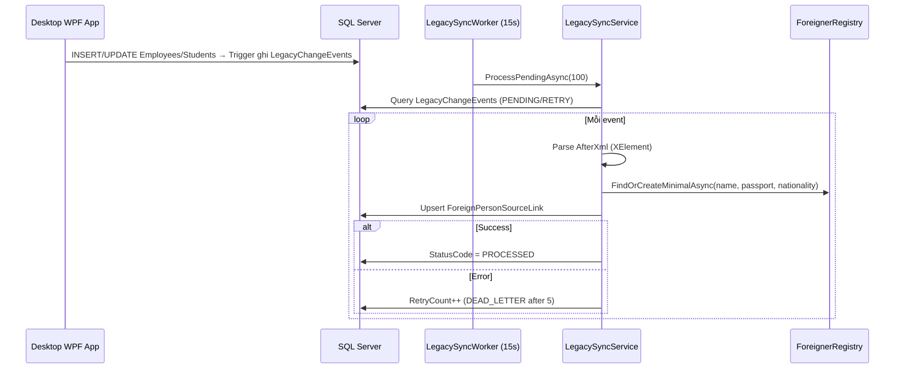
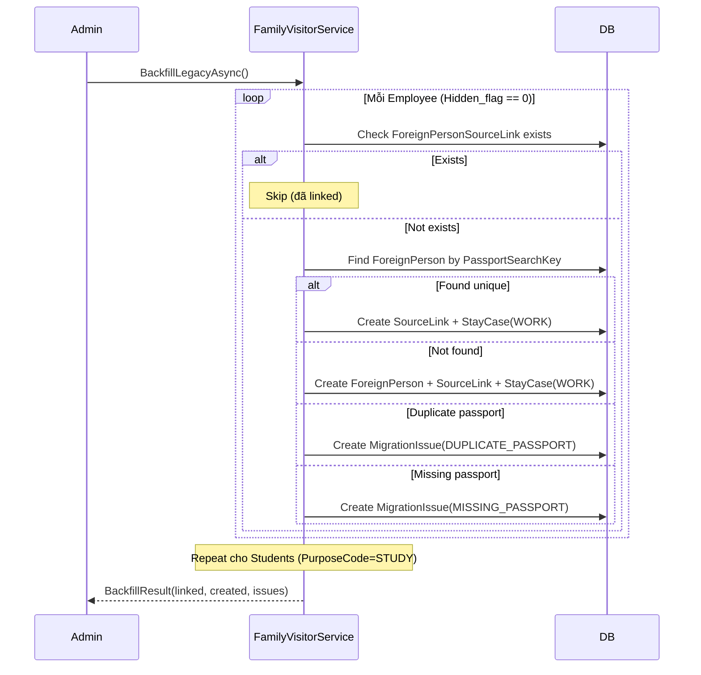

# Đồng bộ Legacy (Legacy Sync)

## 1. Tổng quan

Module đồng bộ dữ liệu từ hệ thống desktop WPF cũ sang mô hình v0.1.0 (ForeignPersons). Gồm 2 cơ chế:
- **Real-time:** `LegacySyncWorker` (BackgroundService) poll bảng `LegacyChangeEvents` mỗi 15 giây
- **Batch:** `BackfillLegacyAsync()` chạy thủ công để link toàn bộ Employees/Students hiện có vào ForeignPersons

## 2. Kiến trúc kỹ thuật

### Files liên quan

| Layer | File | Vai trò |
|---|---|---|
| Service | `Services/LegacySyncService.cs` | ILegacySyncService + LegacySyncWorker |
| Service | `Services/FamilyVisitorService.cs` | BackfillLegacyAsync() |
| Service | `Services/SchemaVersionService.cs` | Kiểm tra schema version |
| Model | `Data/Models/V010Models.cs` | LegacyChangeEvent, ForeignPersonSourceLink, MigrationIssue |

### Flow Real-time



### Flow Batch (Backfill)



## 3. Database Schema

| Bảng | Mô tả |
|---|---|
| `LegacyChangeEvents` | Event log từ trigger SQL: EntityType, EntityId, AfterXml, StatusCode (PENDING→PROCESSED/DEAD_LETTER) |
| `ForeignPersonSourceLinks` | Link ForeignPerson ↔ Legacy ID: `(SourceType, SourceId)` unique |
| `MigrationIssues` | Vấn đề cần xem xét thủ công: MISSING_PASSPORT, DUPLICATE_PASSPORT |
| `SchemaVersions` | Version schema DB — app kiểm tra `0.1.0` tồn tại trước khi khởi động |

### LegacyChangeEvent Status Flow

```
PENDING → PROCESSED (success)
PENDING → RETRY → RETRY → ... → DEAD_LETTER (after 5 retries)
```

## 4. Service Interface

### `ILegacySyncService`

| Method | Return | Mô tả |
|---|---|---|
| `ProcessPendingAsync(batchSize)` | `Task<int>` | Xử lý batch events, trả số processed |

### `ISchemaVersionService`

| Method | Return | Mô tả |
|---|---|---|
| `ValidateAsync()` | `Task` | Throw nếu schema 0.1.0 chưa có |

### `LegacySyncWorker`

- Kế thừa `BackgroundService`
- `PeriodicTimer(15s)` poll liên tục
- Tạo scope mới mỗi vòng lặp (vì Blazor Server scoped lifetime)
- Chỉ log error, không throw → worker luôn chạy

## 5. Ràng buộc Nghiệp vụ

- **AfterXml parsing:** Dữ liệu từ WPF trigger dạng XML — parse bằng `XElement`
- **DEAD_LETTER:** Sau 5 lần retry thất bại, event bị đánh dấu DEAD_LETTER — cần xem xét thủ công
- **No auto-migration:** App **KHÔNG** tự chạy EF migrations. Schema phải được DBA chạy migration script riêng → app validate bằng `SchemaVersionService`
- **SQLite mode:** Worker không chạy ở chế độ SQLite development

## 6. Hướng dẫn Test

- Seed LegacyChangeEvent PENDING → call ProcessPendingAsync → verify ForeignPerson + SourceLink created
- Seed event với XML thiếu data → verify retry + DEAD_LETTER after 5
- Backfill: seed Employees + Students → call BackfillLegacyAsync → verify SourceLinks + StayCases
- Duplicate passport: 2 employees cùng passport → verify MigrationIssue created

## 7. Hướng dẫn Mở rộng

- **Thêm entity type sync:** Xử lý thêm case trong `ProcessPendingAsync` switch
- **Tăng batch size:** Config `batchSize` parameter
- **Dashboard sync:** Thêm UI hiển thị PENDING/DEAD_LETTER counts
