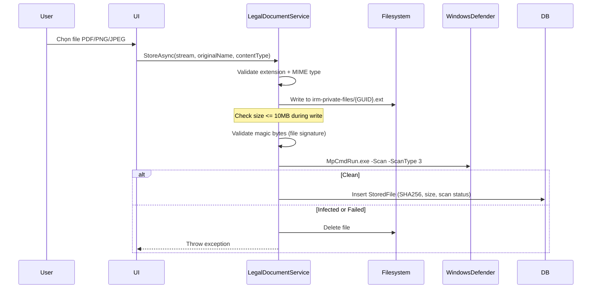

# Quản lý Hồ sơ Pháp lý & File Upload

## 1. Tổng quan

Module upload, lưu trữ, và quản lý hồ sơ pháp lý (ĐKKD, giấy phép đầu tư, hợp đồng...) của doanh nghiệp. File được lưu trên filesystem (ngoài webroot), validate format, quét malware bằng Windows Defender, hash SHA256 để đảm bảo tính toàn vẹn.

## 2. Kiến trúc kỹ thuật

### Files liên quan

| Layer | File | Vai trò |
|---|---|---|
| Service | `Services/LegalDocumentService.cs` | Upload, download, metadata |
| Service | `WindowsDefenderMalwareScanner` (trong cùng file) | Quét malware |
| Model | `Data/Models/V010Models.cs` | CompanyLegalDocument, StoredFile |

### Luồng Upload



### DI Registration

```csharp
builder.Services.AddScoped<ILegalDocumentService, LegalDocumentService>();
builder.Services.AddSingleton<IMalwareScanner, WindowsDefenderMalwareScanner>();
```

## 3. Database Schema

### StoredFile

| Cột | Type | Mô tả |
|---|---|---|
| `Id` | `int` PK | |
| `StorageName` | `string` | `{GUID}.ext` trên filesystem |
| `OriginalName` | `string` | Tên file gốc từ user |
| `ContentType` | `string` | MIME type |
| `Size` | `long` | Bytes |
| `Sha256` | `string` | Hash toàn vẹn |
| `ScanStatusCode` | `string` | CLEAN, PENDING, INFECTED |
| `CreatedByAccountId` | `int` | User đã upload |
| `IsDeleted` | `bool` | Soft delete |

### CompanyLegalDocument

| Cột | Type | Mô tả |
|---|---|---|
| `CompanyId` | `int` FK | Doanh nghiệp |
| `TypeCode` | `string` | BUSINESS_REGISTRATION, INVESTMENT_LICENSE... |
| `Number` | `string` | Số giấy tờ |
| `IssuedBy` | `string?` | Cơ quan cấp |
| `StoredFileId` | `int?` FK | File đính kèm |

## 4. Bảo mật

- **File storage ngoài webroot:** `irm-private-files/` không accessible trực tiếp
- **Path traversal prevention:** `Path.GetFullPath()` + `StartsWith(_storageRoot)` check
- **Extension whitelist:** Chỉ .pdf, .png, .jpg, .jpeg
- **Magic bytes validation:** Check file signature (PDF: `%PDF`, PNG: `89504E47`, JPEG: `FFD8FF`)
- **Size limit:** 10MB streaming check
- **Malware scan:** Windows Defender MpCmdRun.exe
- **SHA256 hash:** Verify tính toàn vẹn file
- **Download guard:** Chỉ cho download file có `ScanStatusCode == "CLEAN"`

## 5. Hướng dẫn Mở rộng

- **Thêm file type:** Thêm vào `Allowed` dictionary + implement magic bytes check trong `HasAllowedSignature`
- **Thay đổi storage:** Config `FileStorage:Root` trong appsettings.json
- **Cloud storage:** Replace filesystem logic bằng Azure Blob/S3 trong `StoreAsync`/`OpenReadAsync`
