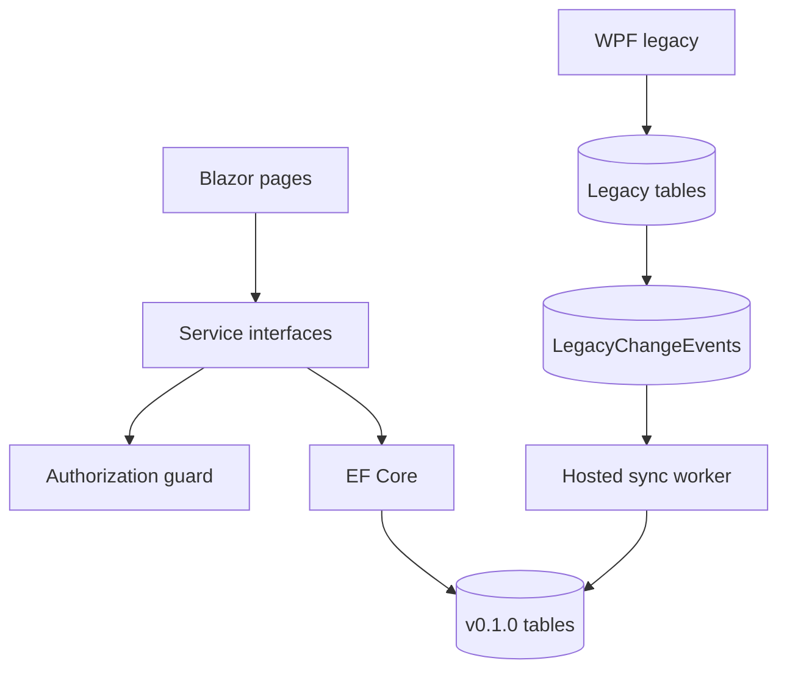

# Giai đoạn 2 — Thiết kế giải pháp IRM v0.1.0

> **Architecture gate:** APPROVED cho development/test theo chỉ thị triển khai; production gate vẫn PENDING.

## Quyết định

| Chủ đề | Quyết định |
|---|---|
| Ứng dụng | ASP.NET Core 8 Blazor Server, không mở API nghiệp vụ mới |
| Đồng tồn tại | WPF và web cùng database; WPF ghi legacy, trigger/outbox đồng bộ sang mô hình mới |
| Dữ liệu | Bảng v0.1.0 additive; không thêm cột vào legacy |
| Identity | `ForeignPersons` + `ForeignPersonSourceLinks` |
| Thời gian | `ValidFrom/ValidTo`; as-of khác event range |
| Địa bàn | `AdministrativeUnits`, 54 đơn vị Quảng Ninh; không thêm `IDDistrict` vào `Wards` |
| Auth | Cookie + hash upgrade + 5 role; policy và service guard |
| File | Ngoài webroot, GUID, SHA-256, whitelist, 10 MB, Defender, audit |
| Migration | SQL Server 2014 script có transaction/checksum/version; startup chỉ validate |
| Phase 2 req.4 | Border movements/episodes deferred |

## Sơ đồ component

ERD, ADR, threat matrix và blueprint cửa khẩu nằm trong [báo cáo implementation](IRM-v0.1.0-implementation-report.md).
